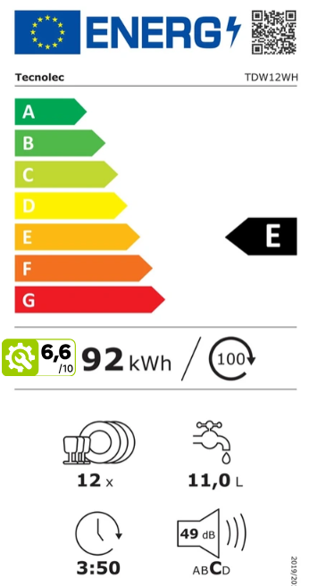
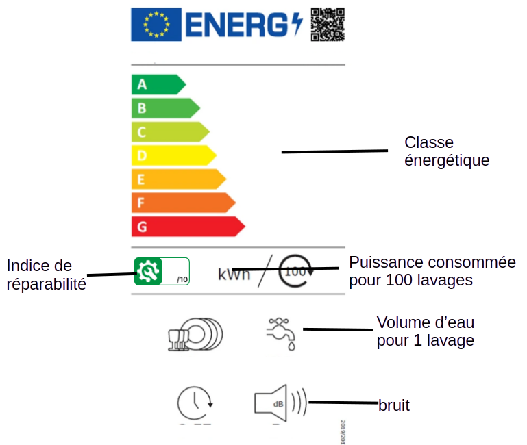
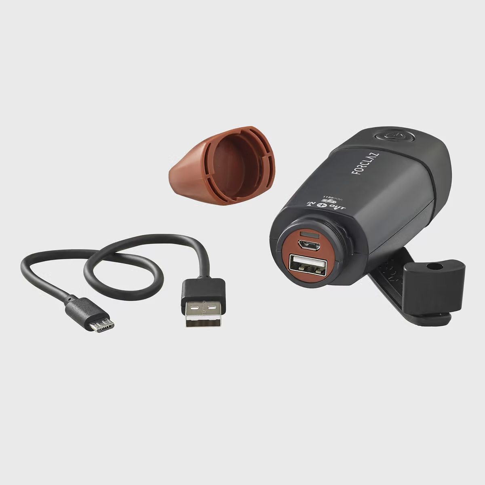

# Activité : Choix d'un OST et le développement durable

!!! note "Compétences"

    Analyser l’impact environnemental d’un objet et de ses constituants.

!!! warning "Consignes"

    1. Choisir un lave-vaiselle, le but est d'en trouver un qui, à l'usage, coûtera le moins cher possible, justifie ton choix.
    2. Un fabricant de gourde souhaite fabriquer des gourdes plus écologiques, il hésite entre 3 matériaux, proposer un choix en le justifiant.
    3. Une personne souhaite faire un treck de plusieurs jours, pour cela elle souhaite acheter une lampe de poche, elle hésite entre trois modèles. Laquelle est la plus adaptée. Justifier le choix

??? bug "Critères de réussite"

**Document 1 Différents lave-vaisselles**

{:style="width:200px;border-color:black;border: solid 0.1em;"}
{:style="width:200px;border-color:black;border: solid 0.1em;"}
{:style="width:200px;border-color:black;border: solid 0.1em;"}
{:style="width:200px;border-color:black;border: solid 0.1em;"}
{:style="width:200px;border-color:black;border: solid 0.1em;"}

**Document 2 L'indice de réparabilité**

L'indice de réparabilité est une note qui indique si un produit est facile à réparer. Il va de 0 à 10, où 10 signifie que le produit est très simple à réparer. Cet indice a été créé pour aider les consommateurs à choisir des produits durables.

- Si un produit est facile à réparer, on le jette moins.
- Réparer un produit coûte souvent moins cher que d'acheter un nouveau produit.
- Cela réduit l'impact sur notre planète.

L'indice de réparabilité nous aide à choisir des produits qui peuvent durer longtemps et qui sont bons pour la planète.

**Document 3 La classe énergétique**

La classe énergétique est un système qui classe les appareils en fonction de leur consommation d'énergie. Elle va de A à G, où A est la meilleure note, indiquant que l'appareil est très économe en énergie.

- Les appareils bien classés consomment moins d'électricité, ce qui réduit les factures d'énergie.
- Moins d'énergie consommée signifie moins de pollution et une meilleure protection de la planète.

La classe énergétique nous aide à choisir des appareils qui sont bons pour notre porte-monnaie et pour la planète. 

**Document 4 Des matériaux pour fabriquer une gourde**

| | acier | verre | plastique |
| -- | --- | ---- | ---- |
|matière première| minerai | sable | pétrole |
| fin de vie | Recyclable, peut être réutilisé plusieurs fois | 100% recyclable, cependant, peut se briser et créer des déchets | recyclage compliqué |
| Émissions de CO₂ (kg par kilogramme) | 1,8 à 2,0 kg | 0,5 à 1,0 kg | 1,5 à 3,0 kg |
| coût au kg | 0,9 € | 1,95 € | 1,4 € |

**Document 5 Différentes lampes torches**

| | Lampe torche rechargeable et batterie externe - DYNAMO 900 PWB | Lampe torche à piles, TL100 | Lampe torche rechargeable - tl900 |
|---|---| -- |----|
| prix | 24,99€ | 9,99€ | 29,99€ |
| puissance | 210 lumens | 100 lumens | 300 lumens |
| portée | 40m | 25m | 75m |
| focntionnement | Rechargeable par USB et autonome grâce à sa dynamo. | Fonctionne avec 3 piles LR03-AAA fournies | Batterie rechargeable en micro-USB |
| | {:style="width:100px;"} | {:style="width:100px;"} | {:style="width:100px;"} |

