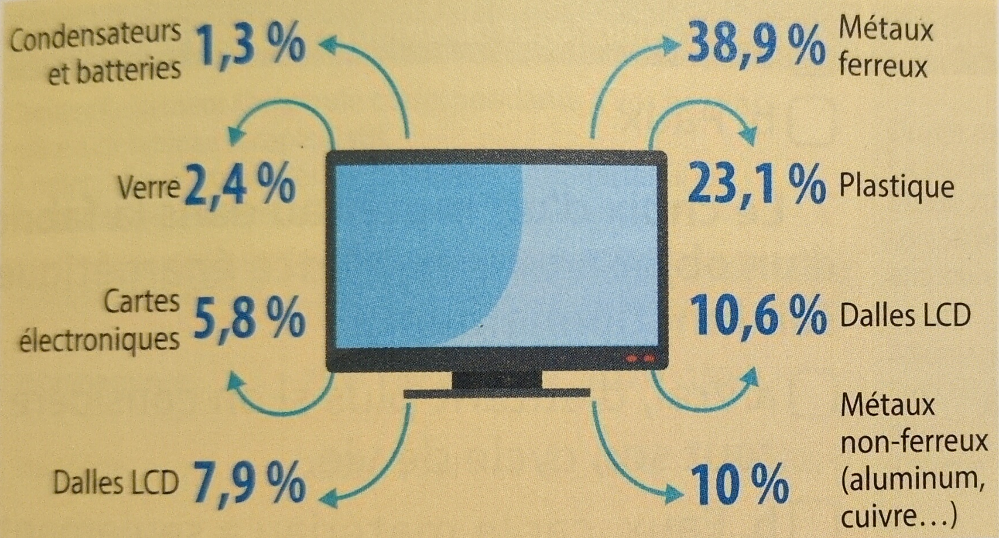
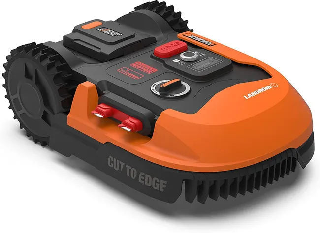
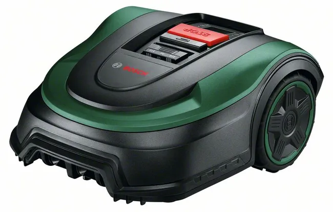
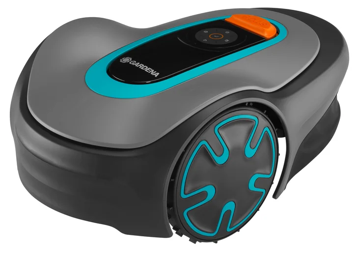

# Activité : Exercice d’application

## Exercice 1 : Matériaux présents dans un objet 

!!! note "Compétences"

    Trouver et utiliser des informations 

!!! warning "Consignes"

    1. Quel est le matériau le plus présent dans un écran plat ?
    2. Quel peut être l'impact écologique d'un écran plat ?
    3. Il se vand plus de 5 écrans plats par seconde dans le monde, quelles peuvent être les solutions pour limiter l'impact écologique du marché des écrans plats sur les ressources de la Terre.

**Document La composition d'un écran plat**

## Exercice 2 : Choix d'une tondeuse autonome

!!! note "Compétences"

    Trouver et utiliser des informations 

!!! warning "Consignes"

    1. Quel robot choisir si on ne s'intéresse qu'au performance ? 
    2. Quel robot choisir si on ne s'intéresse qu'au prix ? 
    3. Quel robot choisir si on ne s'intéresse qu'à sa capacité à être réparé ? 
    4. Finalement, quel robot choisir ?

|  |   |   |     |
|--|---|---|--|
| Prix |  710 € |  679,90 € |  659,90€ |  
| Capacité de tonte max | 500  ㎡ | 500 ㎡| 450 ㎡ |   
| Pente max conseillée | 25%   |  20% | 20% |   
| Alarme sonore  | ou  | non  | non |   
|  |   |   |    |   

