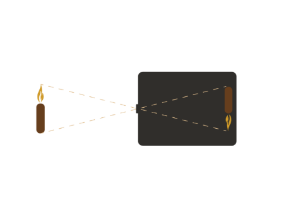
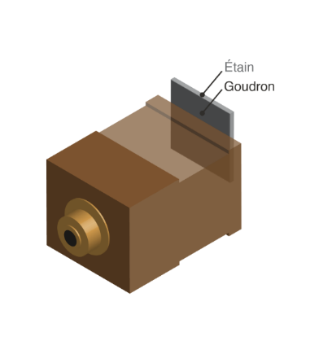
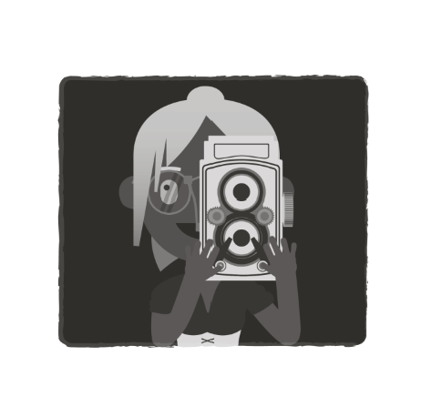
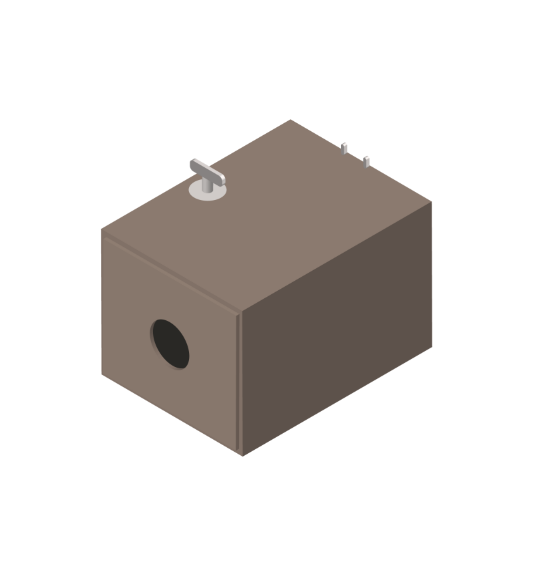
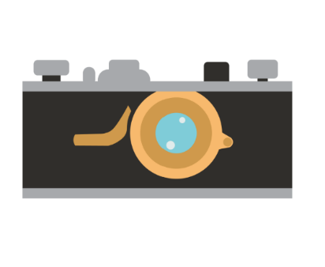
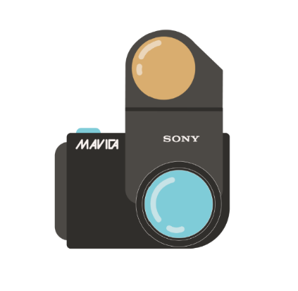

# Activité : Evolution de la photographie

!!! note Compétences

    Trouver et utiliser des informations 
 

!!! warning Consignes

    1. Peut-on dire qu'Aristote était un photographe ? Justifier. 
    2. Parmi les personnages cités, qui est l’inventeur de la photographie ? Justifier. 
    3. Quelle invention a permis la photographie papier ? 
    4. Comparer l’aspect de l’appareil de Nicéphore Nièpce (1827) au MAVICA (1981). Quels sont les innovations de l'appareil de Sony? 
    5. Représenter sans soucis d’échelle, une lignée d’objet regroupant 4 appareils photo.
    
??? bug Critères de réussite
    - 

**Document 1 Définitions.**

- Une lignée d’objets est une suite chronologique d’objets techniques répondant à un même besoin et mettant en œuvre (ou en évidence) le même principe technique (ou principe de fonctionnement).
- L’invention est une création comme un nouvel objet, un nouveau procédé ou un nouveau système d'exploitation. L'invention fait suite à tout un processus de recherche, de travail et la fabrication de prototypes. 
- L’innovation est l'amélioration d'une invention existante à laquelle on apporte un progrès technique ou technologique.

Les découvertes, les inventions et les innovations permettent les évolutions technologiques. Elles marquent de nettes améliorations dans de nombreux domaines, on appelle cela des ruptures technologiques. 

**Document 2 La photographie.**

La photographie, c’est bientôt deux siècles d’inventions et de perfectionnement entre la première image figée, le développement, la première photographie en noir et blanc, et aujourd’hui, avec des photos en couleur prises avec un simple smartphone. Elle regroupe l’ensemble des procédés permettant de figer durablement l’image d’un objet. 
A ses débuts, elle est mal accueillie, notamment par le monde artistique, car les peintres y voient un danger pour leur art. Mais, par la suite, elle deviendra de plus en plus accessible pour le grand public et influencera de nombreux domaines. 

**Document 3 Les principes optiques (De – 400 à 1827)** 
  
L’invention du premier appareil photographique repose sur des principes optiques découverts dès l’Antiquité. La chambre noire, le sténopé et la lentille de verre représentent les bases de ce qui deviendra plus tard la photographie.

- –350 : Le sténopé – Aristote

Dans l’un de ses ouvrages le philosophe grec Aristote (384-322 av. J-C) décrit le principe de la chambre noire et du sténopé. Cela consiste à faire passer de la lumière dans une pièce obscure par un petit trou. L’image extérieure est projetée de manière inversée sur le mur opposé. Aristote se sert de la chambre noire pour observer une éclipse solaire.

- 1515 : La "camera obscura" – Léonard de Vinci

Le célèbre inventeur italien Léonard de Vinci reprend les travaux de ses prédécesseurs en créant une boîte noire appelée "camera obscura" en latin. Léonard de Vinci suggère que cette invention pourrait aider les artistes à reproduire des paysages.

- 1540 : L’objectif – Girolamo Cardano

Le scientifique italien Girolamo Cardano (Jérome Cardan) améliore en 1540 la camera obscura de Léonard de Vinci. Il ajoute au sténopé une lentille de verre. Cette lentille améliore la projection et constitue l’invention du premier objectif. Plus tard, on ajoute des miroirs à 45 degrés pour remettre l’image à l’endroit et la camera obscura devient une innovation répandue chez les peintres pour dessiner durant les 16ᵉ et 17ᵉ siècles.

**Document 4 Les procédés chimiques (De 1827 à 1841)**

Au début du XIXᵉ siècle, les techniques optiques sont déjà très avancées, mais il n’existe toujours pas de moyen pour fixer les images. C’est à ce moment que la chimie entre en scène.

- 1827 : L’appareil de Nicéphore Nièpce

L’inventeur français Nicéphore Niépce met au point le premier procédé permettant de fixer une image qu’il appelle "héliographie". Cela signifie : "écriture par le soleil". Sa technique consiste à employer une chambre noire et une plaque sensible à la lumière. La première image est réalisée en 1827 par lui-même, d’une fenêtre à l’étage de sa maison. L’exposition aurait durée de 12 à 18 heures.

- 1841 : Le Calotype 

En Angleterre, William Henry Fox Talbot invente le négatif, permettant la reproduction des images sur du papier. Il appelle sa technique : "calotype". On peut ainsi reproduire un grand nombre de tirages sur un support léger : le papier. Le principe du négatif restera la base de la photographie pendant 150 ans.

- 1900 : Le Brownie

Kodak mise sur un appareil simple et très bon marché : le Brownie. Il est constitué d’un boîtier en carton et d’un objectif. Commercialisés au prix de 1 dollar, ces appareils deviennent très populaires auprès du grand public.

**Document 5 Les améliorations électro-mécaniques (De 1925 à 1975)**

Après les innovations de Kodak, l’appareil photographique se démocratise progressivement pendant le XXᵉ siècle. Le développement de la presse provoque aussi l’apparition du métier de photoreporter. De nouvelles contraintes poussent alors les fabricants à améliorer l’électronique et la mécanique de leurs appareils.

- 1925 : Leica I

L’ingénieur Oskar Barnack construit pour l’entreprise allemande Leitz, un appareil photographique léger et robuste : le Leica I. Cet appareil utilise un nouveau format de film 35 mm plutôt utilisé pour le cinéma, mais le principe technique utilisé reste le même. Sa petite taille et sa qualité lui offrent un très grand succès auprès des journalistes reporters. 

**Document 6 La photographie numérique (De 1975 à aujourd’hui)**

À la fin du XXᵉ siècle, la photographie se tourne vers les technologies numériques. À mesure que la qualité des photos numériques augmente, la photographie argentique avec ses pellicules est peu à peu abandonnée. De plus, la photographie numérique intègre dès l’an 2000 les téléphones portables et se popularise avec les smartphones.

- 1981 : MAVICA – Sony

Le constructeur japonais Sony sort en 1981 le MAVICA. Cet appareil photo numérique possède un capteur de 279 300 pixels (570 x 490 px). L’enregistrement analogique des photos se fait sur une disquette ayant une capacité de 50 images.

- 2007 : iPhone – Apple

Le constructeur d’ordinateur américain Apple lance en 2007 le premier smartphone avec un écran tactile "multi-touch". L’important succès de l’iPhone démocratise la photographie sur smartphone.

