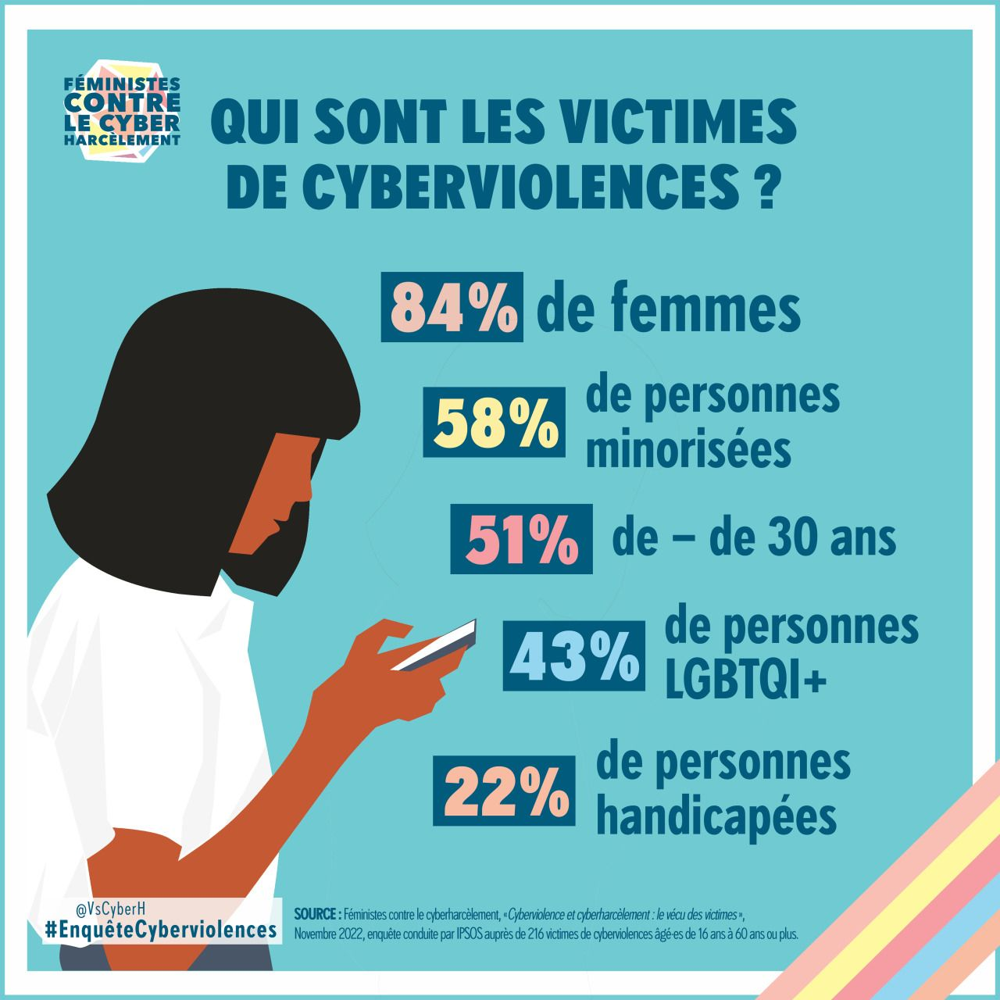

# Séquence : Usages et impacts sociétaux du numérique

!!! note-prof
    si besoin d’infos

!!! question "Problématique"

    Quel est l’impact du numérique dans nos vies ?

    

## Séance 1 : Les systèmes d’informations

En langage simple, le système informatique est l’ensemble des équipements qui font fonctionner l’ordinateur, et le système d’information est les données que nous stockons dans l’ordinateur sous la forme de divers formats de fichiers.

!!! question "Problématique"

    Comment sont organisées les données stockées dans un système informatique ?

[Activité les données informatiques](../systInformation)

??? abstract "Bilan"

    <a markdown id="bilan1">

    Les données sont simplement des informations.

    Il existe des données différents types, elles sont stockées dans des fichiers  que l'on peut identifier grâce à leur icône, leur nom et leur extension qui précise leur format

    Il existe des fichiers de plusieurs tailles (appelées aussi "poids"), mesurées en kilo-octets (ko), méga-octets (Mo), giga-octets (Go) ou tera-octets (To)

    Les fichiers sont stockés dans des périphériques de stockage local physiques (par exemple : disque dur de 2 To, carte mémoire de 512 Go, clé USB de 32 Go, ...) ou de stockage en ligne (cloud).

    Ces espaces de stockage sont organisés sous la forme d'une arborescence, afin de pouvoir classer et retrouver ses fichiers stockés. Une arborescence est composée de dossiers, sous-dossiers et de fichier. Le chemin d'accès permet de savoir où sont stockés les fichiers et d'y  accéder.

    Le stockage en ligne favorise le partage des fichers. Les données peuvent être transmises par des systèmes d'informations (ENT, réseaux sociaux, Service de cloud, sites collaboratifs, ...) de manière sécurisée

    </a>

## Séance 2 : la cyberviolence

{:style="height:400px; "} 

!!! question "Problématique"

    comment le numérique peut-il avoir un impact dans notre vie ?

[Activité ELEA : Cyberviolence](https://mureaux.elea.ac-versailles.fr/course/view.php?id=1384)

[Activité Cyberviolence](../cyberviolence)

??? abstract "Bilan"

    <a markdown id="bilan2">

    Les cyberviolences sont des actes malveillants, intentionnels, commis dans le monde numérique, par une ou plusieurs personnes dans le but de nuire à un individu comme l'usurpation d'identité, l'envoi de messages insultants et menaçants à une personne ou un groupe de personnes, le partage indélicat de photos ou des insultes. Ces actes sont punissables par la loi (peine de prison et amende)

    Il faut donc bien réfléchir à ce que l'on publie sur les réseaux. Si on est victime ou témoin, la première chose à faire et de prévenir un adulte de confiance.

    En cas de cyberharcèlement, vous devez en parler si vous n'osez pas en parler autour de vous, un service existe que vous pouvez contacter le 3018.

    </a>

À faire avant la séance 3 : [Activité Hachette](college.hachette-education.com/ressources/0002017890737/techno5e_genially10/)

Noter les 4 mots qui sont fournis à la fin de chaque mission.

## Séance 3 : Cybersécurité

!!! question "Problématique"

    Quels sont les points de vigilance pour ne pas mettre en danger ses données informatiques ?

[Activité Cybersécurité](../cybersecu)

[Vidéos sur les données personnelles](https://www.lumni.fr/video/donnees-personnelles-et-reseaux-sociaux)

[Test mot de passe](https://www.ssi.economie.gouv.fr/motdepasse)

??? abstract "Bilan"

    <a markdown id="bilan3">

    La cybersécurité consiste à protéger les matériels informatiques ainsi que nos données personnelles contre les attaques malveillantes.

    Il faut alors protéger son matériel informatique :

    - antivirus.
    - mots de passes uniques et robustes.
    - prudence avec les logiciels et documents ouverts.
    - Sauvegarder ses données.

    Lorsqu'on utilise internet des informations sont diffusées.
    Volontairement (photos, messages), qui peuvent rester en ligne et nous échapper.
    Involontairement, les cookies qui stockent des informations sur nous (sites visités, zone géographique, informations personnelles), beaucoup de cookies sont utilisés pour le ciblage publicitaire.

    </a>

## Séance 4 : Exercices

[Activité Exercices](../exercicesNum)

