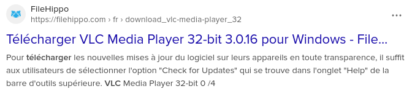
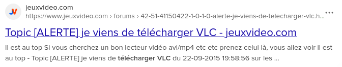
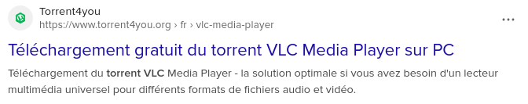
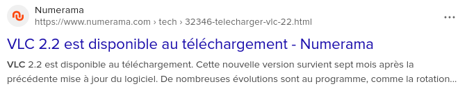

# Activité : Cybersécurité 

!!! note Compétences

    Interpréter 

!!! warning Consignes

    1. d'après le doucment, combien de temps votre mot de passe principal peut il être cracké
    2. Pourquoi un mot de passe unique peut-il être dangereux
    3. Sur quel site des résultats de la recherche vous téléchargeriez le logiciel VLC ?
    
??? bug Critères de réussite
    - 

**Document 1 Temps de résistance des mots de passe**

**document 2 mots de passe les plus utilisés en France en 2024**

| Rang | Mot de passe | Temps pour craquer |
|--------|--------------|--------------------|
| 1      | 123456       | < 1 seconde        |
| 2      | 123456789    | < 1 seconde        |
| 3      | azerty       | < 1 seconde        |
| 4      | admin        | < 1 seconde        |
| 5      | 1234561      | 1 seconde          |
| 6      | azertyuiop   | 1 minute           |
| 7      | loulou       | < 1 seconde        |
| 8      | 000000       | < 1 seconde        |
| 9      | doudou       | < 1 seconde        |
| 10     | password     | < 1 seconde        |
| 11     | marseille    | 1 jour             |
| 12     | motdepasse   | 14 heures          |
| 13     | 12345678     | < 1 seconde        |
| 14     | chouchou     | < 1 seconde        |
| 15     | soleil       | < 1 seconde        |
| 16     | cheval       | 2 minutes          |
| 17     | 12345        | < 1 seconde        |
| 18     | Password     | < 1 seconde        |
| 19     | bonjour      | < 1 seconde        |
| 20     | 1234567891   | < 1 seconde        |

**Document 3 Fuite de données et risques pour toutes les données**

La Commission nationale de l’informatique et des libertés (Cnil) a enregistré l’an dernier 5.629 notifications de violations de données, soit 20% de plus qu’en 2023, a-t-elle détaillé dans son rapport annuel.
Certains sites, comme https://haveibeenpwned.com/, permettent de savoir si notre adresse mail fait partie des fuites de donénes et quelles sont les donénes qui ont été dérobées

**Document 4 Virus hacking**

Des logiciels malveillants existent. Ces logiciels peuvent avoir différents rôles. Certains ont pour but de faire dysfonctionner les appareils ou les réseaux (virus, botnet). D’autres ont pour but de voler des informations (spyware, chevaux de Troie), de bloquer l’ordinateur contre une rançon ou bien d’afficher des pubs pour gagner de l’argent.

Pour éviter de se retrouver avec des logiciels comme ceux-ci, il est important de faire attention aux fichiers téléchargés sur internet (d’où vient-il ? qui a fait le logiciel ? et dans quel but ?), il ne faut pas brancher des clés USB sans en connaitre l’origine et avoir un logiciel antivirus peut aider à détecter et bloquer des menaces, mais attention, ils ne sont pas infaillibles.

Pour être téléchargé, les malwares sont souvent déguisés en éléments attractifs (films, photo, document texte, jeux vidéos ou logiciel connu).

Faire une sauvegarde de ses données est important, sinon en cas de perte, vol ou destruction de son appareil, on perdrait les données contenues sur celui-ci.
On parle souvent de sauvergades 3 2 1, avec 3 copies en tout :
- les données de l’appareil
- une sauvergade sur un disque externe (disque dur, clé USB, DVD) 
- une sauvegarde présente à un autre endroit (pour éviter le vol ou la destruction de la sauvergade en même temps que celui de l’appareil.)

**Document 6 Source possibles pour télécharger le logiciel VLC**
 
Si on recherche sur un moteur de recherche à télécharger le logiciel VLC de Videolan, on obtient les résultats suivants.

