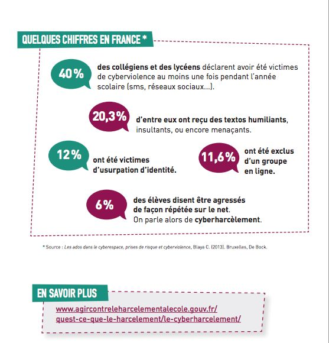
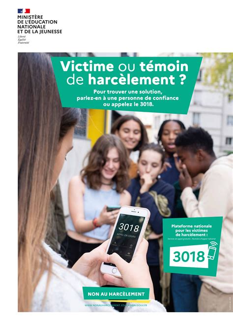

# Activité : Cyberviolence

!!! note "Compétences"

    Interpréter 

!!! warning "Consignes"

    1. Pour chacune des situations du document 4, dire s'il s'agit de cyberharcélement
    2. Que faire en cas de cyberviolence ?
    
    
??? bug "Critères de réussite"
    - 

**Document 1 Cyberviolence au collège**

[video sur lumni](https://www.lumni.fr/video/cyberharcelement)

**Document 2 Article 226-1 du code pénal**

Est puni d'un an d'emprisonnement et de 45 000 euros d'amende le fait, au moyen d'un procédé quelconque, volontairement de porter atteinte à l'intimité de la vie privée d'autrui :

1° En captant, enregistrant ou transmettant, sans le consentement de leur auteur, des paroles prononcées à titre privé ou confidentiel ;

2° En fixant, enregistrant ou transmettant, sans le consentement de celle-ci, l'image d'une personne se trouvant dans un lieu privé.

3° En captant, enregistrant ou transmettant, par quelque moyen que ce soit, la localisation en temps réel ou en différé d'une personne sans le consentement de celle-ci.

Lorsque les actes mentionnés aux 1° et 2° du présent article ont été accomplis au vu et au su des intéressés sans qu'ils s'y soient opposés, alors qu'ils étaient en mesure de le faire, le consentement de ceux-ci est présumé.

**Document 3 Campagne de prévention des cyberviolences**

**Document 4 Des situations de cyberviolence ?**

Dire une fois à quelqu’un que vous n’êtes pas d’accord avec lui.

Se regrouper avec des ami(e)s pour se moquer d’une personne.

Diffuser des vraies photos de quelques sans lui demander sans accord

Faire des commentaires sur une photo en évitant d’être désagréable.

Faire un commentaire désagréable à chaque fois que l’on parle d’une personne

Créer un groupe pour s’entraider. 

Utiliser le compte de quelqu’un d’autre et en profiter pour insulter tout le monde en se faisant passer pour lui.

