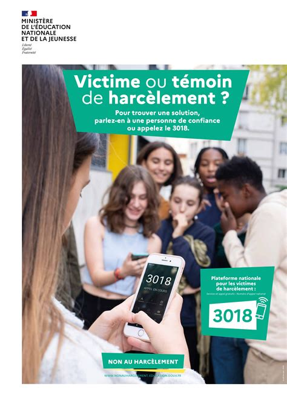

# Activité : Numérique et vie privée 

!!! note “Compétences”

    Interpréter 

!!! warning “Consignes”

    1. Pour chacune des situations du doc 1, dire s'il sa'agit de cyberharcélement
    2. Que faire en cas de cyberviolence ?
    3. Comment les cookies peuvent-ils être une menace à la vie privée
    
    
??? bug “Critères de réussite”
    - 

**Document 1 Cyberviolence**

pourcentage cyberviolence (1/4 collégiens) harcélement 1/5 collégien en 2021-2022

video sur lumni
https://www.lumni.fr/video/cyberharcelement

**Document 2 Des situations de cyberviolence ?**

Dire une fois à quelqu’un que vous n’êtes pas d’accord avec lui.

Se regrouper avec des ami(e)s pour se moquer d’une personne.

Diffuser des vraies photos de quelques sans lui demander sans accord

Faire des commentaires sur une photo en évitant d’être désagréable.

Faire un commentaire désagréable à chaque fois que l’on parle d’une personne

Créer un groupe pour s’entraider. 

Utiliser le compte de quelqu’un d’autre et en profiter pour insulter tout le monde en se faisant passer pour lui.

**Document 3 Cookies et traces sur internet**

https://www.lumni.fr/video/donnees-personnelles-et-reseaux-sociaux

