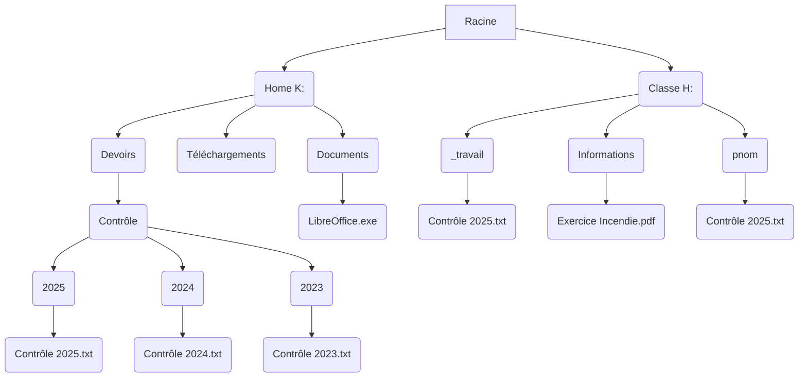

# Activité : Exercices d’application

## Exercice 1 : Moyens de stockage

!!! note "Compétences"

    Trouver et utiliser des informations 

!!! warning "Consignes"

    1. Vous avez un document de 3500 Mo à enregistrer , vous devez choisir un moyen de stokage pour le sauvegarder. Quel objet faut-il utiliser ? 

| Nom de l’objet  | Taille  |
|--|--|
| Clé USB | 64Go   |
| CD | 700 Mo|
| Disque externe | 500 Go |

## Exercice 2 : Arborescences des données

!!! note "Compétences"

    Trouver et utiliser des informations 

!!! warning "Consignes"

    1. Donner le chemin d'accès où se trouve le fichier nommé "Exercice Incendie.png"
    2. Quel fichier du contrôle 2025 a été complété et rendu par l'élève. Indiquer le chemin complet.

**Document 1 Un système d'information du collège**

{: style="width:800px"}
Contrôle

Le collège a un réseau informatique comportant des espaces de stockage.

Trois répertoires sont à votre disposition.

L’espace personnel (lecteur K:) qui n’est accessible que par l'utilisateur.

L’espace de travail (lecteur H:) contient deux répertoires :
- un répertoire « _travail » : où les enseignants peuvent déposer un document. Les élèves n’ont que le droit en lecture sur ce répertoire et ne peuvent donc pas modifier les documents présents.
Le répertoire de l’élève « identifiant_eleve » : l’élève peut y sauvegarder ses travaux. Ce dossier est accessible en lecture et écriture par l’ensemble des professeurs de la classe. 

## Exercice 3 : Sécurité informatique

!!! note "Compétences"

    Trouver et utiliser des informations 

!!! warning "Consignes"

    1. Indiquer les mots de passse qui vous semblent les plus appropriés dans le document 1
    2. Indiquer où est ce que l'on peut télécharer le logiciel VLC sans risque de malware. 

**Document 1 Mots de passe**

Une élève nommée Idia et née le 07072012 veut choisir un mot de passe dans cette liste :

- password
- Xb2Rs583TksuR8
- hakimi
- lesmureaux78
- F25vw
- #q;6ieR28V
- 07072021
- Idia78
- able-skating-rubbed-octopus
- i-have-a-dream

**Document 2 Source possibles pour télécharger le logiciel VLC**
 
Si on recherche sur un moteur de recherche à télécharger le logiciel VLC de Videolan, on obtient les résultats suivants.

 

## Exercice 3 : Cyberviolence

!!! note "Compétences"

    Trouver et utiliser des informations 

!!! warning "Consignes"

    1. Pour chacune de ces situations indiquer s'il s'agi de cyberviolence.

**Document 4 Des situations de cyberviolence ?**

Dire une fois à quelqu’un que vous n’êtes pas d’accord avec lui.

Se regrouper avec des ami(e)s pour se moquer d’une personne.

Diffuser des vraies photos de quelques sans lui demander sans accord

Faire des commentaires sur une photo en évitant d’être désagréable.

Faire un commentaire désagréable à chaque fois que l’on parle d’une personne

Créer un groupe pour s’entraider. 

Utiliser le compte de quelqu’un d’autre et en profiter pour insulter tout le monde en se faisant passer pour lui.

