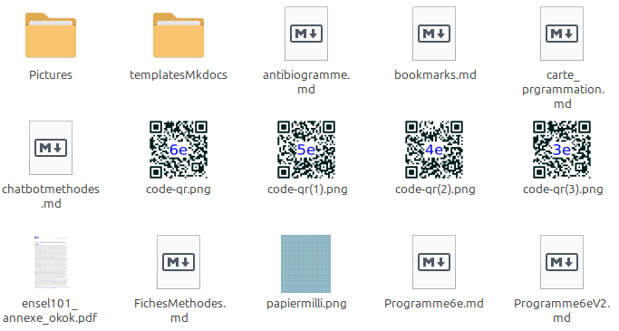
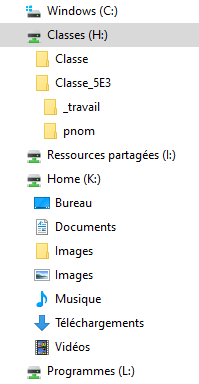

# Activité : Les données informatiques des systèmes d'informations. 

!!! note "Compétences"

    Trouver et exploiter des informations 

!!! warning "Consignes"

    1. À partir de l'image du document 2, indiquer quels sont les 3 moyens d'identifier un fichier.
    2. Classer par taille croissante les moyens de stockage.
    3. Parmi les chemins du document 4, lequel correspond au fichier de l'image. Indiquer le dossier, le sous dossier, le nom du fichier et l'extension
    4. A partir des informations du document 5 :
    
    - indiquer où l'enseignant peut déposer un fichier pour vous.
    - indiquer où vous pouvez déposer un fichier sans que personne d'autre ne le voit
    - indiquer où déposer un fichier pour le rendre à un enseignant.
    
??? bug "Critères de réussite"
    - 

**Document 1 les données informatiques**

La quantité d'information contenue dans un fichier correspond à sa taille.
La taille d'un fichier informatique est mesuré en octet (o) qui correspond à 8 bits. (de manière simplifiée un bit correspond à 0 ou 1).
Tous les fichiers portent un nom et sont présents dans un dossier du système d'informations.
Le format de fichiers peut varier :
- Format texte (txt, odt, docx ...)
- Format image (png, bmp, jpg ...)
- Format vidéo (mpeg, mp4, mkv ...)
- Format audio (mp3, wav, midi ...)
Il existe énormément de types de fichiers différents.

Les unités de tailles les plus courantes :
1 ko = 1000 o
1 Mo = 1000 ko
1 Go = 1000 Mo
1 To = 1000 Go

**Document 2 Des fichiers informatiques**

**Document 3 Des supports de stockage**

<table markdown><thead><tr><th>Supports</th><th>Capacité</th><th>Photo</th></tr></thead>
<tbody markdown>
<tr markdown><td>Disque dur </td><td>1 To</td><td markdown>{:style="height:200px; "} </td></tr>
<tr markdown><td>disquette 3,5 pouce </td><td>1,4 Mo</td><td markdown>{:style="height:200px; "} </td></tr>
<tr markdown><td>DVD</td><td>4,7 Go</td><td markdown>{:style="height:200px; "} </td></tr>
<tr markdown><td>Clé USB </td><td>64 Go</td><td markdown>{:style="height:200px; "} </td></tr>
<tr markdown><td>Blu-ray </td><td>100 Go</td><td markdown>{:style="height:200px; "} </td></tr>
<tr markdown><td>CD </td><td>700 Mo</td><td markdown>{:style="height:200px; "} </td></tr></tbody></table>

**Document 4 : des chemins dans l'arborescence dans un système d'information.**

**Sous un ordinateur Linux macOS**

- /home/prof/Téléchargement/vacances.pdf
- /home/prof/Téléchargement/vacances.png
- /home/prof/Archives/vacances.pdf
- /home/prof/Photos/listePhoto.csv
- /home/prof/Documents/parcours.odt
- /home/prof/Musiques/générique.mp3
- /home/prof/Vidéos/souvenirs.mp4

**Sous un ordinateur Windows**

- c:\prof\Téléchargement\vacances.pdf
- c:\prof\Téléchargement\vacances.png
- c:\prof\Archives\vacances.pdf
- c:\prof\Photos\listePhoto.csv
- c:\prof\Documents\parcours.odt
- c:\prof\Musiques\générique.mp3
- c:\prof\Vidéos\souvenirs.mp4

**Document 5 Un système d'information du collège**

Le collège a un réseau informatique comportant des espaces de stockage.

Trois répertoires sont à votre disposition.

L’espace personnel (lecteur K:) qui n’est accessible que par l'utilisateur.

L’espace de travail (lecteur H:) contient deux répertoires :
- un répertoire « _travail » : où les enseignants peuvent déposer un document. Les élèves n’ont que le droit en lecture sur ce répertoire et ne peuvent donc pas modifier les documents présents.
Le répertoire de l’élève « identifiant_eleve » : l’élève peut y sauvegarder ses travaux. Ce dossier est accessible en lecture et écriture par l’ensemble des professeurs de la classe. 

