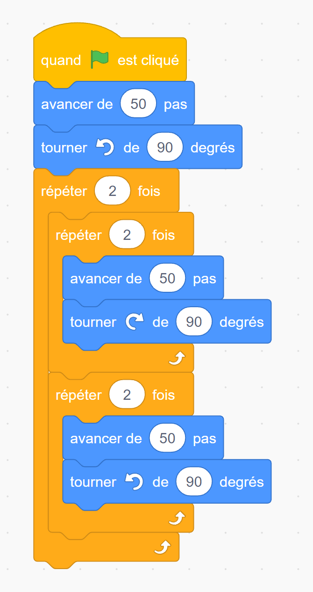
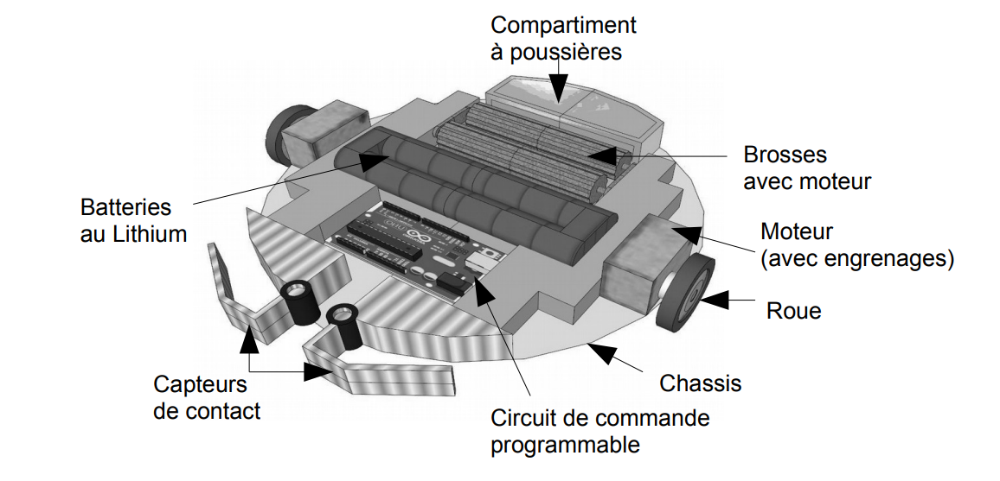
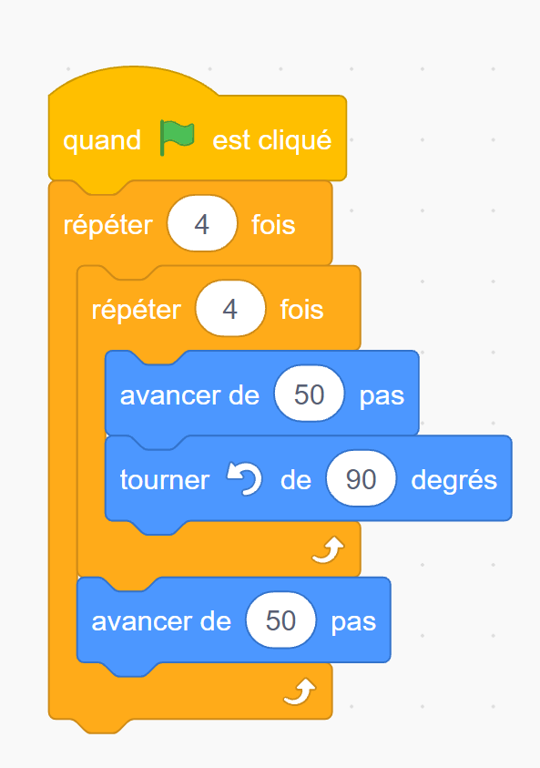

# Activité : Étude d’objets programmés, le cas d'un robot aspirateur

!!! note Compétences

    - Trouver et utiliser des informations
    - Passer d'un langage à un autre.

!!! warning Consignes

    1. Relier la fonction technique de l’objet étudié avec la solution technique retenue dans le document 4
    2. Dessiner le parcours correspondant au programme du document 5. On prendra une échelle de 10 pas pour 1 mm
    3. Compléter l'algorigramme du document 6

??? bug Critères de réussite
    - 

**Document 1 Projet Roobs**

Le projet de robot aspirateur Roobs est en phase de conception pour la société Clean’up. Ce robot devra être capable de se déplacer rapidement en évitant les obstacles et d’aspirer les poussières sur le sol lors de son passage.

L’aspiration des poussières est assurée par la rotation de deux brosses cylindriques animées d’un mouvement de rotation grâce à un moteur à courant continu. Ces dernières déposent les poussières dans un compartiment. Le compartiment à poussière a une taille limitée et un capteur est prévu pour prévenir l’utilisateur lorsque le niveau maximum de poussière est atteint (l’aspirateur s’arrête et déclenche un signal sonore).

Le déplacement du robot est assuré par deux moteurs à courant continu. Ils transmettent le mouvement de rotation à des roues en caoutchouc à l’aide d’engrenages en silicone. Le robot fonctionne à l’aide de batteries rechargeables au lithium basse tension 12V.

**Document 2 Exemple de programme et le résultat du parcours**

{: style="width:200px;"}

{: style="width:150px;"}

**Document 3 Vue interne du robot aspirateur**

{: style="width:600px;"}

**Document 4 Solutions techniques adoptées**

<table>
<thead>
  <tr>
    <th colspan="2"> Fonction technique </th>
    <th colspan="2"> Solution technique </th>
  </tr>
</thead>
<tbody>
  <tr>
    <td> 			Se déplacer </td>
    <td> 			 	O			 			 		</td>
    <td> 			 	O			 			 		</td>
    <td> 			Le capot 		</td>
  </tr>
  <tr>
    <td> 			Détecter des obstacles 		</td>
    <td> 			 	O			 			 		</td>
    <td> 			 	O			 			 		</td>
    <td> 			Le moteur et les roues 		</td>
  </tr>
  <tr>
    <td> 			Stocker 			de l’énergie 		</td>
    <td> 			 	O			 			 		</td>
    <td> 			 	O			 			 		</td>
    <td> 			Le 			châssis 		</td>
  </tr>
  <tr>
    <td> 			Protéger 			les composants 		</td>
    <td> 			 	O			 			 		</td>
    <td> 			 	O			 			 		</td>
    <td> 			Le 			capteur avant 		</td>
  </tr>
  <tr>
    <td> 			Tenir 			les éléments 		</td>
    <td> 			 	O			 			 		</td>
    <td> 			 	O			 			 		</td>
    <td> 			Les 			brosses rotatives 		</td>
  </tr>
  <tr>
    <td> 			Aspirer 			la poussière 		</td>
    <td> 			 	O			 			 		</td>
    <td> 			 	O			 			 		</td>
    <td> 			La 			batterie 		</td>
  </tr>
  <tr>
    <td> 			Allumer 			/ éteindre l’aspirateur 		</td>
    <td> 			 	O			 			 		</td>
    <td> 			 	O			 			 		</td>
    <td> 			L’interrupteur 			sur le capot 		</td>
  </tr>
</tbody>
</table>

**Document 5 Exemple de programme**

{: style="width:300px;"}

**Document 6 Algorigramme du robot aspirateur**

{: style="width:400px;"}

