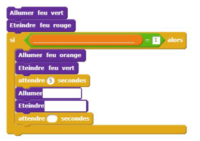
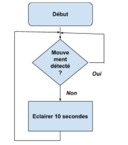
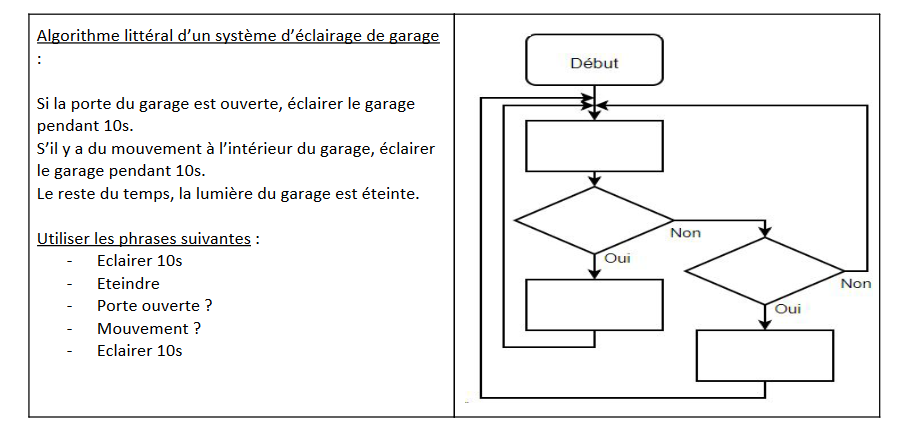

# Activité : Exercices d'entraînement

!!! note Compétences

    - Trouver et utiliser des informations
    - Passer d'un langage à un autre.
    
??? bug Critères de réussite

## Exercice 1

!!! warning Consignes

    1. Compléter la programmation en blocs suivant en fonction du besoin et de l’algorithme
    
    2. Que faut-il ajouter pour que cet algorithme fonctionne en permanence ?

On souhaite créer un feu de carrefour intelligent avec un appel piéton. Ce feu doit suivre l'algorithme suivant. 

Algorithme : Le feu vert reste tout le temps allumé, si un piéton appuie sur un appel piéton (la valeur du bouton passe à 1, le temps de l'appui), le feu passe à l’orange 5 secondes, puis rouge pendant 60 secondes. Ensuite, le feu repasse au vert.

## Exercice 2

!!! warning Consignes
    1. Quelle est la condition de cet algorigramme ? 
    2. Quels sont les 2 cas possibles de la condition ? 
    3. Quelle est l’action à réaliser ? 
    4. Que se passe-t-il après l’action ? 

## Exercice 3 

!!! warning Consignes
    Indiquer pour chacun de ces exemples s'il s'agit d’un algorithme littéral, d’un algorigramme ou d’une programmation en blocs.

## Exercice 4

!!! warning Consignes
    1. Compléter l’algorigramme
    2. Compléter la programmation en blocs à l’aide de l'algorithme littéral.
    Utiliser les termes suivants : Éclairer, éteindre le garage, 10s, Capteur de porte, Mouvement, Ouverte, Capteur de mouvement, 10 s

Algorithme littéral :
Si la porte du garage est ouverte, éclairer le garage pendant 10s. 
S’il y a du mouvement à l’intérieur du garage, éclairer le garage durant 10s. 
Le reste du temps, la lumière du garage est éteinte.

## Exercice 5

!!! warning Consignes
    Consigne : Dessiner le parcours d’un robot suivant le programme ci-dessous. Échelle 10 pas = 1 mm.
    
