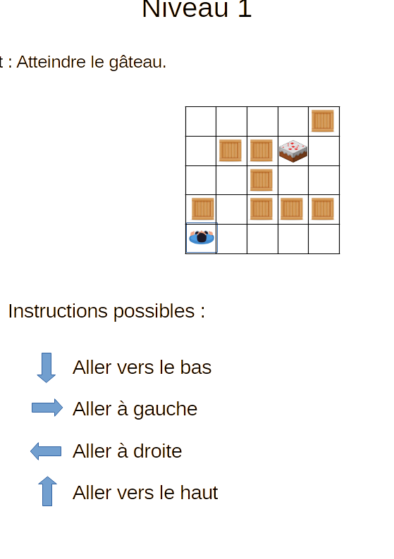
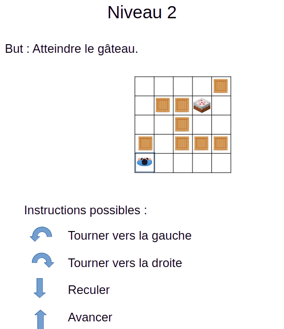
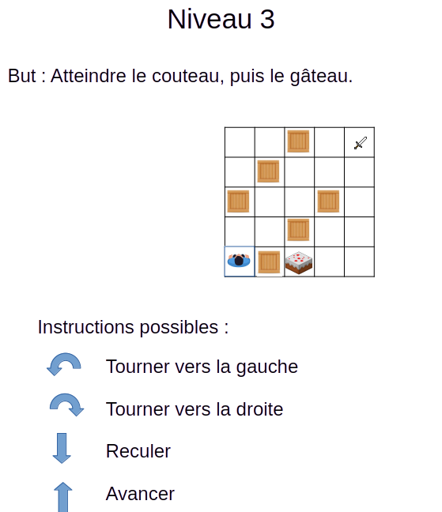
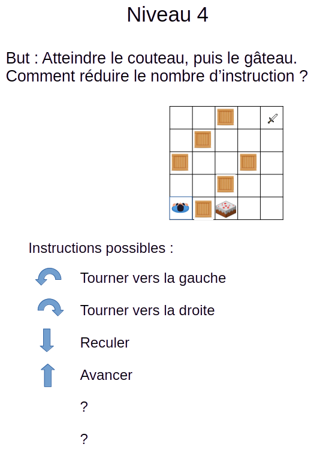
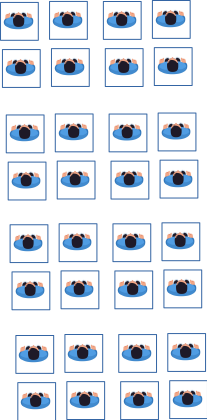

# Activité : Initiation aux algorithmes

!!! note "Compétences"

    Appliquer les principes élémentaires de l’algorithmique et du codage à la résolution d’un problème simple.

!!! warning "Consignes"
    
    Pour les 4 niveaux, écrire la séquence d'instruction à donner à la personne pour atteindre son but.

??? bug "Critères de réussite"
    - 

