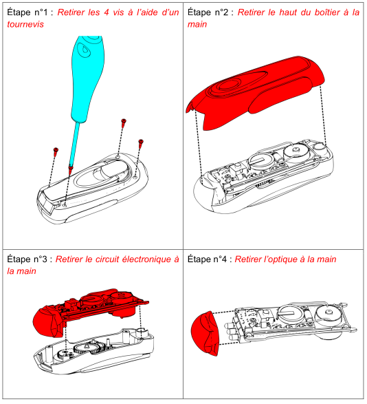

# Activité : Recherche de panne et réparation

!!! note "Compétences"

    - Repérer visuellement une pièce défectueuse
    - Réaliser une réparation en suivant un protocole fourni

!!! warning "Consignes"

    Pour chaque OST, indentifier la panne et suivre le protocole de réparation. Recopier et compléter le tableau au fur et mesure des répartion
    
??? bug "Critères de réussite"
    - 

**Document 1 Bien réparer**

Pour réparer les OST, il est nécessaire de suivre un protocole précis et de bien utiliser les outils adéquats pour ne pas plus endommager l'objet.

Il est important d'être ordonné pour ne pas perdre de pièces et être capable remonter l'objet.

De plus, il faut appliquer des consignes de sécurité pour ne pas se blesser.

- Port d'équipement de protection individuel (EPI), lunettes, casque anti-bruit, gants, masque si l'on utilise des outils pouvant nous mettre en danger (perceuse, fer à souder)
- Débrancher les appareils électriques
- Garder la pièce aérée en cas d'émanations dangereuse (impression 3D, soudure)

**Document 2 récapitulatif des pannes**

| objet |  problème constaté  |  panne identifiée  | réparation effectuée |
|---|---|---|---|
| Ventilateur 1 |   |   |   |
| Ventilateur 2 |   |   |   |
| Ventilateur 3 |   |   |   |
| Ventilateur 4 |   |   |   |
| Ventilateur 5 |   |   |   |
| Lampe 3  |   |   |   |
| Lampe 5  |   |   |   |
| Lampe 6 |   |   |   |
| mBot |   |   |   |

