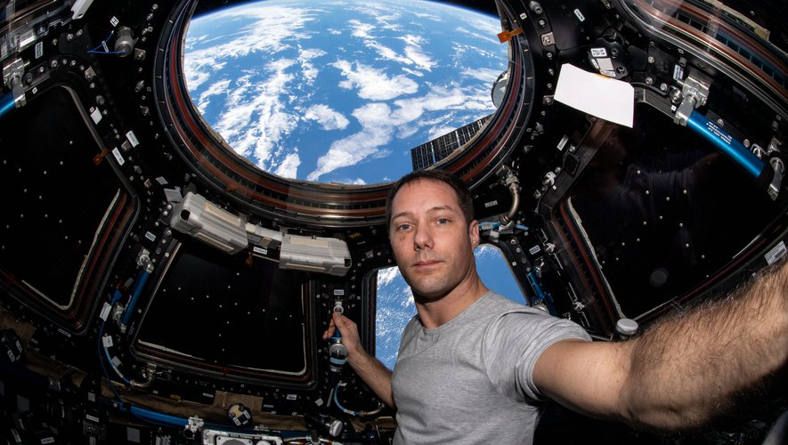

# Séquence : La Terre, une planète active qui abrite la vie

!!! note-prof
    si besoin d'infos

    
### Document d’appel :

Situation déclenchante : Photographie de Thomas Pesquet et de la Terre.

La planète Terre est la seule planète du système solaire à présenter de la vie.

!!! question "Problématique"
    Pourquoi ne peux pas vivre sur une autre planète? Quelles sont les conditions nécessaires à la vie?

## Séance 1 : Les conditions de vie sur Terre 

!!! question "Problématique"
    Pourquoi ne peux pas vivre sur une autre planète? Quelles sont les conditions nécessaires à la vie?

[Activité Condition nécessaire à la vie](../conditionVie)

??? abstract "Bilan"

    Pour pouvoir vivre sur une planète, il faut regrouper les conditions nécessaires au fonctionnement des cellules :
    • Une température adaptée (environ 15 degrés)
    • De l’eau à l’état liquide
    • Une atmosphère avec une couche d’ozone protectrice des mauvais rayons du soleil (Rayons Ultras Violets)
    La température d’une planète dépend de sa distance au Soleil et de la présence d’une atmosphère.
    Attention : le dioxygène n’est pas nécessaire à la vie ! (des bactéries anaérobies qui font de la fermentation ; bactérie dénitrifiante dans le cycle de l’azote (utilise l’azote à la place du dioxygène))

## Séance 2 : L'eau dans les êtres vivants

!!! question "Problématique"
    En quoi l’eau liquide est importante pour la vie ?

[Activité L’eau, un composant des êtres vivants](../VivantetEau)

??? abstract "Bilan"
    Tous les êtres vivants contiennent de l’eau à l’état liquide et ont besoin d’eau ou d’aliments contenant de l’eau.

## Séance 3 : Les besoins d'un végétal

!!! question "Problématique"
    Quels sont les besoins des plantes ?

[Activité Les besoins nutritifs des végétaux](../besoinVeg)

??? abstract "Bilan"
    Pour se grandir et se développer, les plantes ont besoin de lumière et de matière minérale (dioxyde de carbone, eau et sels minéraux). Les plantes sont des producteurs primaires : à partir de la matière minérale, elles vont fabriquer de la matière organique.
    
    La majorité des graines ont besoin d’eau et de chaleur pour germer.

    Définition :

    
    Germination : c’est la formation d’une nouvelle plante à partir d’une graine.

