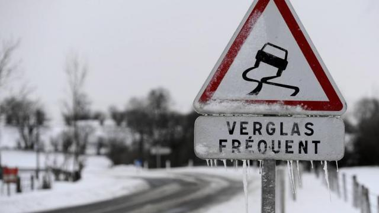

# Séquence : La Terre, une planète active qui abrite la vie

!!! note-prof
    si besoin d'infos

    
### Situation déclenchante :

Photographie de Thomas Pesquet et de la Terre.

La planète Terre est la seule planète du système solaire à présenter de la vie.

!!! question "Problématique"
    Pourquoi ne peux pas vivre sur une autre planète? Quelles sont les conditions nécessaires à la vie?

## Séance 1 : Les conditions de vie sur Terre 

!!! question "Problématique"
    Pourquoi ne peux pas vivre sur une autre planète? Quelles sont les conditions nécessaires à la vie?

[Activité Condition nécessaire à la vie](../conditionVie)

??? abstract "Bilan"

    Pour pouvoir vivre sur une planète, il faut regrouper les conditions nécessaires au fonctionnement des cellules :

    - Une température adaptée (environ 15 degrés)
    - De l’eau à l’état liquide
    - Une atmosphère avec une couche d’ozone protectrice des mauvais rayons du soleil (Rayons Ultras Violets)

    La température d’une planète dépend de sa distance au Soleil et de la présence d’une atmosphère.

    Attention : le dioxygène n’est pas nécessaire à la vie !

## Séance 2 : L'eau dans les êtres vivants

!!! question "Problématique"
    En quoi l’eau liquide est importante pour la vie ?

[Activité L’eau, un composant des êtres vivants](../VivantetEau)

??? abstract "Bilan"
    Tous les êtres vivants contiennent de l’eau à l’état liquide et ont besoin d’eau ou d’aliments contenant de l’eau.

## Séance 3 : La température de changement d'état

Le verglas est une couche de glace qui se forme sur le sol à une température inférieure à zéro degrés Celsius (°C). Chaque année, de nombreux accidents sont dus à la présence de verglas sur la route. Pour pallier ce problème, la neige est souvent déblayée et on projette du sel sur la route.

!!! question "Problématique"
    Pourquoi projeter du sel sur la route lorsqu’il y a du verglas ?

[Activité Les changement d'état de l'eau](../chgtEtatEau)

??? abstract "Bilan"

    L'état physique (solide, liquide ou gaz) d'un corps dépend de sa température.

    Le changement d’état d’un corps pur s’effectue à température constante, il y a un palier de température.
    La température du palier est appelée température de changement d'état.

    - 0°C, c’est la température de solidification de l’eau pure.
    - 100°C, c’est la température d’ébullition de l’eau pure.

    Durant les changement d'état de mélange, la température ne reste pas constante.

## Séance 4 : Les besoins d'un végétal

!!! question "Problématique"
    Quels sont les besoins des plantes ?

[Activité Les besoins nutritifs des végétaux](../besoinVeg)

??? abstract "Bilan"
    Pour se grandir et se développer, les plantes ont besoin de lumière et de matière minérale (dioxyde de carbone, eau et sels minéraux). Les plantes sont des producteurs primaires : à partir de la matière minérale, elles vont fabriquer de la matière organique.
    
    La majorité des graines ont besoin d’eau et de chaleur pour germer.

    Définition :

    
    Germination : c’est la formation d’une nouvelle plante à partir d’une graine.

