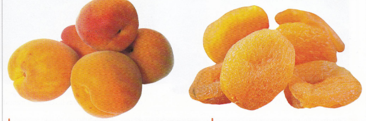
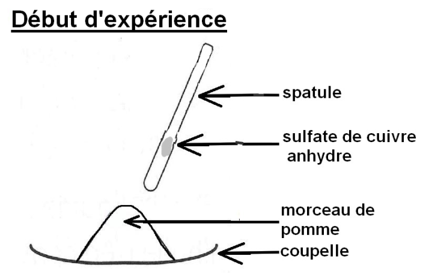

# Activité : L’eau, un composant des êtres vivants.

!!! note Compétences

    - Manipuler
    - Utiliser des outils mathématiques 

!!! warning Consignes

    1. Réaliser le protocole du document 1 et expliquer ce que l’on peut conclure.
    2. Faire un schéma des différentes étapes de l’expérience.
    3. Compare la masse d’un organisme frais et d’un organisme sans eau, calculer la quantité d’eau à l’intérieur.
    4. Expliquer en quoi l’eau est importante pour les êtres vivants.
    
??? bug Critères de réussite
    - 

**Document 1 : Expérience au sulfate du cuivre.**

Le sulfate de cuivre est normalement blanc, ou bleu très clair ; il se colore en bleu s’il est en contact avec de l’eau.

1. Mettre un morceau de pomme dans une coupelle
2. À l’aide d’une spatule, déposer une petite quantité de sulfate de cuivre anhydre sur le morceau de pomme.
3. Observer le résultat

**Document 2 : Composition des êtres vivants**

La masse d’un abricot frais est d’environ 96 g, la masse d’un abricot sec est d’environ 13 g.
Pour obtenir un abricot sec, il suffit d’éliminer l’eau liquide contenue dans des abricots frais en les chauffant sans les cuire.

**Document 3 : l’eau liquide et la vie.**

Certaines des transformations chimiques à l’intérieur des êtres vivants ne peuvent se faire que dans l’eau liquide.
Chez de nombreux êtres vivants, l’eau est un élément circulant permettant le transport de nutriments ou de déchets dans l’organisme. L’eau liquide est ainsi le principal élément du sang des animaux ou de la sève des végétaux.

??? note-prof
    