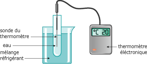
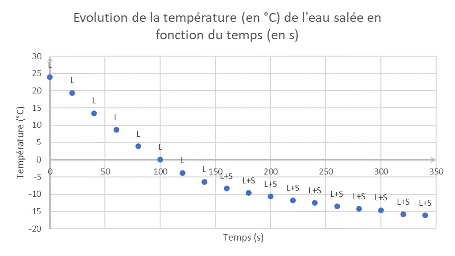
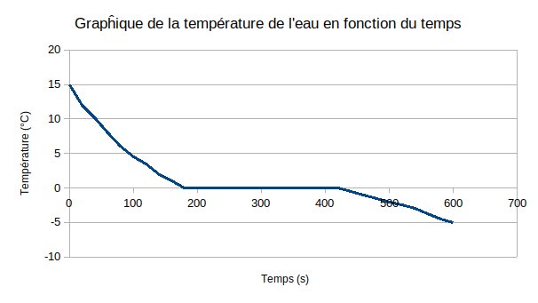

# Activité Les changement d'état de l'eau

!!! note "Compétences"

    - Manipuler
    - Interpréter

!!! warning "Consignes"
    1. Faire la manipulation du document 1 et compléter le tableau fourni
    2. Créer le graphique sur LibreOffice Calc en vous aidant du document 2
    3. Répondre aux questions du document 3
    4. Compléter la conclusion du document 4

??? bug "Critères de réussite"
    Aide 1 :

**Document 1 Etude de l'influence de la température sur l'eau**
On place dans un tube à essai, contenant de l’eau pure (environ 3cm de hauteur), dans un mélange réfrigérant (glace pilée + sel).

On observe l’état physique de l’eau contenue dans le tube à essai et on relève la température de l’eau pure, à intervalle de temps régulier.

**Document 2 Créer un graphique avec LibreOffice**

À l’aide du logiciel LibreOffice Calc, tracer la courbe d’évolution de la température en fonction du temps.

1. Ouvrir LibreOffice
2. Sélectionner Calc
3. Dans la colonne A, rentrer les valeurs de temps en secondes (s) toutes les 20s. Pour ça :
- Dans A1, rentrer 0
- Dans A2, rentrer 20
- Sélectionner les cellules A1 et A2 avec la souris
- En restant appuyé sur le carrée en bas à droite de la sélection, étendre la sélection vers le bas jusqu’à voir apparaître 900 (ce qui correspond à 15min)
- Relâcher 
1. Dans la colonne B, rentrer les valeurs de température en degrés Celsius (°C) correspondantes.

Le tableau réalisé sur Calc, il faut maintenant faire apparaître le graphique. 

1. Sélectionner les colonnes A et B
2. Cliquer sur Insertion puis Diagramme
3. Choisir le type de graphique « XY dispersion »
4. Dans « éléments du diagramme » :
- Titre : Évolution de la température (en °C) en fonction du temps (en s)
- Axe X : Temps (s)
- Axe Y : Température (°C)
- Décocher « afficher la légende
5. Cliquer sur Terminer

Une fois le graphique construit, appeler le professeur et lui demander de l’imprimer.

**Document 3 Analyse de l'influence de la température sur l'eau**

En observant le graphique, répondre aux questions suivantes : 

1. Comment évolue la température en fonction du temps ? 
2. Que fait la température lorsque l’eau liquide et l’eau solide sont présentes en même temps ? 
3. À quelle température l’eau pure a-t-elle commencé à se solidifier ? 
4. Quel est l’état physique de l’eau pure lorsqu’il fait -5°C ?

On réalise cette fois-ci l’expérience non plus avec de l’eau pure mais avec de l’eau salée et on obtient le graphique ci-contre. 

1. Observe-t-on la même évolution de température ? 
2. Quel est l’état physique de l’eau avec du sel lorsqu’il fait -5°C ?

**Document 4 Conclusion**
L’eau pure se solidifie à ….. °C. Lors d’un changement d’état physique, les températures restent ……….........… et forment un palier de température : il y a coexistence de deux états en même temps.
Pour un mélange, le palier de température disparaît.
On ajoute du sel sur les routes car cela permet de modifier la température de ………............. de l’eau qui n’est plus à 0°C, la rendant ainsi ………...........  

| Temps (en s) | Température (en °C) | État de l'eau | 
|---|---|---|
|     |     |     |
|     |     |     |
|     |     |     |
|     |     |     |
|     |     |     |
|     |     |     |
|     |     |     |
|     |     |     |
|     |     |     |
|     |     |     |
|     |     |     |
|     |     |     |
|     |     |     |
|     |     |     |
|     |     |     |
|     |     |     |
|     |     |     |
|     |     |     |
|     |     |     |
|     |     |     |
|     |     |     |
|     |     |     |
|     |     |     |
|     |     |     |
|     |     |     |
|     |     |     |
|     |     |     |
|     |     |     |
|     |     |     |
|     |     |     |
|     |     |     |
|     |     |     |
|     |     |     |
|     |     |     |
|     |     |     |
|     |     |     |
|     |     |     |
|     |     |     |
|     |     |     |
|     |     |     |
|     |     |     |
|     |     |     |
|     |     |     |
|     |     |     |
|     |     |     |
|     |     |     |
|     |     |     |
|     |     |     |

