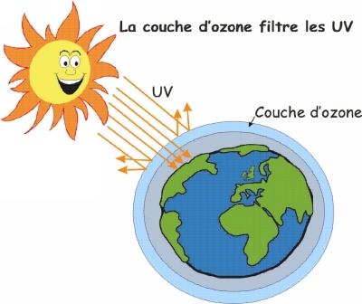

# Activité :  Les conditions nécessaires à la vie sur Terre

!!! note Compétences

    Trouver et utiliser des informations 

!!! warning Consignes
    Peut-on trouver de la vie sur Mercure, Vénus ou Mars ? Justifier.

??? bug Critères de réussite
    Aide 1 : Indiquer la particularité de la Terre qui a permis le développement de la vie.

    Aide 2 : Indiquer sont les paramètres qui influence la présence d’eau liquide d’une planète.

    Aide 3 : Indiquer sont les paramètres qui influence la température d’une planète.

    Aide 4 : Expliquer en quoi la couche d’ozone dans l’atmosphère favorise le développement de la vie.

**Document 1 : L’eau liquide et la vie**

Les scientifiques pensent qu’une succession de très nombreuses transformations chimiques est à l’origine de la vie. Or ces transformations peuvent se produire de façon simultanée dans l’eau à l’état liquide, mais pas dans d’autres liquides. L’eau à l’état liquide a donc sans doute été indispensable à l’apparition de la vie.
L’eau est très abondante dans l’univers, mais c’est souvent sous forme de glace ou de vapeur. L’eau à l’état liquide est rare ailleurs que sur notre planète.

**Document 2 : La température à la surface d’une planète.**

Pour qu’une planète possède de l’eau à l’état liquide à sa surface, il faut que la température permette à l’eau de se trouver à l’état liquide. Cela signifie que la température moyenne à la surface de la planète doit être supérieure à 0 °C.
La température de la surface d’une planète dépend notamment de l’énergie thermique qu’elle reçoit de son étoile. Plus elle est éloignée plus la quantité reçue est faible.

**Document 3 Comparaison des quelques astres du système solaire**

<table>
<thead>
  <tr>
    <th rowspan="2">Astres 		</th>
    <th rowspan="2">Distance au Soleil (millions de km) 		</th>
    <th rowspan="2"> Température moyenne de surface (°C) </th>
    <th colspan="3"> Présence d’eau actuelle </th>
    <th rowspan="2"> Présence d’une atmosphère (couche de gaz entourant la planète) </th>
  </tr>
  <tr>
  <th> Solide (glace) 		</th>
    <th> Liquide		</th>
  <th> Gaz (vapeur d'eau) 		</th>

  </tr>

  </thead>
  <tr>
    
    <th> 			Mercure 		</th>
    <td>58 		</td>
    <td> 			+180 		</td>
    <td> 					 		</td>
    <td> 					 		</td>
    <td> 					 		</td>
    <td> 					 		</td>
  </tr>
  <tr>
    <th> 			Vénus 		</th>
    <td> 108 </td>
    <td> 			+460 		</td>
    <td> 					 		</td>
    <td> 					 		</td>
    <td> 			x 		</td>
    <td> 			x 		</td>
  </tr>
  <tr>
    <th> 			Terre 		</th>
    <td> 			150 		</td>
    <td> 			+15 		</td>
    <td> 			x 		</td>
    <td> 			x 		</td>
    <td> 			x 		</td>
    <td> 			x 		</td>
  </tr>
  <tr>
    <th> 			Lune 		</th>
    <td> 			150 		</td>
    <td> 			−20 		</td>
    <td> 			x 		</td>
    <td> 					 		</td>
    <td> 					 		</td>
    <td> 					 		</td>
  </tr>
  <tr>
    <th> 			Mars 		</th>
    <td> 			228 		</td>
    <td> 			−50 		</td>
    <td> 			x 		</td>
    <td> 					 		</td>
    <td> 					 		</td>
    <td> 			x 		</td>
  </tr>
</tbody>
</table>

**Document 4 l’impact de l’ozone**

L’ozone est un gaz qui absorbe les UV (ultraviolet). Il est présent dans la haute atmosphère de la Terre où il forme une couche appelée « couche d’ozone ».
Or, les UV solaires à trop fortes doses sont mortels pour les êtres vivants aériens : ce sont des rayons qui transportent beaucoup d’énergie. L’eau liquide peut absorber les rayons UV.
De l’ozone a été détecté sur Vénus et sur Mars, mais en quantité très faible.

**Document 5 Une différence étonnante entre la Terre et la Lune**

La Terre et la Lune sont à la même distance du Soleil. Pourtant leurs températures moyennes sont différentes. En effet, la Terre possède une enveloppe gazeuse (atmosphère), contrairement à la Lune. Or, certains gaz (les gaz à effet de serre) composant cette atmosphère permettent de conserver la chaleur au lieu de la laisser s’échapper dans l’espace, c’est l’effet de serre. Parmi les planètes proches du Soleil c’est sur Vénus que l’effet de serre est le plus important car sot atmosphère est très riche en gaz à effet de serre.

??? note-prof "correction"
    Correction :
    1/On observe que sur Vénus (2e planète du système solaire), il fait + 460 °C, alors que sur Mars il ne fait plus que – 50 °C.
    Conclusion : plus la planète est éloignée du soleil, plus il y fait froid.
    2/Les êtres vivants sont tous composés d’une grande quantité d’eau. Ils ont donc besoin de la renouveler avec un apport d’eau, notamment un apport d’eau à l’état liquide.
    3/ D’après le schéma, on voit que la couche d’ozone renvoie une grande partie des rayons nocifs du soleil (UV). Elle protège donc les êtres vivants.
    4/ La position de la Terre dans le système solaire permet d’avoir une température adaptée à la présence d’eau sous ses 3 états, et adaptée au développement de la Vie.
    L’eau liquide est nécessaire au fonctionnement des êtres vivants.
    La couche d’ozone protège les êtres vivants d’une partie des mauvais rayons du soleil.