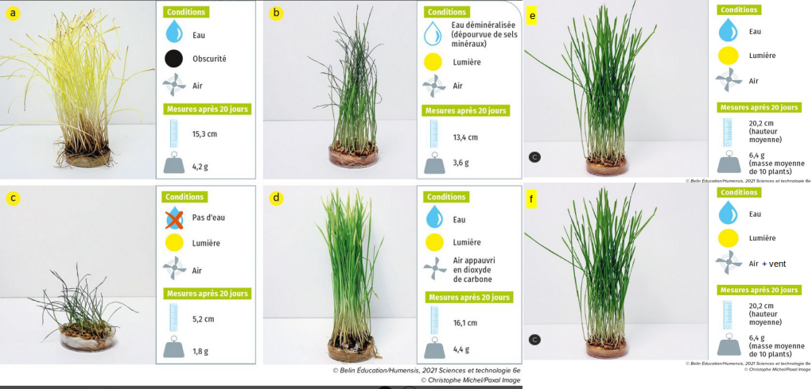

# Activité : Exercice sur les besoins des végétaux

!!! note "Compétences"

    - Interpréter des résultats et en tirer des conclusions

!!! warning "Consignes"

  1. Choisir deux manipulations qui permettent de vérifier que les plantes ont besoin de dioxyde de carbone justifier votre réponse.
  2. recopier et compléter le tableau du document 2 en utilisant les montages e et b.
  3. recopier et compléter le tableau du document 2 en utilisant les montages e et f.
        
??? bug "Critères de réussite"
    - 

**Document 1 : Photos de résultats de différents montages pour étudier les besoins des plantes.**

**Document 2 Compte-rendu d’une expérience**

<table style="width:700px;">
    <colgroup>
       <col span="1" style="width: 10%;">
       <col span="1" style="width: 45%;">
       <col span="1" style="width: 45%;">
    </colgroup>
<thead>
  <tr>
    <th> 			Problème 		</th>
    <th colspan="2"> 			 &nbsp;&nbsp;			 		 </th>
  </tr>
</thead>
<tbody>
  <tr>
    <td> 			Hypothèse 		</td>
    <td colspan="2"> 			 &nbsp;&nbsp;			 		 </td>
  </tr>
  <tr>
    <td> 			Protocole 		</td>
    <td> 			 &nbsp;&nbsp;			 		</td>
    <td> 			 &nbsp;&nbsp;			 		</td>
  </tr>
  <tr>
    <td> 			Résultats 			attendus 		</td>
    <td> 			 &nbsp;&nbsp;			 		</td>
    <td> 			 &nbsp;&nbsp;			 		</td>
  </tr>
  <tr>
    <td> 			Résultats 			observés 		</td>
    <td> 			 &nbsp;&nbsp;			 		</td>
    <td> 			 &nbsp;&nbsp;			 		</td>
  </tr>
  <tr>
    <td> 			Conclusion 		</td>
    <td colspan="2"> 			 &nbsp;&nbsp;			 		 </td>
  </tr>
</tbody>
</table>