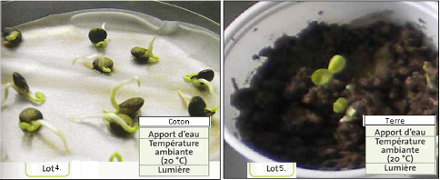

# Activité : Exercice sur les besoins des végétaux lors de la germination

!!! note Compétences

    - Interpréter des résultats et en tirer des conclusions

!!! warning Consignes

    À partir des documents, compléter; dans le document 3, l’analyse d’expérience du document 2
        
??? bug Critères de réussite
    - 

**Document 1 Une expérience sur la germination**

Des élèves ont voulu vérifier que la terre était nécessaire pour faire germer des graines. Pour cela, ils ont fait une expérience dans laquelle ils ont pris deux pots. Dans l’un des pots, ils ont mis de la terre et des graines, dans l’autre du coton et des graines. Ils ont ensuite arrosé les deux régulièrement.

**Document 2 Photos des résultats de germinations dans différentes conditions.**

**Document 3 Analyse de l’expérience.**

<table style="width:700px;">
    <colgroup>
       <col span="1" style="width: 10%;">
       <col span="1" style="width: 45%;">
       <col span="1" style="width: 45%;">
    </colgroup>
<thead>
  <tr>
    <th> 			Problème 		</th>
    <th colspan="2" > 			 &nbsp;&nbsp;			 		 </th>
  </tr>
</thead>
<tbody>
  <tr>
    <td> 			Hypothèse 		</td>
    <td colspan="2"> 			 &nbsp;&nbsp;			 		 </td>
  </tr>
  <tr>
    <td> 			Protocole 		</td>
    <td> 			 &nbsp;&nbsp;			 		</td>
    <td> 			 &nbsp;&nbsp;			 		</td>
  </tr>
  <tr>
    <td> 			Résultats 			attendus 		</td>
    <td> 			 &nbsp;&nbsp;			 		</td>
    <td> 			 &nbsp;&nbsp;			 		</td>
  </tr>
  <tr>
    <td> 			Résultats 			observés 		</td>
    <td> 			 &nbsp;&nbsp;			 		</td>
    <td> 			 &nbsp;&nbsp;			 		</td>
  </tr>
  <tr>
    <td> 			Conclusion 		</td>
    <td colspan="2"> 			 &nbsp;&nbsp;			 		 </td>
  </tr>
</tbody>
</table>
