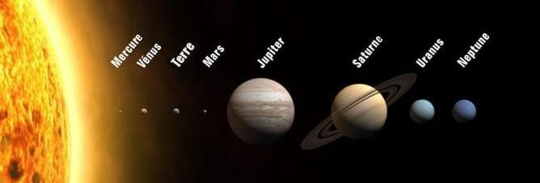

# Séquence : Les mouvement de la Terre
!!! note-prof
    si besoin d'infos

### 

    

## Séance 1 : Révolution et Rotation

La planète sur laquelle nous nous trouvons s’appelle la Terre. Elle fait partie d’un ensemble que l’on appelle système solaire. Huit planètes sont en orbite autour d’une étoile appelée Le Soleil. Ce sont les mouvements de la Terre autour du Soleil qui ont, pendant très longtemps, définit les mots tels que « jour » et « année ».

!!! question "Problématique"
    Comment a-t-on défini les principales unités temporelles ?

[Activité Révolution et rotation](../RevolRotation)

??? abstract "Bilan"
    Une année correspond au mouvement de révolution de la Terre autour du Soleil, du point de vue héliocentrique ;
    Un jour correspond au mouvement de rotation de la Terre par rapport à l’axe des pôles.
    La Terre tourne autour du Soleil, elle a un mouvement circulaire.

- Observer et identifier des situations où la vitesse d’un objet en mouvement par rapport à un observateur a une valeur constante ou variable.

## Séance 2 : Vitesse

Dans l’activité précédente, nous avons vu que la Terre se déplaçait selon une révolution autour du Soleil en une année, soit 365,25 jours et qu’un jour correspondait à une rotation de la Terre sur elle-même par rapport à ses pôles.

!!!question "Problématique"
    À quelle vitesse la Terre se déplace-t-elle ?

[Activité Vitesse](../Vitesse)

??? abstract "Bilan"
    La vitesse est une grandeur physique qui caractérise le mouvement d’un objet. 

    $v= distance \div temps$

    Un mouvement est caractérisé par sa trajectoire et sa vitesse.
    Si la trajectoire est une droite le mouvement est rectiligne
    Si la trajectoire est un cercle le mouvement est circulaire

    Si la vitesse est constante le mouvement est uniforme
    Si la vitesse diminue le mouvement est ralentie
    Si la vitesse augmente le mouvement est accélérée

 [Activité Exercices sur la vitesse](../VitesseExercices)
   

