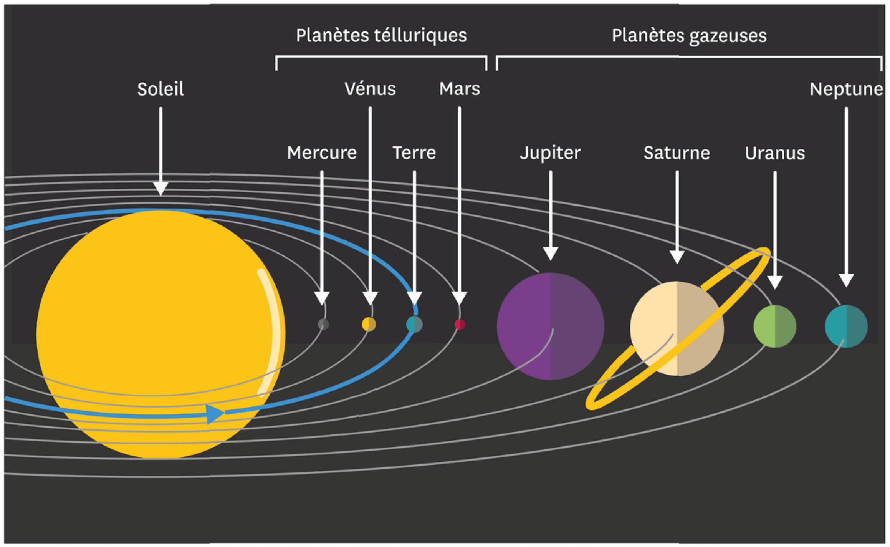
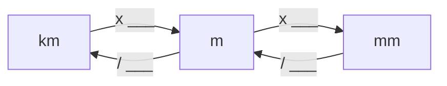

# Activité : Révolution et Rotation

!!! note "Compétences"
    - Utiliser l'outil numérique
    - Trouver et exploiter des informations

!!! warning "Consignes"
    Consigne 1 : À l’aide des réponses aux questions 1 et 2, donner une définition de « année ».  
    Consigne 2 : Comment appelle-t-on habituellement une rotation pour la Terre ?   
    Consigne 3 : En vous aidant des documents 4 et 5, compléter les cases manquantes des tableaux des documents 3 et 6.

!!! bug Critères de réussite
    - Définir ce qu'est une révolution
    - Définir ce qu'est une année
    - Définir ce qu'est une rotation
    - Définir ce qu'est une journée
    - Compléter les documents 4 et 5, pour aider aux conversions

**Document 1 le système solaire**

**Document 2 Définitions**

Révolution : temps que met une planète pour faire un tour complet autour du Soleil du point de vue héliocentrique.

Rotation : temps que met une planète pour tourner sur elle-même selon par rapport à ses pôles.

Modèle Héliocentrique : Point de vue de l'étude dss mouvements des planètes selon laquelle le Soleil est au centre et les planètes sont en mouvement autour de celui-ci.

**Document 3 Révolution des planètes du point de vue héliocentrique**

<table class="tg">
<thead>
  <tr>
    <th class="tg-0lax"></th>
    <th class="tg-0lax">Mercure 		</th>
    <th class="tg-0lax">Venus 		</th>
    <th class="tg-0lax">Terre </th>
    <th class="tg-0lax">Mars 		</th>
    <th class="tg-0lax">Jupiter 		</th>
    <th class="tg-0lax">Saturne 		</th>
    <th class="tg-0lax">Uranus 		</th>
    <th class="tg-0lax">Neptune 		</th>
  </tr>
</thead>
<tbody>
  <tr>
    <td class="tg-0lax">Révolution (en jours) 		</td>
    <td class="tg-0lax">87,96 		</td>
    <td class="tg-0lax">224,7 		</td>
    <td class="tg-0lax">365,25 		</td>
    <td class="tg-0lax"> 			687 		</td>
    <td class="tg-0lax"> 			 &nbsp;&nbsp;			 		</td>
    <td class="tg-0lax"> 			 &nbsp;&nbsp;			 		</td>
    <td class="tg-0lax">30589 		</td>
    <td class="tg-0lax"> 			 &nbsp;&nbsp;			 		</td>
  </tr>
  <tr>
    <td class="tg-0lax">Révolution (en année) 		</td>
    <td class="tg-0lax">			 		</td>
    <td class="tg-0lax"></td>
    <td class="tg-0lax">1 		</td>
    <td class="tg-0lax"> 		</td>
    <td class="tg-0lax">12 		</td>
    <td class="tg-0lax">30 		</td>
    <td class="tg-0lax"> 			   			 		</td>
    <td class="tg-0lax">165 		</td>
  </tr>
</tbody>
</table>

**Document 4 Conversion jour/année**

**Document 5 Conversion distance**

<table>
<thead>
  <tr>
    <th>km</th>
    <th>hm</th>
    <th>dam</th>
    <th>m</th>
    <th>dm</th>
    <th>cm</th>
    <th>mm</th>
  </tr>
</thead>
<tbody >
  <tr style="height:30px">
<td> </td>
<td> </td>
<td> </td>
<td> </td>
<td> </td>
<td> </td>
<td> </td>

  </tr>
    <tr style="height:30px">
<td></td>
<td></td>
<td></td>
<td></td>
<td></td>
<td></td>
<td></td>

  </tr>
    <tr style="height:30px">
<td></td>
<td></td>
<td></td>
<td></td>
<td></td>
<td></td>
<td></td>

  </tr>
  <tr style="height:30px">
<td></td>
<td></td>
<td></td>
<td></td>
<td></td>
<td></td>
<td></td>

  </tr>
</tbody>
</table>

**Document 6 : Distance des planètes telluriques par rapports au Soleil**

<table>
<thead>
  <tr>
    <th> 			</th>
    <th> Mercure</th>
    <th>Venus</th>
    <th>Terre 		</th>
    <th> Mars </th>
  </tr>
</thead>
<tbody>
  <tr>
    <td>Distance (en kilomètre) 		</td>
    <td>4880 		</td>
    <td> 			</td>
    <td> 			</td>
    <td> 6805 		</td>
  </tr>
  <tr>
    <td>Distance	(en mètre) 		</td>
    <td> 			 		</td>
    <td> 12104000 		</td>
    <td>12756000 		</td>
    <td></td>
  </tr>
</tbody>
</table>