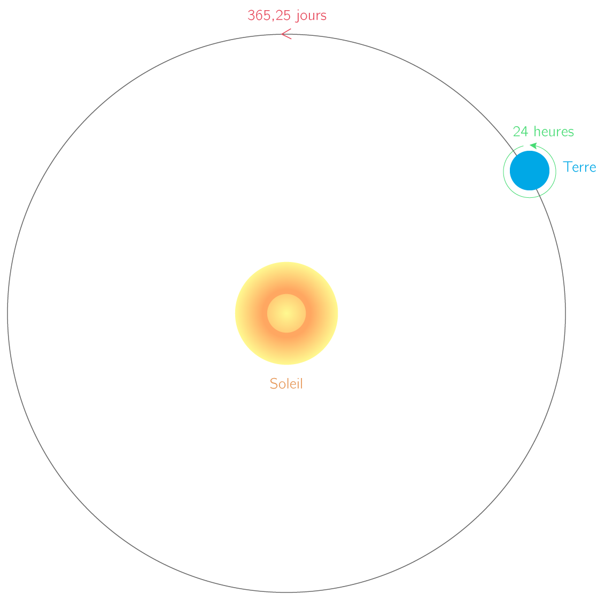
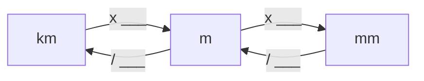

# Activité : Vitesse

!!! note "Compétences"
    - Utiliser l'outil numérique
  
!!! warning "Consignes"
    Consigne : Calculer la vitesse de la Terre en km/h durant sa révolution. 
    
!!! bug "Critères de réussite"
    - Trouver combien il y a d'heure dans une année
      - Trouver le nombre de jour dans une année
      - Trouver le nombre d'heure dans un jour
    - Convertir la distance parcourue par la Terre pendant une année en kilomètre (km)

**Document 1 : La vitesse, définition**

La vitesse est une grandeur physique qui caractérise le mouvement d’un objet. Elle est définie comme étant le quotient entre la distance parcourus et la durée du trajet, telle que 

$v= distance \div temps$

Si la distance est en kilomètre (km) et le temps en heure (h), alors la vitesse sera en kilomètre par heure (km/h).

**Document 2 Point de vu d’un observateur de la Terre autour du Soleil.**

{: style="width:300px"}

**Document 3 : Le mouvement de la Terre autour du Soleil**

Le mouvement d’un objet est défini comme étant l’association d’une trajectoire et d’une vitesse. La Terre a une trajectoire qui est un cercle dans le référentiel héliocentrique. Elle parcourt 942 000 000 000 m en une année. Sa vitesse est constante tout au long de son parcours. On dit alors que le mouvement de la Terre est circulaire uniforme par rapport à un observateur (doc2).

**Document 4 Conversion de temps**

**Document 5 Conversion distance**

