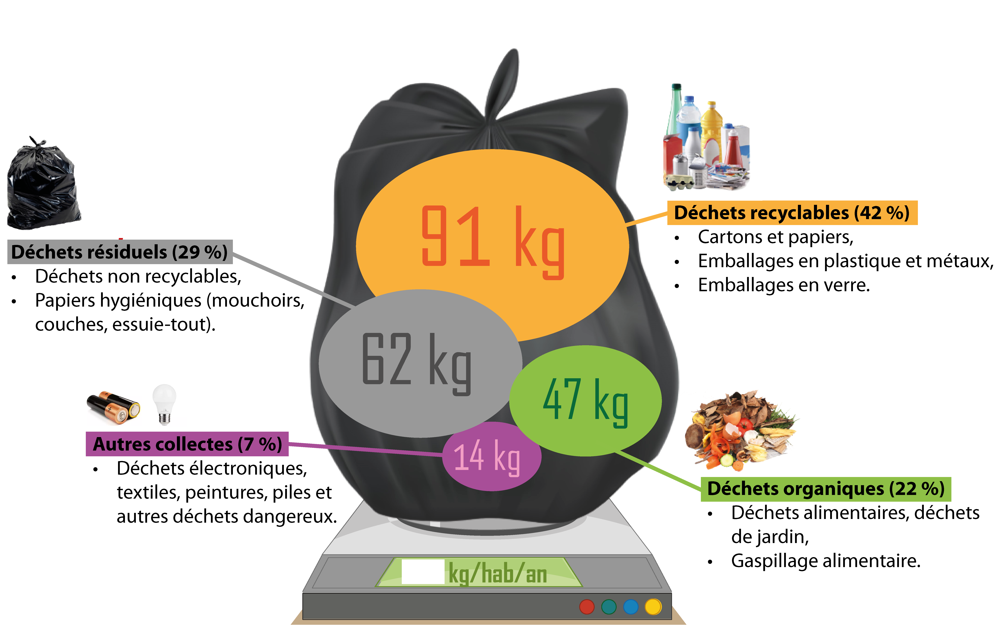

# Activité : Importance du tri des déchets

!!! note Compétences
    - Interpréter des résultats de façon raisonnée et en tirer des conclusions en mobilisant des arguments scientifiques.  
    - Relier des connaissances acquises en sciences et technologie à des questions de santé, de sécurité et d’environnement.

!!! warning Consignes

    Consigne 1 : Comparer la masse de déchets qui va être envoyé en déchetterie avec et sans tri.  
    Consigne 2 : Expliquer ce que deviennent les déchets au cours du temps.  
    Consigne 3 : À partir de vos deux réponses précédentes, expliquer pourquoi il est important de trier ces déchets correctement.  
    Consigne 4 : Expliquer pourquoi on retrouve peu de restes d’êtres vivants ou d’aliments dans les paysages.

??? bug Critères de réussite
    - avoir pesé le sac non trié puis le sac trié
    - avoir écrit une phrase comparant les deux masses.
    - avoir comparé les temps de décomposition des différents déchets
    - avoir expliqué le problème lors de la dégradation de certains objets.

**Document 1 les éléments d'une poubelle**

**Document 2 Consigne de tri.**

<figure markdown style=" float: left; margin-right:5px; margin-top:0px">
  {: style="width:500px" }
</figure>

Beaucoup d’objets ne vont pas à la poubelle, mais doivent être rapportés dans des bacs spéciaux pour être traités et recyclés, c'est le cas des appareils électroniques, des vêtements et de la peinture. 

Les déchets verts peuvent être mis dans des composteurs pour faire de l'engrais.

**Document 3 Dégradation et pollution.**

Lors de leur dégradation, les objets libèrent des éléments qui peuvent polluer les sols et les eaux.
C’est le cas des piles qui peuvent libérer des liquides extrêmement nocifs, mais c’est aussi le cas des plastiques qui lors de leur décomposition libèrent des micro-particules de plastiques. Ces toutes petites particules peuvent s’accumuler dans les êtres vivants (comme les humains) et entraîner des problèmes de santé.

**Document 4 Temps de décomposition**

| Type de déchets                          | Temps de dégradation |
| ---------------------------------------- | -------------------- |
| Mouchoir en papier, épluchures de pommes | 3 mois               |
| Journaux, ticket de bus                  | 1 an                 |
| Chewing-gum, papier bonbon, brique soupe | 5 ans                |
| Débris en bois                           | 15 ans               |
| Boîte de conserve, Canette en aluminium  | 100 ans              |
| Couche jetable                           | 400 ans              |
| Bouteille en plastique                   | 500 ans              |
| Verre                                    | 4000 ans             |

