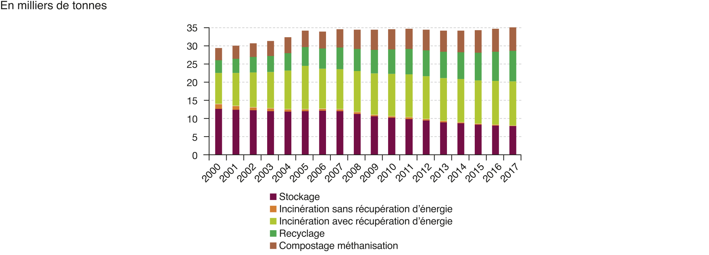
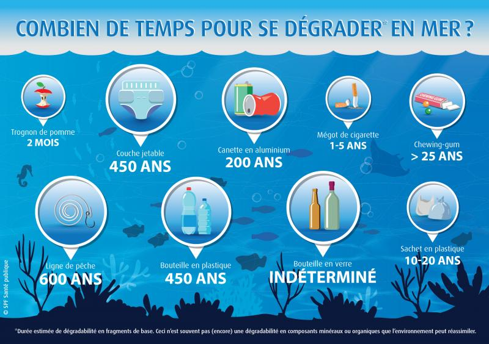

# Séquence : Propriété de la matière.

!!! note-prof

## Séance 1 : Décomposition de la matière

    
### Document d’appel :

{: style="width:600px"}
{: style="width:900px"}
{: style="width:600px"}

{: style="width:600px"}

!!! question Problématique
    Pourquoi le tri des déchets est-il si important ?

[Activité sur la décomposition des matériaux](../Decomposition)

!!! note-prof
    Préparer un sac poubelle avec :

    - pot en verre
    - boite œuf
    - pot yaourt
    - mouchoir/sopalin
    - pain
    - canette
    - emballage pompote
    - morceau de tissu
    - coquille œuf
    - couche ?
    - piles
    - jeu électronique

??? abstract "Bilan"
    La matière se décompose avec le temps.
    La vitesse de décomposition est très différente d’un objet à l’autre. Les objets composés de matière organiques se décomposent plus rapidement que les déchets composés de matière minérale, sauf les matières plastiques qui se décomposent très lentement.

    Les déchets peuvent s’accumuler et de nombreux déchets mettent des centaines d’années à se décomposer, s’ils sont jetés n’importe comment ils vont s’accumuler et polluer les écosystèmes

## Séance 2 : Propriétés de la matière

!!! note "Compétences"
    - Interpréter des résultats de façon raisonnée et en tirer des conclusions en mobilisant des arguments scientifiques.  
    - Relier des connaissances acquises en sciences et technologie à des questions de santé, de sécurité et d’environnement.

### Document d’appel :
Sarah et Sofiane préparent un gâteau au
caramel.

Ils ont deux cuillères, une en métal et l'autre en bois, Sofiane indique que celle en bois est moins dangereuse.  

 

Quelle cuillère utiliser pour ne pas se brûler ?

!!! question "Problématique"
    Comment les propriétés des matériaux peuvent influencer leur utilisation ?

[Activité sur les propriétés des matériaux](../Proprietes)

??? abstract "Bilan"
    Les matériaux peuvent être caractérisés par leurs propriétés : conductivité thermique, conductivité électrique, magnétisme, etc.

    On observe que chaque échantillon de matière n’aura pas les mêmes propriétés, cela montre une **grande diversité de la matière.

