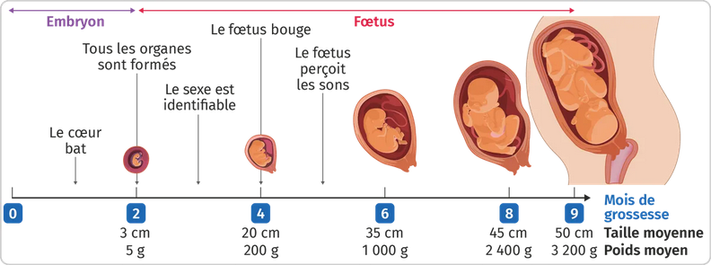
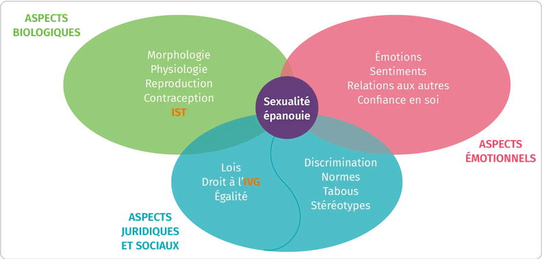

# Séquence : Reproduction humaine et sexualité

!!! note-prof
    - Caractériser les modifications morphologiques, comportementales et physiologiques de la puberté.
    - Connaître et localiser les principaux organes de l’appareil reproducteur des êtres humains en les associant à leurs fonctions.
    - Caractériser les processus impliqués dans la reproduction humaine, en particulier la fécondation interne et le développement vivipare impliquant des échanges placentaires.
    - Distinguer la notion de reproduction de celle de sexualité humaine (définie dans ses différentes dimensions).

    
### Document d’appel :

## Séance 1 : La puberté

!!! question Problématique
    Comment se manifeste la puberté ?

[Activité La puberté](../puberte)

??? abstract Bilan
    Un être humain devient capable de se reproduire à partir de la puberté, car les organes reproducteurs deviennent fonctionnels et produisent des cellules reproductrices.

    Lors de la puberté, le corps subit des transformations, ce sont les caractères sexuels secondaires.
    Lors de la puberté, il y a aussi des changements de comportement.

    L’âge de la puberté n’est pas le même pour tout le monde.
    
    Les cellules reproductrices sont les spermatozoïdes (cellule reproductrice de l’homme) et les ovule (cellule reproductrice de la femme).

## Séance 2 : Reproduction et grossesse

!!! question Problématique
    Comment se développent les êtres humains ?
    
[Activité Le développement des êtres humains](../repro)

??? abstract Bilan
    

    L'embryon se forme lors de la fécondation qui est la rencontre d’un spermatozoïde (cellule reproductrice de l’homme) et d’un ovule (cellule reproductrice de la femme).

    L'embryon se développe dans l'utérus de la femme. L'espèce humaine est vivipare

    La grossesse dure pendant 9 mois. À partir de la 8e semaine, tous les organes de l’embryon sont formés, on l’appelle alors fœtus. 

    L'embryon et sa mère ont des échanges au niveau du placenta (qui est relié par le cordon ombilical), cela permet d'obtenir les éléments indispensables et d'évacuer les déchets.

## Séance 3 : Sexualité

    

??? abstract Bilan
    Chez les êtres humains, la sexualité n'est pas qu'une affaire de reproduction : elle prend en compte les aspects biologiques, mais aussi les aspects émotionnels, juridiques et sociaux

## Séance 4 : Exercices

[Activité Exercice la puberté](../exoPuberte)
