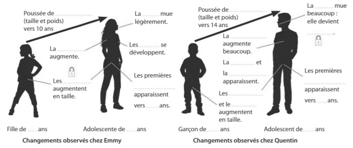

# Activité : La puberte Escape Game

!!! note "Compétences"

    Trouver et exploiter des informations 

!!! warning "Consignes"

    1. En utilisant l'application du document 1, compléter les schémas du document 2 puis les textes des documents 3 et 4.
    2. Faire le test flash en notant la lettre correspondant à la bonne réponse.
    
??? bug "Critères de réussite"
    - 

Le frère et la sœur de Zélie ont 15 ans. Ils ont changé de comportement et physiquement à partir de la 5e et Zélie, leur petite sœur, ne comprend pas pourquoi.

Que se passe-t-il dans le corps entre 11 et 15 ans ?

**Document 1 QRcode de l'application**   

[https://college.hachette-education.com/visionneur/?res_id=st6_2023_exploration_32zip](https://college.hachette-education.com/visionneur/?res_id=st6_2023_exploration_32zip)

**Document 2 Schéma des changements à la puberté**

**Document 3 Les appareils reproducteurs**

Chez les garçons et les filles, la …………………. commence environ à …………. et se termine à …………. où ils/elles deviennent ……………….. et peuvent avoir des ……     . . Les …………………………………………………………………… augmentent de taille. Les ……………………………………………………………………………… apparaissent. 

**Docvument 4 La puberté** 

La ………  …….. est un processus permettant aux enfants humains de devenir aptes à ……………………… et de produire une ………………………. . Ce phénomène est accompagné de modifications ……………………….. des organes et des bouleversements d’ordre …………………….. Les organes producteurs de cellules reproductrices ……………………. de taille lors cette période et des nouveaux ……………………………………………… apparaissent.

**Document 5 Mots de passe l'application**

- Chambre d'Emmy : Cadenas pour la fille du document 2
- Chambre de Quentin : Cadenas pour le garçon du document 2
- Livre de Biologie du salon : Cadenas du document 3

