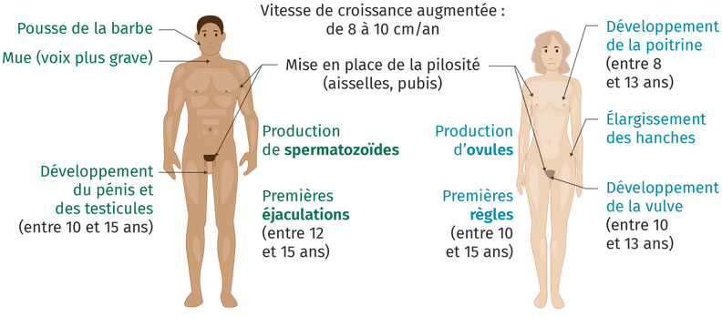
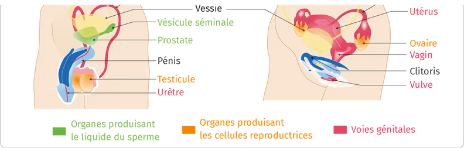

# Activité : La puberté

!!! note Compétences

    Construire un tableau 

!!! warning Consignes

    1. À partir des documents, compléter un tableau comparant les changements liés à la puberté chez les filles et les garçons.
    2. Expliquer en quoi la puberté permet aux humains d’être capables de se reproduire
    
??? bug Critères de réussite
    - 

**Document 1 __________________________________________________**

<table><thead>
  <tr>
    <th></th>
    <th> Période de la puberté </th>
    <th> Organes produisant les cellules reproductrices </th>
    <th> Pilosité </th>
    <th> Comportement </th>
    <th> Morphologie (=forme du corps) </th>
  </tr></thead>
<tbody>
  <tr style="height:150px;">
    <td> 			Filles 		</td>
    <td></td>
    <td></td>
    <td></td>
    <td></td>
    <td></td>
  </tr>
  <tr style="height:150px;">
    <td> 			Garçons 		</td>
    <td></td>
    <td></td>
    <td></td>
    <td></td>
    <td></td>
  </tr>
</tbody>
</table>

**Document 2 Changements morphologiques et physiologiques lors de la puberté.**

**Document 3 Des transformations liées à la puberté**

On observe des modifications comportementales : envie de plaire et premiers désirs sexuels, l'humeur devient changeante, émotivité, oppositions aux adultes, envie d’indépendance… cette période que l’on nomme parfois de façon péjorative « crise d’adolescence » est une étape importante du développement.

A la puberté, les organes reproducteurs commencent à produire les cellules reproductrices, spermatozoïdes chez l'homme et ovule chez la femme.

Chez les filles, les règles surviennent. Les ovaires des filles produisent un ovule par mois et chaque mois, l’utérus se prépare en cas de fécondation en fabriquant des vaisseaux sanguins. S’il n’y a pas de fécondation, ces vaisseaux sont détruits et du sang s’écoule du vagin : ce sont les règles.

Chez les garçons, les éjaculations apparaissent, il s’agit d’émission de sperme qui est un mélange de spermatozoïdes produits par les testicules et de liquide nutritif pour ces cellules.

Les règles et les éjaculations sont les signes visibles du fonctionnement des appareils reproducteurs. 

**Document 4 Principaux organes des appareils reproducteurs masculin et féminin**

