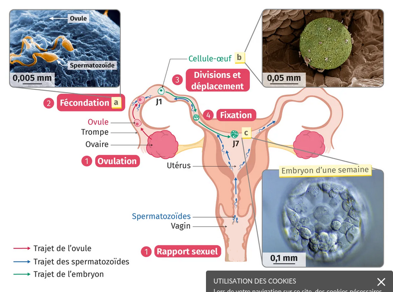
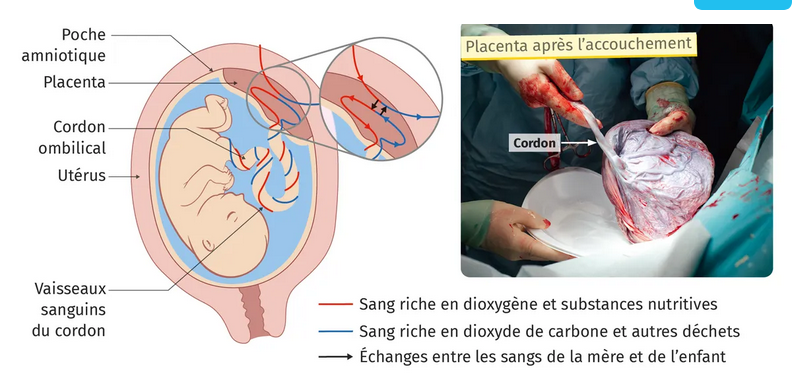

# Activité : La reproduction des humains

!!! note Compétences

    Interpréter 

!!! warning Consignes

    1. Indiquer où se fait la fécondation
    2. Expliquer si l'espèce humaine est vivipare ou ovipare.
    3. Expliquer comment l'embryon a les éléments nécessaire à son développement.
    
??? bug Critères de réussite
    - 

**Document 1 Trajet des cellules reproductrices, fécondation et première semaine de l'embryon.**

Lors d'un rapport sexuel avec éjaculation, les spermatozoïdes sont déposés dans le vagin. Ils se déplacent à la rencontre d'un éventuel ovule, libéré par un ovaire. Un seul spermatozoïde fusionne avec l'ovule lors de la fécondation a qui forme la cellule-œuf b. Cette cellule se divise de nombreuses fois pour former un embryon c qui migre dans l'utérus et s'y fixe. 

**Document 2 Échanges entre la mère et le fœtus au niveau du placenta.**

 
Le placenta est un organe très riche en vaisseaux sanguins. Le sang de la mère apporte du dioxygène et des éléments nutritifs au fœtus et évacue les déchets. 

**Document 3 Définitions**

- Vivipare : développement de l'embryon à l'intérieur de sa mère.
- Ovipare : développement de l'embryon à l'intérieur d'un oeuf.

