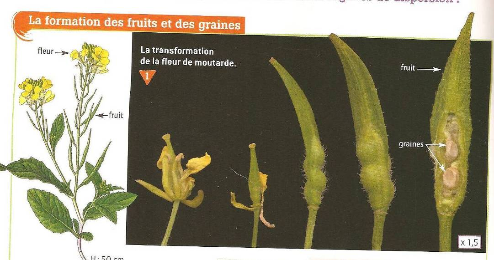

# Séquence : Reproduction des plantes

!!! note-prof
    Cycle de vie
    Mettre en évidence le rôle de la pollinisation dans la  transformation de la fleur en fruit et des ovules en graines.
    Illustrer la notion de coopération (interaction mutualiste) avec l’exemple de la pollinisation.
    Relier l’évolution de l’abondance de pollinisateurs à ses conséquences sur certaines cultures.
    Comprendre l’impact de l’utilisation des pesticides sur l’abondance des pollinisateurs.

!!! question "Problématique"
    Comment les plantes à fleurs se reproduisent-elles?
    
### Document d’appel :

## Séance 1 : Fomration des fruits et des graines

!!! question "Problématique"
    Comment se forment un fruit et des graines ?

[Activité Formation des fruits et des graines](../formationGraines)

Transformation de la fleur de prunier en prune

??? abstract "Bilan"
    Une fleur est l’organe de la plante qui permet la formation des fruits et des graines. Elle est composée de l’extérieur vers l’intérieur, de sépales, de pétales, d’étamines et d’un pistil.

    Les fleurs sont les organes reproducteurs des plantes.

    Les étamines produisent du pollen qui contient les cellules reproductrices mâles et le pistil contient des ovules qui contiennent les cellules reproductrices femelles.

    Si le pollen se dépose sur le pistil d’une fleur de la même espèce, c’est la pollinisation, les cellules mâles et femelles vont se rencontrer et permettre la fécondation.

    La fleur va se transformer. Le pistil va former un fruit et les ovules qui sont à l’intérieur du pistil vont donner des graines. Les autres éléments meurent.

    *Définition reproduction sexuée : *formation d’un nouvel individu issu d’un mélange entre des organes mâles et femelles.

    *Définition pollinisation : *Transport du pollen, des étamines jusqu’au pistil.

## Séance 2 : La pollinisation

!!! question "Problématique"
    Quels sont les éléments permettant la pollinisation ?
    
[Activité nom activité](../lien vers l'activité)

??? abstract "Bilan"
    Bilan

