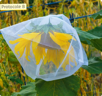
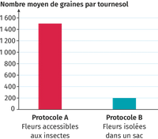
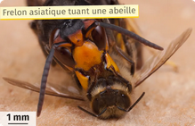

# Activité : La disparition des abeilles

!!! note "Compétences"

    Analyser des expériences 

!!! warning "Consignes"

    1. Relever les conséquences de la disparition des insectes pollinisateurs pour les plantes et pour les êtres humains.
    2. Relever les causes de la disparition des abeilles

??? bug "Critères de réussite"
  

**Document 1 Insectes pollinisateurs et rendement des cultures de tournesol**
La production de graines a été mesurée sur une culture de tournesol, en fonction de l'accès des fleurs aux insectes pollinisateurs. Certaines fleurs de la culture ont été enfermées dans des sacs en tissu léger (protocole B), empêchant tout passage d'insectes. D'autres sont à l'air libre (protocole A) et les insectes peuvent passer.

{: style="width: 400px;"}

{: style="width: 400px;"}

Les graines de tournesol sont utilisées majoritairement pour la production d'huile alimentaire. Les graines issues du protocole A sont plus riches en huile que celles issues du protocole B.

**Document 2 Composition d'un petit-déjeuner avec ou sans pollinisateurs**

{: style="width: 400px;"}

Si les insectes pollinisateurs disparaissaient, beaucoup de céréales, comme le blé ou le riz, ne seraient pas affectées (elles sont pollinisées grâce au vent). Cependant, la majorité des fruits et des légumes (qui nous fournissent vitamines et sels minéraux) ne pourraient plus être produits.

**Document 3 Causes de la disparition des abeilles**

« Les apiculteurs constatent une disparition brutale et inexpliquée des colonies d'abeilles domestiques (Apis mellifera) depuis quelques années dans de nombreux pays. En Europe, par exemple, la diminution du nombre de colonies est estimée à 25 % entre 1985 et 2005. »
D'après Vigie-Nature École, « La pollinisation menacée »

[Vidéo sur la disparition des abeilles](http://www.lumni.fr/video/abeilles-pourquoi-disparaissent-elles)

