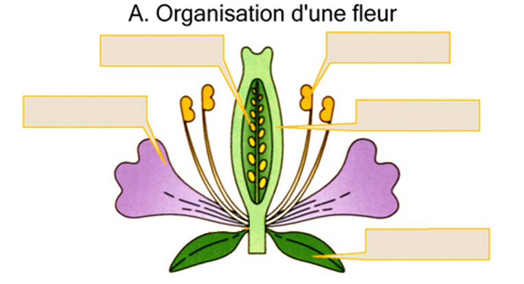

# Activité : La formation du fruit et des graines

!!! note "Compétences"

    Analyser des expériences 

!!! warning "Consignes"

    
    1. À l’aide du site : xpfleur.svtdebrock.com, faire les différentes expériences du document 1 et noter les résultats observés.
   
    2. expliquer dans quelles conditions la fleur se transforme-t-elle en un fruit contenant des graines, en justifiant vos réponses à l’aide des expériences que vous aurez effectuées.

    3. Indiquer ce que devient chacun des éléments de la fleur.

    4. Compléter les schémas du document 2. 

??? bug "Critères de réussite"
    - 

**Document 1 : Expériences sur la transformation des en fruits**

<table>
<tbody>
<tr class="odd">
<td>Expériences</td>
<td>Conditions expérimentales</td>
<td>Résultats : 
transformation en fruit ou pas.</td>
</tr>
<tr class="even">
<td>1</td>
<td>Fleur intacte</td>
<td></td>
</tr>
<tr class="odd">
<td>2</td>
<td>Fleur dont le pistil est isolé de tout
contact avec des insectes pollinisateurs et du pollen extérieur.</td>
<td></td>
</tr>
<tr class="even">
<td>3</td>
<td>Fleur dont on a supprimé certaines
parties :</td>
<td></td>
</tr>
<tr class="odd">
<td>
• Sépales
</td>
<td></td>
<td></td>
</tr>
<tr class="even">
<td>
• Pétales
</td>
<td></td>
<td></td>
</tr>
<tr class="odd">
<td>
• Étamines
</td>
<td></td>
<td></td>
</tr>
<tr class="even">
<td>
• Pistil
</td>
<td></td>
<td></td>
</tr>
<tr class="odd">
<td>4</td>
<td>Fleur dont on a supprimé les 
étamines et qui a reçu du pollen de la même espèce sur son pistil</td>
<td></td>
</tr>
<tr class="even">
<td>5</td>
<td>Fleur dont on a supprimé les étamines
et qui a reçu du pollen d’une autre espèce sur son pistil.</td>
<td></td>
</tr>
</tbody>
</table>

**Document 2 de la fleur au fruit**

Aides :

<table>
<tbody>
<tr class="odd">
<td>Expériences</td>
<td>Conditions expérimentales</td>
<td>Résultats : 
transformation en fruit ou pas.</td>
<td>Conclusions : 
Pour qu’une fleur se transforme en fruit, il faut..</td>
</tr>
<tr class="even">
<td>1</td>
<td>Fleur intacte</td>
<td></td>
<td></td>
</tr>
<tr class="odd">
<td>2</td>
<td>Fleur dont le pistil isolée de tout
contact avec des insectes pollinisateurs et du pollen extérieur.</td>
<td></td>
<td></td>
</tr>
<tr class="even">
<td>3</td>
<td>Fleur dont on a supprimé certaines
parties : 
• Sépales 
• Pétales 
• Étamines 
• Pistil</td>
<td></td>
<td></td>
</tr>
<tr class="odd">
<td>4</td>
<td>Fleur dont on a supprimé les 
étamines et qui a reçu du pollen de la même espèce sur son pistil.</td>
<td></td>
<td></td>
</tr>
<tr class="even">
<td>5</td>
<td>Fleur dont on a supprimé les étamines
et qui a reçu du pollen d’une autre espèce sur son pistil.</td>
<td></td>
<td></td>
</tr>
</tbody>
</table>