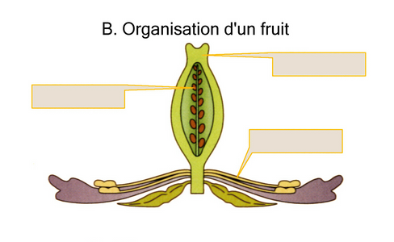

# Activité : La formation du fruit et des graines

!!! note "Compétences"

    Analyser des expériences 

!!! warning "Consignes"

    1. À l’aide du site : [xpfleur.svtdebrock.com](xpfleur.svtdebrock.com), faire les différentes expériences du document 2 et noter les résultats observés.
    2. expliquer dans quelles conditions la fleur se transforme-t-elle en un fruit contenant des graines, en justifiant vos réponses à l’aide des expériences que vous aurez effectuées.
    3. Indiquer ce que devient chacun des éléments de la fleur.
    4. Compléter les schémas du document 3. 

??? bug "Critères de réussite"
    - <table>
    <tbody>
    <tr class="odd">
    <td>Expériences</td>
    <td>Conditions expérimentales</td>
    <td>Résultats : 
    transformation en fruit ou pas.</td>
    <td>Conclusions : 
    Pour qu’une fleur se transforme en fruit, il faut..</td>
    </tr>
    <tr class="even">
    <td>1</td>
    <td>Fleur intacte</td>
    <td></td>
    <td></td>
    </tr>
    <tr class="odd">
    <td>2</td>
    <td>Fleur dont le pistil isolée de tout
    contact avec des insectes pollinisateurs et du pollen extérieur.</td>
    <td></td>
    <td></td>
    </tr>
    <tr class="even">
    <td>3</td>
    <td>Fleur dont on a supprimé certaines
    parties : 
    • Sépales 
    • Pétales 
    • Étamines 
    • Pistil</td>
    <td></td>
    <td></td>
    </tr>
    <tr class="odd">
    <td>4</td>
    <td>Fleur dont on a supprimé les 
    étamines et qui a reçu du pollen de la même espèce sur son pistil.</td>
    <td></td>
    <td></td>
    </tr>
    <tr class="even">
    <td>5</td>
    <td>Fleur dont on a supprimé les étamines
    et qui a reçu du pollen d’une autre espèce sur son pistil.</td>
    <td></td>
    <td></td>
    </tr>
    </tbody>
    </table>

**Document 1 Les différents composants d’une fleur :**

Les fleurs sont des organes composés de différents éléments :

- Les sépales sont les éléments les plus externes de la fleur, ils sont généralement verts, mais peuvent être de la couleur des pétales ; ils forment également une couronne et peuvent eux aussi être soudés ;
- Les pétales sont les éléments les plus colorés de la fleur, ils sont disposés en cercle et forment une couronne, ils sont parfois soudés les uns aux autres ;
- Les étamines sont à l’intérieur de la couronne de pétales, elles sont aussi disposées en cercle. Une étamine est composée d’une sorte de tige qui porte à son extrémité deux petits sacs jaunes pleins de pollen. Les étamines sont les organes reproducteurs mâles ;
- Le pistil est l’élément central de la fleur, c’est l’organe reproducteur femelle. Il est constitué d’une zone renflée tout en bas de la fleur collée au pédoncule floral, qui se prolonge par une espèce de tube dont l’extrémité a souvent une forme d’étoile. À     l’intérieur se trouve l’ovule.
- Le pédoncule floral relie la fleur à une tige.

**Document 2 Expériences sur la transformation des en fruits**

<table>
<tbody>
<tr class="odd">
<td>Expériences</td>
<td>Conditions expérimentales</td>
<td>Résultats : 
transformation en fruit ou pas.</td>
</tr>
<tr class="even">
<td>1</td>
<td>Fleur intacte</td>
<td></td>
</tr>
<tr class="odd">
<td>2</td>
<td>Fleur dont le pistil est isolé de tout contact avec des insectes pollinisateurs et du pollen extérieur.</td>
<td></td>
</tr>
<tr class="even">
<td rowspan="5">3</td>
<td >Fleur dont on a supprimé certaines
parties :</td>
<td></td>
</tr>
<tr class="odd">
<td>
• Sépales
</td>
<td></td>
<td></td>
</tr>
<tr class="even">
<td>
• Pétales
</td>
<td></td>
<td></td>
</tr>
<tr class="odd">
<td>
• Étamines
</td>
<td></td>
<td></td>
</tr>
<tr class="even">
<td>
• Pistil
</td>
<td></td>
<td></td>
</tr>
<tr class="odd">
<td>4</td>
<td>Fleur dont on a supprimé les étamines et qui a reçu du pollen de la même espèce sur son pistil</td>
<td></td>
</tr>
<tr class="even">
<td>5</td>
<td>Fleur dont on a supprimé les étamines
et qui a reçu du pollen d’une autre espèce sur son pistil.</td>
<td></td>
</tr>
</tbody>
</table>

**Document 3 de la fleur au fruit**

{: style="width: 300px;"}
{: style="width: 300px;"}

