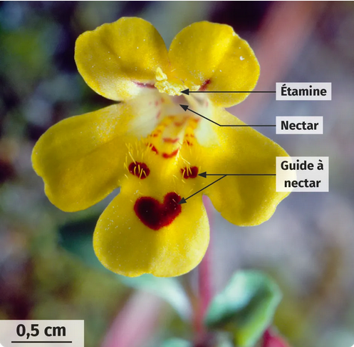

# Activité : La pollinisation, un exemple de coopération

!!! note Compétences

    Extraire des informations

!!! warning Consignes

    1. Identifier les éléments des fleurs qui attirent les insectes.
    2. Identifier les caractéristiques des grains de pollen qui favorisent la pollinisation.
    3. Expliquer le rôle des insectes dans la pollinisation des fleurs.
    4. Justifier le terme de coopération entre plantes à fleurs et insectes.

??? bug Critères de réussite

**Document 1 Attraction des insectes pollinisateurs par les fleurs**

{: style="width: 300px;"} 
{: style="width: 300px;"}

Certaines fleurs ont des formes et des couleurs ressemblant à des insectes pour attirer d'autres insectes. 
Les fleurs peuvent dégagées des odeurs qui vont attirer les insectes. 
D'autres fleurs produisent du nectar. Le nectar est riche en sucres dont les insectes se nourrissent. 

**Document 2 Grains de pollen observés au microscope**

Les grains de pollen de différentes espèces de plantes sont observés au microscope à balayage, un outil puissant qui permet d'obtenir des images en relief (de fausses couleurs ont ensuite été ajoutées). L'ornementation de certains grains de pollen leur permet de bien s'accrocher au corps des pollinisateurs.

**Document 3 Adaptation du corps des insectes à la pollinisation**

La tête de l'abeille porte une langue lui permettant d'aspirer le nectar dont elle se nourrit. Sur ses pattes, des poils rigides permettent la collecte du pollen, une autre ressource alimentaire des abeilles.

**Document 4 Vocabulaire**

- Coopération : collaboration entre deux espèces apportant un bénéfice pour chacune.
- Nectar : liquide sucré de certaines fleurs.
- Pollinisation : transport des grains de pollen des étamines au pistil.
