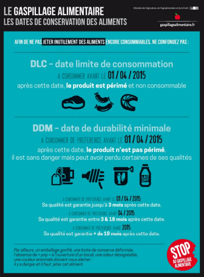

# Séquence : Alimentation humaine

!!! note-prof
    si besoin d'infos

!!! question "Problématique"
    Comment produire et conserver des aliments ?

## Séance 1 : Alimentation et santé

!!! question "Problématique"
    Comment les aliments répondent-ils à nos besoins ?

[Activité Les apports de nos aliments](../apportsAlim)

??? abstract "Bilan"
    Les aliments sont une source d’énergie et de matière.
    L’alimentation doit apporter à un individu suffisamment d’énergie et une quantité équilibrée de glucides, lipides, protéines, vitamines et sels minéraux.
    Les besoins énergétiques varient en fonction des individus (âge, sexe, activité ...)
    Chaque aliment apporte des éléments différents, donc il faut manger un peu de tout pour répondre à ces besoins, notre alimentation doit être variée.

    

    Dans le monde, les habitudes alimentaires sont différentes.
    Les cultures des pays dépendent des climats. 
    Les habitudes alimentaires ont donc, pendant très longtemps, été influencées par le climat.

## Séance 2 : Conservation, saumure

!!! question "Problématique"
    Comment conserver les aliments ?

[Activité La conservation des aliments](../conservation)

??? abstract "Bilan"
    Des micro-organismes peuvent se développer sur les aliments. Certains de ces micro-organismes sont pathogènes. On prend donc des mesures d’hygiène pour éviter la contamination des aliments. 
    Pour conserver les aliments on peut les stériliser (ce qui tue les micro-organismes) ou les conserver au froid (ce qui évite le développement de micro-organismes).

    Micro-organismes : êtres vivants très petits observables uniquement au microscope.
    Pathogène : se dit d’un élément qui provoque des maladies chez l’être humain

    
    

## Séance 3 : Fabrication du yaourt 

Un gérant d'une société produisant des yaourts souhaiterait faire des économies dans sa production de yaourts. Il souhaiterait donc supprimer une des étapes de la recette, tout en gardant un résultat correct. Proposer une solution possible au gérant en vérifiant avant la validité de votre choix

**Document Recette de yaourt**

1. Chauffer légèrement un litre de lait.
2. Verser un yaourt du commerce dans le lait ou remplacer par des ferments lactiques (bactéries).
3. Remuer avec une spatule pour bien mélanger.
4. Remplir les pots avec le mélange.
5. Placer les pots dans la yaourtière à 40°C.
6. Les yaourts sont prêts 6 à 8 heures plus tard.
7. Conserver les yaourts au réfrigérateur et les consommer dans les jours suivants.

!!! question "Problématique"
    Quelles étapes indispensables permettant de faire le yaourt consistant ?

[Activité La fabrication du yaourt](../fabricationYaourt)

??? abstract "Bilan"
    Pour fabriquer du yaourt, on utilise des bactéries. Les bactéries sont des micro-organismes. Ce sont des êtres vivants unicellulaires.

    On utilise d’autres micro-organismes, par exemple des champignons, comme les levures, pour faire le fromage ou le pain.

## Séance 4 : Fabrication du pain

Un gérant d'une société produisant des yaourts souhaiterait faire des économies dans sa production de yaourts. Il souhaiterait donc supprimer une des étapes de la recette, tout en gardant un résultat correct. Proposer une solution possible au gérant en vérifiant avant la validité de votre choix

**Document Recette de deux pains différents**

|  Types de pain |  ingrédients  |  Étapes  |
|---------|----------|--------------|
|     Pain blanc     |   500g de farine  10g de sel   3200 ml d’eau  8g de levure de boulanger        |       Mélanger les ingrédients   pétrissage.    Laisser reposer la pâte    Façonner la pâte     Laisser reposer la pâte    cuisson à 240 °C          |
|  Pain azyme         |     500 g de farine    12,5g de sel     250 ml d’eau              |             Mélanger les ingrédients    cuisson à 200 °C            |

!!! question "Problématique"
    Comment la pâte à pain peut-elle gonfler ?

[Activité La fabrication du pain](../fabricationPain)

??? abstract "Bilan"

    Pour fabriquer du pain, on utilise des levures. Les levures sont des micro-organismes. Ce sont des êtres vivants unicellulaires. Ces levures permettent de faire gonfler la pâte à pain.

    On utilise d’autres micro-organismes, par exemple des bactéries, pour faire le fromage ou des yaourts.

    Les levures vont faire gonfler la pâte à pain en produisant un gaz, le dioxyde de carbone.
    Ce gaz va créer des petites bulles dans la pâte.
