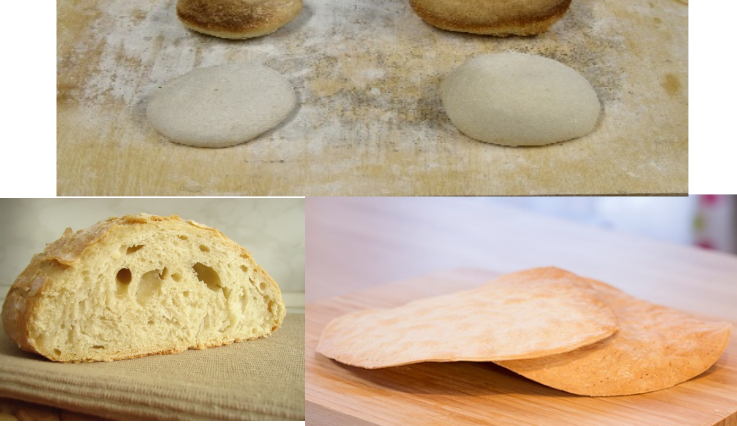
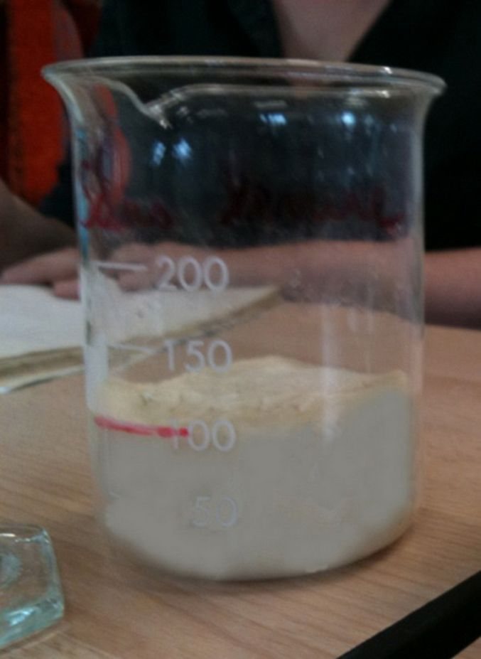
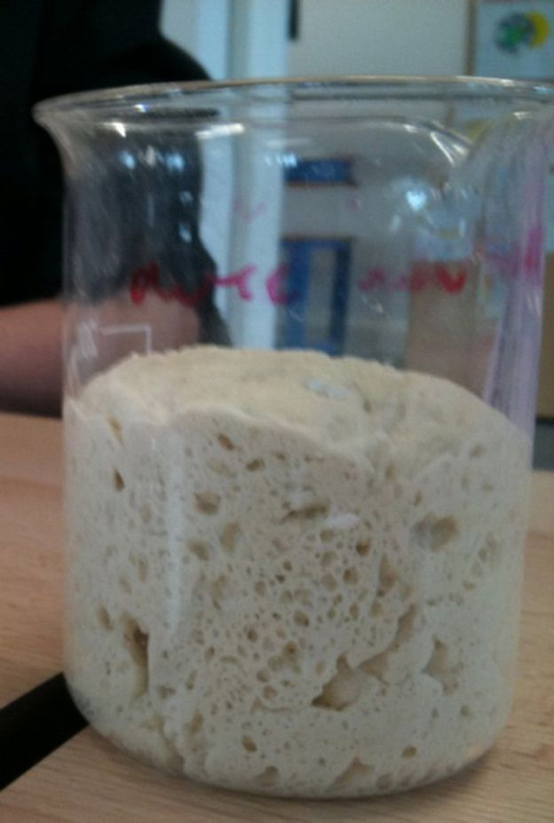
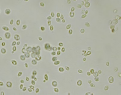
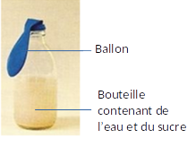
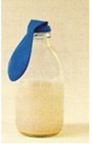
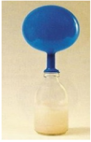

# Activité : Fabriquer du pain

!!! note "Compétences"

    Interpréter 

!!! warning "Consignes"

    Consigne 1 : 
    
??? bug "Critères de réussite"
    - 

    III. Comment la pâte à pain peut-elle gonfler ?

Types de pain
ingrédients
Étapes
Pain blanc
500g de farine
10g de sel
3200 ml d’eau
8g de levure de boulanger
Mélanger les ingrédients
pétrissage.
Laisser reposer la pâte
Façonner la pâte
Laisser reposer la pâte
cuisson à 240 °C
Pain azyme
500 g de farine
12,5 de sel
250 ml d’eau
 
Mélanger les ingrédients
cuisson à 200 °C

Fiche méthode
La démarche scientifique
La démarche expérimentale comporte 6 étapes : 
PROBLÈME – HYPOTHÈSE – EXPÉRIENCES – RÉSULTATS ATTENDUS – RÉSULTATS OBSERVES – INTERPRÉTATION. 
Il est important de noter tous les éléments de la démarche scientifique et toujours marquer et souligner le nom de l’étape que vous êtes en train de rédiger.

Formuler un problème scientifique
En observant les phénomènes qui nous entourent, on peut être amené à dégager un problème scientifique c’est-à-dire une question scientifique.

Proposer une ou plusieurs hypothèses
C’est une proposition de réponse au problème. Elle n’est pas forcément vraie, mais elle doit être précise et être une réponse scientifique testable.

Tester les hypothèses
On peut tester une hypothèse par des expériences, des manipulations ou des recherches.

Pour faire une expérience, il est nécessaire de bien réfléchir au protocole c’est-à-dire à ce que l’on va faire dans l’expérience.
Si les hypothèses sont testées par des expériences il faut prévoir une expérience pour chaque hypothèse et respecter 3 règles pour concevoir un protocole : 
 ne tester que l’effet d’un seul paramètre, soit en le supprimant, soit en le faisant varier. Tous les autres paramètres doivent rester constants.
 Faire en parallèle deux montages un montage test et un montage témoin (le montage dans les conditions normales, il permet de comparer les résultats), on décrira le protocole en comparant les deux montages et en indiquant la différence entre les deux.
 Répéter l’expérience plusieurs fois si possible.
Avant de réaliser l’expérience, il faut écrire les résultats attendus. C'est-à-dire les résultats que l’on prévoit obtenir si l’hypothèse est validée. 

Réfléchir aux conséquences vérifiables. Indiquer ce que l’on devrait observer comme résultat à la fin de l’expérience.

Observer et exploiter les résultats
On doit absolument noter les résultats et il faut les interpréter, c’est-à-dire leur donner un sens. Pour interpréter les résultats, il faut les comparer deux à deux. On compare dans ce cas le témoin avec une autre expérience ayant une seule différence au départ.

Conclure sur la validité de l’hypothèse et répondre au problème par une synthèse.

    Activité 13: La levure et la pâte à pain.
Consigne 1 : À partir des documents, proposer une expérience permettant de vérifier notre hypothèse, appeler le professeur pour vérification. 
Consigne 2 : Réaliser l’expérience.
Consigne 3 : Compléter le tableau du document 3 jusqu’aux résultats attendus.
Consigne 4 : Observer les deux pains, coupez-les en deux et compléter la fin du tableau.
Document 1 :  Recette pour fabriquer du pain.
Ingrédients :
30 g de farine
30 ml d’eau tiède
1/2 sachet de levure boulangère
1/2 pincée de sel

Étapes :
Mélanger l’eau et la levure (cette étape à déjà été faite)
Mélanger, dans un récipient, la farine, le sel et l’eau
Pétrir 4 minutes et faire une boule avec la pâte
Laisser gonfler 5 minutes de chaque côté
Cuire 1 minute au micro-ondes.

Document 2 : Analyse de l’expérience.
Problème =  question scientifique

Hypothèse =  proposition de réponse au problème

Protocole = comparer les deux tests de l’expérience en précisant la différence entre les deux

Résultats attendus =
Résultats que l’on devrait avoir si l’hypothèse est vérifiée

Résultats observés =
Résultats que l’on observe réellement

Conclusion = Hypothèse validée ou non et 
reformuler cette hypothèse

Bilan :
Pour fabriquer du pain, on utilise des levures. Les levures sont des micro-organismes. Ce sont des êtres vivants unicellulaires. Ces levures permettent de faire gonfler la pâte à pain.
On utilise d’autres micro-organismes, par exemple des bactéries, pour faire le fromage ou des yaourts.
    IV. Comment les levures font-elles gonfler le pain ?

    Activité 14: Le rôle de la levure dans le gonflement du pain
Consigne : Analyse l’expérience du document 2 en complétant le tableau du document 3.
Document 1 : Photo de levures observées au microscope (x600)

La levure est un champignon microscopique utilisé dans la fabrication de divers aliments et boissons : pain, bière, vin, etc.
Pour fabriquer du pain, il faut d’abord faire une pâte avec de la farine et de l’eau qu’on laisse reposer avant de la cuire. Pour se nourrir, les levures consomment des sucres.

Document 2 : Expérience pour mettre en évidence le rôle des levures.
Les scientifiques ont voulu tester l’hypothèse que les levures produisent un gaz.
Début de l’expérience

Fin de l’expérience (après quelques heures)

  le ballon contient un gaz, le dioxyde de carbone.
 

Document 3 : Analyse de l’expérience.
Problème
Comment expliquer que les levures font gonfler le pain ?
Hypothèse

Protocole

Résultats attendus

Résultats observés

Conclusion

Bilan :
Les levures vont faire gonfler la pâte à pain en produisant un gaz, le dioxyde de carbone.
Ce gaz va créer des petites bulles dans la pâte.
