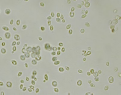
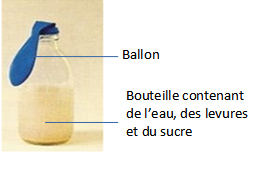
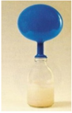

# Activité : La levure et la pâte à pain.

!!! note Compétences

    Interpréter 

!!! warning Consignes

    1. À partir des documents, proposer une expérience permettant de vérifier qu les lévures sont responsables du gonflement de la pâte à pain, appeler le professeur pour vérification. 
    2. Réaliser l’expérience.
    3. Analyse l’expérience du document 4.
    
??? bug Critères de réussite
    - Analyser l'expérience en respectant les différentes étapes:

        - hypothèse
        - protocole
        - résultats attendus
        - résultats observés
        - conclusion

**Document 1 :  Recette pour fabriquer du pain.**

Ingrédients :

- 30 g de farine
- 30 ml d’eau tiède (= ....g)
- 1/2 sachet de levure boulangère
- 1/2 pincée de sel

Étapes :

- Mélanger l’eau et la levure (cette étape à déjà été faite)
- Mélanger, dans un récipient, la farine, le sel et l’eau
- Pétrir 4 minutes et faire une boule avec la pâte
- Laisser gonfler 5 minutes de chaque côté
- Cuire 1 minute au micro-ondes.

**Document 2 Photo de levures observées au microscope (x600)**

La levure est un champignon microscopique utilisé dans la fabrication de divers aliments et boissons : pain, bière, vin, etc.
Pour fabriquer du pain, il faut d’abord faire une pâte avec de la farine et de l’eau qu’on laisse reposer avant de la cuire. Pour se nourrir, les levures consomment des sucres.

**Document 3 conversion volume masse de l'eau**

1 L d'eau correspond à 1 kg.
1 ml d'eau correspond à 1g.

**Document 4 Expérience pour mettre en évidence le rôle des levures.**

Les scientifiques ont voulu tester l’hypothèse que les levures produisent un gaz.

| Début de l’expérience   |  Fin de l’expérience (après quelques heures)  |
|----------------|----------------------|
|            |             |
|           |            le ballon contient un gaz, le dioxyde de carbone.
 
         |

