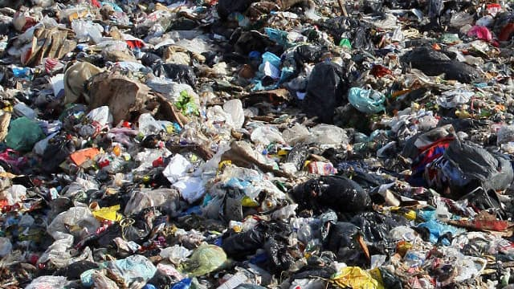
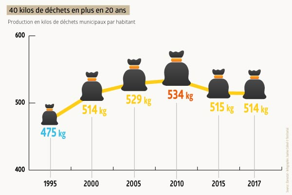

# Séance 1 : Décomposition de la matière

## Document d’appel :

{: style="width:600px"}
{: style="width:80px"}

**attr**{style="color: red"}

!!! question Problématique
    Pourquoi le tri des déchets est-il si important ?

!!! note-prof
    Préparer un sac poubelle avec :

    - pot en verre
    - boite œuf
    - pot yaourt
    - mouchoir/sopalin
    — pain
    — canette
    — emballage pompote
    — morceau de tissu
    — coquille œuf
    — couche ?
    — piles
    — jeu électronique

## Activité : Importance du tri des déchets

!!! warning Compétences

    Interpréter des résultats de façon raisonnée et en tirer des conclusions en mobilisant des arguments scientifiques.
    
    Relier des connaissances acquises en sciences et technologie à des questions de santé, de sécurité et d’environnement.

!!! note Consigne

    Consigne 1 : Comparer le volume de déchets qui va être envoyé en déchetterie avec et sans tri.
    
    Consigne 2 : Expliquer ce que deviennent les déchets au cours du temps.
    
    Consigne 3 : À partir de vos deux réponses précédentes, expliquer pourquoi il est important de trier ces déchets correctement.
    
    Consigne 4 : Expliquer pourquoi on retrouve peu de restes d’êtres vivants ou d’aliments dans les paysages.

**Document 1 Consigne de tri.**

Beaucoup d’objets ne vont pas à la poubelle, mais doivent être rapportés dans des bacs spéciaux pour être traités et recyclés.

**Document 2 Dégradation et pollution.**

Lors de leur dégradation, les objets libèrent des éléments qui peuvent polluer les sols et les eaux.
C’est le cas des piles qui peuvent libérer des liquides extrêmement nocifs, mais c’est aussi le cas des plastiques qui lors de leur décomposition libèrent des micro-particules de plastiques. Ces toutes petites particules peuvent s’accumuler dans les êtres vivants (comme les humains) et entraîner des problèmes de santé.

**Document 3 Temps de décomposition**

| Type de déchets                          | Temps de dégradation |
| ---------------------------------------- | -------------------- |
| Mouchoir en papier, épluchures de pommes | 3 mois               |
| Journaux, ticket de bus                  | 1 an                 |
| Chewing-gum, papier bonbon, brique soupe | 5 ans                |
| Boîte de conserve, briquet en plastique  | 100 ans              |
| Canette                                  | 200 ans              |
| Bouteille en plastique                   | 500 ans              |
| Verre                                    | 4000 ans             |

!!! bug Critères de réussite
    — avoir pesé le sac non trié puis le sac trié
    — avoir écrit une phrase comparant les deux masses.
    — avoir comparé les temps de décomposition des différents déchets
    — avoir expliqué le problème lors de la dégradation de certains objets.

!!! abstract Bilan
    La matière se décompose avec le temps.
    La vitesse de décomposition est très différente d’un objet à l’autre. Les objets composés de matière organiques se décomposent plus rapidement que les déchets composés de matière minérale, sauf les matières plastiques qui se décomposent très lentement.

    Les déchets peuvent s’accumuler et de nombreux déchets mettent des centaines d’années à se décomposer, s’ils sont jetés n’importe comment ils vont s’accumuler et polluer les écosystèmes
