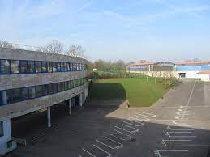
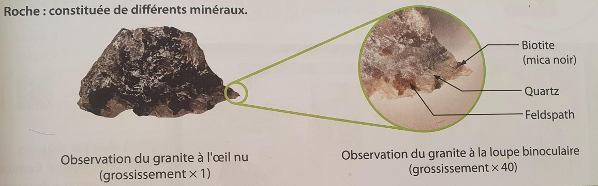
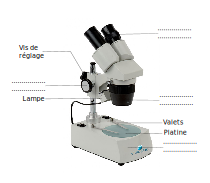
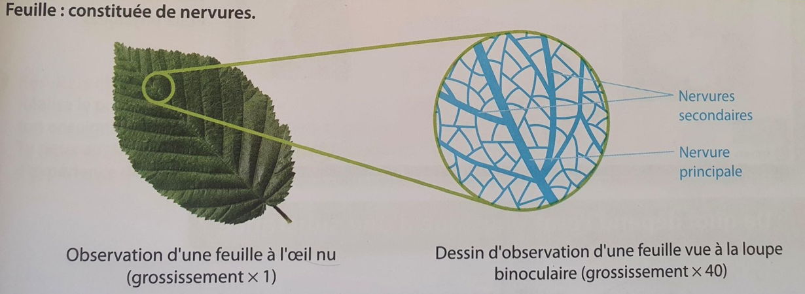
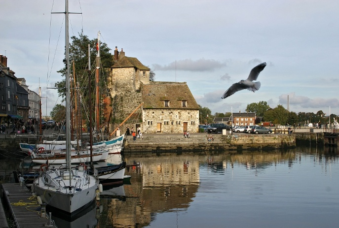

# Séance 1 : La diversité de la matière

Situation déclenchante :

Vous venez d’arriver au collège et c’est un nouvel environnement qui
s’offre à vous.

{width:13.271cm;height:9.939cm}

!!! question Problématique :
    Quelle matière peut-on retrouver au collège ?
    Comment classer les différentes matières observables ?

Hypothèse :

- Du vivant (plantes, pelouse tondue…).

- Du non vivant (cailloux…).

- Des choses construites par l’Homme (poubelles, mur…).

Vérification des hypothèses :

## Activité : Observation de notre environnement.

!!! note Consigne
    Consigne : Recopier le tableau et le compléter avec ce que vous verrez dans la cour.

| Vivant | Non vivant | Construit par l’homme |
| ------ | ---------- | --------------------- |
|        |            |                       |
|        |            |                       |
|        |            |                       |

--\> Correction en classe, les élèves ont constaté que des éléments se
retrouvaient dans 2 colonnes.

!!! note Consigne
    Le tableau n’est pas assez précis. Il faut trouver 2 sous catégories.

Proposition de tableau :

<table>
<tbody>
<tr class="odd">
<td></td>
<td>
Vivant /Organique
</td>
<td>Non vivant/ Minéral</td>
</tr>
<tr class="even">
<td>Objet Naturel</td>
<td></td>
<td></td>
</tr>
<tr class="odd">
<td>Objet transformé par l’être humain</td>
<td></td>
<td></td>
</tr>
</tbody>
</table>

<table>
<tbody>
<tr class="odd">
<td></td>
<td>
Vivant /Organique
</td>
<td>Non vivant/ Minéral</td>
</tr>
<tr class="even">
<td>Objet Naturel</td>
<td>
Pelouse non coupée

Arbres du parc

Plume, coquille d’œuf, squelette
</td>
<td>Cailloux</td>
</tr>
<tr class="odd">
<td>Objet transformé par l’Homme</td>
<td>
Pelouse tondue, planche

Arbre de la cours planté pour faire beau
</td>
<td>Brique</td>
</tr>
</tbody>
</table>

**Attention :** Relever le nombre d’espèces retrouvées dans la cours
et le faire noter dans le cahier, cela servira plus tard dans l’année
(séance 3 de la séquence 3)

## Activité : Observation de la matière minérale et organique.

Donner la fiche méthode d’observation à la loupe binoculaire

Avant de donner le doc pour la roche, laisser les élèves faire le dessin d’observation de la feuille sans leur donner les règles de construction. Passer dans les rang pour voir leur production (soit en afficher ensuite au tableau soit les présenter), voir qu’ils ne sont pas tous pareil, essayer de voir ce qu’il manque, ce qui peut être améliorer et ainsi construire les règles du dessin d’observation avec eux :

- On repère l’objet à dessiner,
- au crayon à papier,
- à main levé mais proprement
- On respecte les proportions
- présence d’une légende
- traits qui ne se croisent pas,
- traits horizontaux
- Titre
- grossissement

!!! note Consigne
    Observe du granite et une feuille d’arbre à la _loupe binoculaire_.
    Réalise le dessin d’observation de la feuille.

**Fiche méthode : Pour observer à la loupe binoculaire**

La loupe binoculaire permet d’observer des détails sur des objets en
relief de petite taille. Elle grossit de 20 à 40 fois.

Ce que je dois faire :

- Je place l’objet sur la platine.
- J’allume la lampe.
- Je règle l’écartement des oculaires par rapport à mes yeux.
- Je réalise la mise au point en tournant la vis jusqu’à ce que l’image soit nette.
- J’explore l’objet en le déplaçant doucement sur la platine et en modifiant la mise au point si nécessaire.

Exemple d’attendu :

!!! abstract "Synthèse"
    Dans notre environnement (ce qui nous entoure), nous avons pu observer 2 grandes catégories : **vivant et non vivant.**

    Un être vivant (animal, végétal,  microbe et champignon) est un organisme qui peut :
    -   Se reproduire (graines des végétaux ramassées)
    -   Se nourrir (végétaux par la racine)
    -   Grandir

    Vivant et non vivant sont *constitués de matière* qui a un aspect différent.

    On appellera la matière des êtres vivants : **matière organique.**

    La matière du non vivant sera appelé : **matière minérale.**

    Tous les objets transformés par l'être humain sont appelés **objets
    techniques**. Ils peuvent être en matière organique ou minérale.

## Exercice d’application : minéral/ organique.

!!! note Consigne
    Regarde bien la photographie et complète le tableau :

<table>
<tbody>
<tr class="odd">
<td colspan=2>Objets organiques</td>
<td colspan=2>Objets minéraux</td>

</tr>
<tr class="even">
<td>Naturels</td>
<td>Techniques</td>
<td>Naturels</td>
<td>Techniques</td>
</tr>

<tr>
<td></td>
<td></td>
<td></td>
<td></td>
</tr>

</tbody>
</table>

## Fiche de révision - Séance 1 La diversité de la matière

Evaluation prévue le ..............

| Connaissances              | Compétences |
| -------------              | ----------- |
| 2 catégories d'éléments : vivant et non vivant  |             |
|            |  -          |
|            |             |

<table> 
<tr>
<td> Connaissances
</td>
<td> Compétences
</td>
</tr>
<tr>
<td> 2 catégories d'éléments :
<ul>
<li>vivant composé de matière organique</li>
<li>non vivant composé de matière minérale</li>
</ul>
 un être vivant peut
<ul>
<li>se reproduire</li>
<li>grandir</li>
<li>se nourrir</li>
</ul>
Les objets techniques
</td>
<td> Compétences
</td>
</tr>

</table>

<table> 
<tr>
<td> Connaissances
</td>
<td> Compétences
</td>
</tr>
<tr>
<td> 
<ul>
<li>Connaitre les 2 types d'éléments que l'on peut trouver dans l'environnement</li>
<li>Savoir de quoi sont composés ces 2 types d'éléments</li>
<li>Savoir ce qui caractérise un être vivant</li>
<li>Non vivant composé de matière minérale</li>
<li>
</ul>

</td>
<td> Compétences
</td>
</tr>

</table>