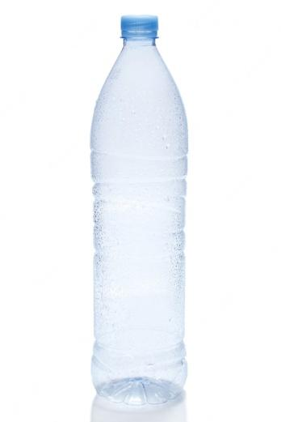
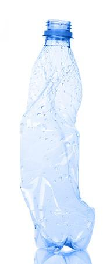

# Séance 3 : Un objet à une masse.
 

Situation déclenchante : Cette bouteille d’eau a-t-elle la même masse si on l’écrase ? Et si on la chauffe ?

!!! question "Problématique":
Quelle est l’influence de la température et de la forme sur la masse ?

La masse se mesure avec……………

La température se mesure avec……………

## Activité : Masse et température.

\*Protocole : **Pensez à noter dans votre cahier les résultats que vous
trouvez !\***

Étape 1 : Mesurer la masse de la feuille.

Étape 2 : Mesurer la température de la bouteille.

Étape 3 : Mettre la feuille au congélateur/ réfrigérateur pendant 2 min.

Étape 4 : Mesurer la masse de la feuille à sa sortie.

Étape 5 : Réchauffer la feuille dans vos mains pendant 1 min et prendre
la température.

Étape 6 : Mesurer à nouveau la masse de la feuille.

Résultats attendus :

……………………………………………………………………………………………………………………………………………………………………………………………………………………………………………………………………………………………………………………………………………………

_Observation :_……………………………………………………………………………………………………………………………………………………………………………………………………………………………………………………………………………………………………………………………………………………

_Conclusion :_……………………………………………………………………………………………………………………………………………………………………………………………………………………………………………………………………………………………………………………………………………………

_Observation :_ J’observe que lorsque la température change, la masse de
la feuille ne change pas.

_Conclusion :_ La masse est propre à la feuille alors que sa température
non.

## Activité : Masse et forme.

_Protocole :_ **_Pensez à noter dans votre cahier les résultats que vous
trouvez !_**

Étape 1 : Mesurer la masse de la feuille.

Étape 2 : Écraser la feuille.

Étape 3 : Mesurer la masse de la feuille déformée.

Étape 4 : Écraser à nouveau la feuille pour lui donner une nouvelle
forme.

Étape 5 : Mesurer à nouveau la masse de la feuille.

Résultats attendus :

……………………………………………………………………………………………………………………………………………………………………………………………………………………………………………………………………………………………………………………………………………………

_Observation :_……………………………………………………………………………………………………………………………………………………………………………………………………………………………………………………………………………………………………………………………………………………

_Conclusion :_……………………………………………………………………………………………………………………………………………………………………………………………………………………………………………………………………………………………………………………………………………………

_Observation :_ J’observe que lorsque la forme de la feuille change, sa
masse ne change pas.

_Conclusion :_ La masse est propre à la feuille alors que sa forme non.

!!! abstract "Synthèse"

    Tout objet matériel possède une **masse** qui lui est propre (c’est à dire qui ne change pas).

    La masse est une ***grandeur physique correspondant à la quantité de matière contenue dans un objet***.

    Elle se mesure avec une ***balance***.

    *L’unité* de la masse est le ***gramme***, de symbole **g**.
