# Séance 4 : Mélange et réaction

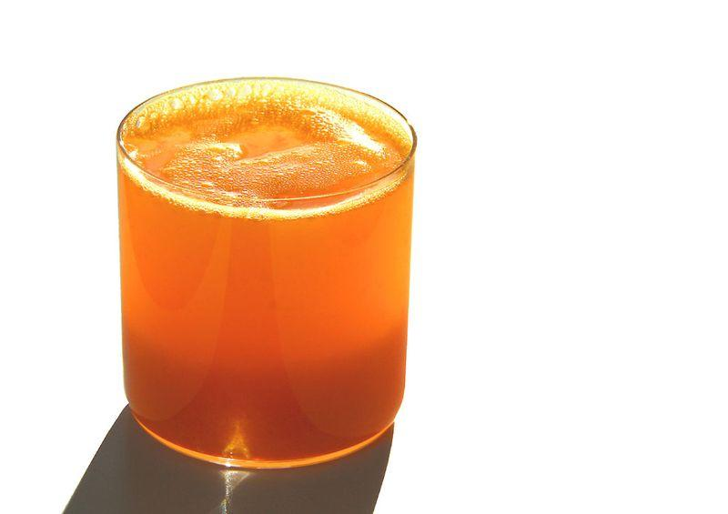{: width='40%' } 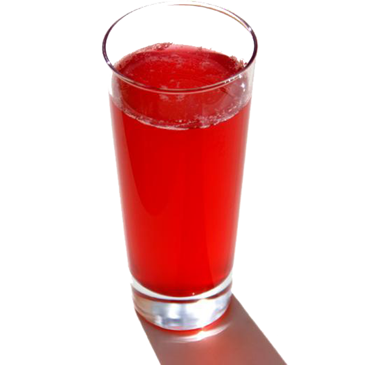{: width='30%' }

_Situation déclenchante :_ C’est jour de fête à la cantine ! On vous
propose différentes boissons avec votre repas.

!!! question "Problématique :"
    Quels sont les différents types de mélanges ?

# Activité : La solubilité.

**_Définition :_** _soluble_ = qui peut se dissoudre dans un liquide.

(Leur faire noter le 1er protocole pour qu’ils apprennent à les noter
correctement)

Protocole :

Etape 1 : verser 20 g d’eau dans chacun des deux béchers.

Etape 2 : Peser 10 g de la poudre 1 du bocal 1.

Etape 3 : Verser la poudre 1 dans le bécher 1.

Etape 4 : Mélanger pendant un moment.

Etape 5 : refaire les étapes 1 à 3 mais avec la poudre 2 du bocal 2.

Etape 6 : Observer et noter les résultats puis conclure.

Résultats attendus : dans un des deux pots la poudre se sera plus
dissoute c’est le sucre

_Observation :_ J’observe que toute la poudre 1 s’est dissoute dans
l’eau alors que pour la poudre 2 il en reste dans l’eau.

_Conclusion :_ la poudre 1 est plus soluble que la poudre 2 donc le
bocal 1 contient le sucre.

## Activité : Des mélanges différents

!!! note "Consignes"
    Consigne 1 : Réalise le protocole du document.

    Consigne 2 : compare les résultats des différents mélanges.

**Document : Protocole.**

Dans chacun des 4 tubes d’eau, ajoute l’un des ingrédients suivant et
agite le tube en le bouchon avec ton pouce :

- 1 spatule de sel
- 1 spatule de sable
- 2 ml d’huile
- 2 ml de sirop

!!! note-prof "Correction"
    On voit que dans certains tubes les composants ne sont plus visibles
    alors que dans d’autres les composants sont distinguables les uns des
    autres

_Définitions :_

- _Mélange _: on parle de _mélange_ lorsqu’au moins deux substances
  différentes sont réunies.

- *Mélange homogène : *un mélange est dit **_homogène_** si on _ne
  peut pas distinguer à l’œil nu_ plusieurs constituants.

- _Mélange hétérogène _: un mélange est dit **_hétérogène_** si _on
  peut distinguer à l’œil nu_ plusieurs constituants.

!!! abstract "Synthèse"
    Dans un mélange, il y a au moins deux constituants (solide, liquide ou gaz) : Exemple : l’eau minérale, limonade

    Dans un corps pur, il n’y a qu’un seul constituant (solide, liquide
    ou gaz) : Exemple : eau déminéralisée. Tous les liquides ne sont
    donc pas des mélanges.

    Il existe deux types de mélanges :

    -   ***Mélange homogène*** (Sirop à la menthe) et

    -   ***mélange hétérogène*** (Jus d’orange avec pulpe)

    Deux liquides sont miscibles lorsque leur mélange reste homogène,
    par exemple le sirop et l’eau. Deux liquides ne sont pas miscibles
    si après mélange le résultat est hétérogène.

## Activité : Un mélange de solide.

!!! note "Consignes"
    Consigne 1 : Explique si à l’œil nu le mélange est homogène ou hétérogène, justifie ta réponse.

    Consigne 2 : Explique si à la loupe binoculaire on peut discerner les différents éléments du mélange, justifie ta réponse.

## Activité : Comparaison de deux eaux différentes.

!!! note "Consignes :"
    Consigne 1 : Comparer la composition de l’eau Volvic et la composition de l’eau déminéralisée.

    Consigne 2 : Décomposer et définir le mot « déminéralisé », (il est possible de s’aider des mots ayant la même racine (défaire, déshabiller).

    Consigne 3 : Pour chacune des deux eaux, explique s’il s’agit d’un mélange ou d’un corps pur.

**Document 1 : Étiquette d’une bouteille de Volvic**

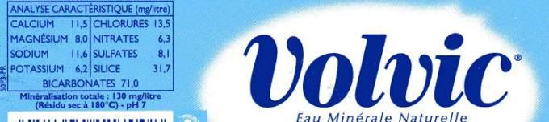

mg/litre : indique que dans chaque litre d’eau se trouve la quantité
d’éléments indiquée

**Document 2 : Étiquette d’une eau déminéralisée.**

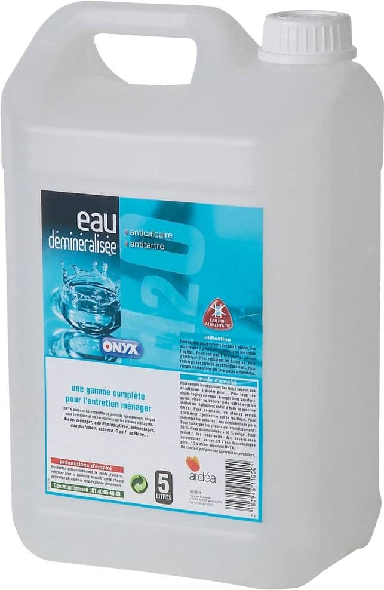{: width='30%' }

Composition : Eau (H~2~O) : 100 %

## Exercices d’applications

### Exercice d’application 1 :

!!! note "Consigne :"
    Parmi ces différents mélanges, écrire dans la troisième ligne du tableau s’il s’agit d’un mélange homogène ou d’un mélange hétérogène en justifiant votre réponse.

| Menthe à l'eau | Mélange thé et eau | Mélange sirop de grenadine et jus d'orange |
|----------------|--------------------|--------------------------------------------|
|     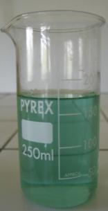{: style="width:100px" }              {: style="width:100px" }      |      {: style="width:100px" }         |

<table markdown>
<tbody markdown>
<tr class="odd">
<td>Menthe à l’eau</td>
<td>Mélange thé + eau</td>
<td>Mélange Sirop de grenadine + jus d’orange</td>
</tr>
<tr class="even">
<td> {: style="width:50px" }</td>
<td> {: style="width:100px" } </td>
<td> {: style="width:100px" } </td>
</tr>
<tr class="odd">
<td></td>
<td></td>
<td></td>
</tr>
</tbody>
</table>

### Exercice d’application 2 :

!!! note "Consigne :"
    À partir du document explique si l’air est un corps pur, un mélange homogène ou un mélange hétérogène en justifiant votre réponse.

**Document : Composition de l’air**
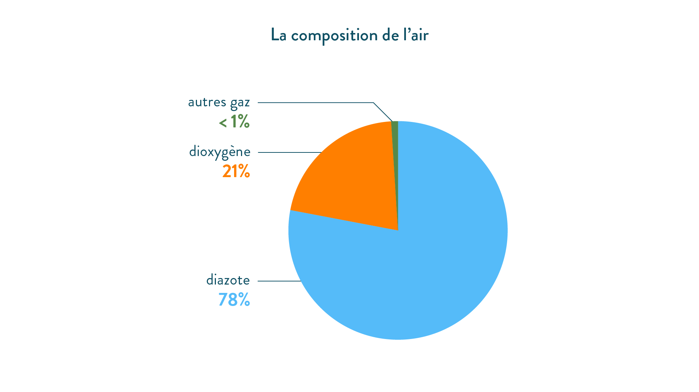

!!! note-prof "Correction :"
    <table>
    <tbody>
    <tr class="odd">
    <td>Menthe à l’eau</td>
    <td>Mélange thé + eau</td>
    <td>Mélange Sirop de grenadine + jus d’orange</td>
    </tr>
    <tr class="odd">
    <td>homogène : on ne distingue pas l’eau du sirop       </td>
    <td>Hétérogène on voit les feuilles de thé dans l’eau</td>
    <td>Hétérogène on voit les différents jus</td>
    </tr>
    </tbody>
    </table>

!!! question "Problématique :"
    Comment peut-on séparer les éléments d’un mélange ?

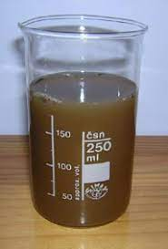

Une eau boueuse est un mélange hétérogène, peut-on rendre cette eau limpide, c’est-à-dire sans impureté.

## Activité : Séparer les éléments d’un mélange hétérogène.

Une eau boueuse est un mélange hétérogène, peut-on rendre cette eau limpide, c’est-à-dire sans impureté.

!!! note "Consigne :"
    Consigne 1 : Suivre le protocole du document 1 et noter vos observations à chaque étape.

    Consigne 2 : Pour chaque étape, indiquer si le mélange est homogène ou hétérogène.

**Document 1 : Protocole de séparation.**

1.  Agiter le tube fourni.

Décantation :

1.  Attendre quelques minutes, en laissant le tube immobile.

    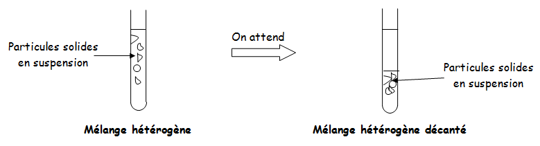

Filtration

1.  Verser le liquide qui surnage après
    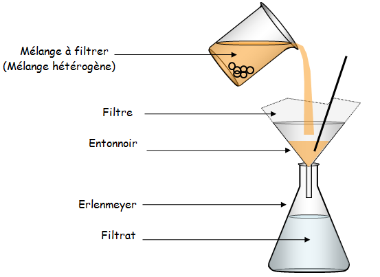
    décantation dans un bécher.
2.  Verser le contenu du bécher dans le filtre disposé sur un entonnoir
    sur un autre bécher ou erlenmeyer.

### Activité Séparer les éléments d’un mélange homogène.

!!! note "Consigne :"

    Consigne 1 : Suivre le protocole du document 1 pour de l’eau minérale.

    Consigne 2 : Suivre le protocole du document 1 pour de l’eau
    déminéralisée.

    Consigne 3 : Comparer les résultats.

    Consigne 4 : À partir de vos connaissances et de vos observations,
    expliquer ce qui est obtenu

**Document 1 : Protocole :**

Étape 1 : Verser de 10 ml d’eau minéralisée dans un récipient.

Étape 2 : Faire chauffer l’eau à l’aide d’une plaque chauffante jusqu’à
évaporation totale. (voir le schéma)

Étape 3 : Réaliser la même expérience avec de l’eau déminéralisée.

Étape 4 : Comparer les résultats.

**Document 2 : Schéma du montage**

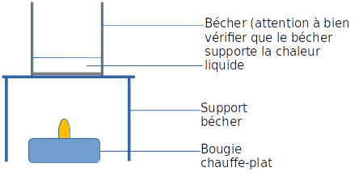

!!! abstract "Conclusion :"

    La **décantation** permet de séparer les constituants les plus lourds d’un **mélange hétérogène**. Les constituants les plus lourds tombent au fond du récipient. On obtient un *mélange hétérogène décanté*.

    La **filtration** permet donc d’obtenir un **mélange homogène** à partir d’un mélange hétérogène. (Le filtre retient toutes les particules solides du mélange hétérogène).

### Activité Séparer les éléments d’un mélange homogène.

!!! note "Consigne :"
    Consigne 4 : Distiller l’eau minéralisée

Protocole :

Étape 1 : Verser l’eau à traiter dans un ballon.

Étape 2 : Chauffer à l’aide d’un chauffe-ballon.

Étape 3 : Mettre en marche le système de distillation.

Etape 4 : Attendre la vaporisation d’une partie du mélange.

Etape 5 : Récupérer l’eau distillée.

**Schéma de l’expérience :**

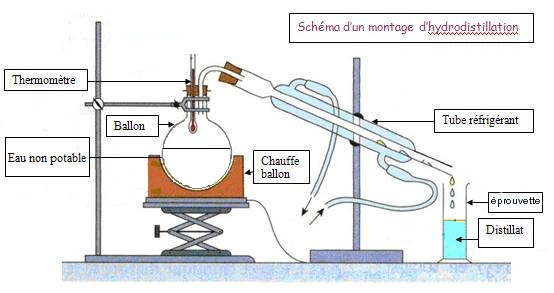

Observation et interprétation :

1.  Dans le récipient avec l’eau minérale, il y a un dépôt au fond : ce sont les minéraux.

2.  Dans le récipient qui contenait l’eau déminéralisée, il n’y a plus rien : toute l’eau s’est évaporée. Il n’y a donc pas de minéraux dans cette eau.

!!! abstract "Conclusion :"

    La *distillation* est une *technique de séparation*.

    Elle aussi permet de *tuer les microbes en chauffant* le mélange et de **séparer l’eau des minéraux**.

!!! abstract "Synthèse générale :"
    La décantation, la filtration et la distillation sont des *techniques de séparation et de purification*.

    Ces techniques permettent d’obtenir une *eau pure* (pure ne veut pas dire potable).

    Une trop grande quantité d’eau pure n’est pas potable.

### Exercice d’application :

!!! note "Consigne :"
    Consigne 1 : Où prélève-t-on l’eau avant de la traiter ?
    Consigne 2 : Quelles étapes correspondent à une filtration ?
    Consigne 3 : Quelle est la fonction d’un coagulant ? Quelle est la méthode de séparation correspondante ?
    Consigne 4 : Pourquoi l’eau limpide obtenue après les quatre premières étapes du traitement n’est-elle toujours pas potable ?
    Consigne 5 : À quoi l’ozonation sert-elle ?
    Consigne 6 : Pourquoi réalise-t-on une chloration ?

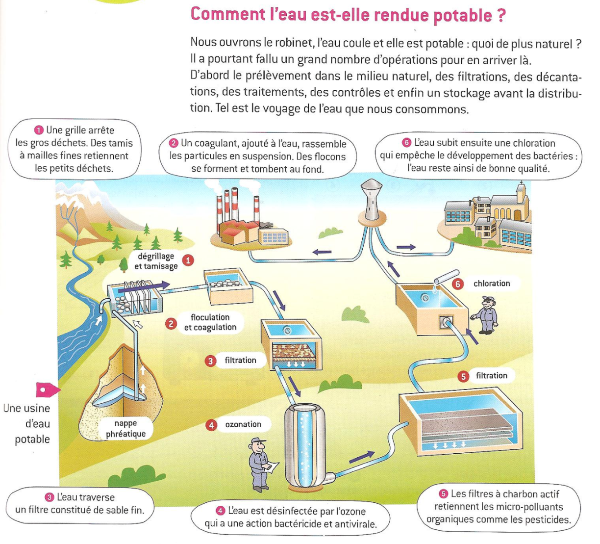

!!! note-prof "Correction :"

    1.  Dans une station de pompage l’eau est prélevée dans l’environnement.
        Dans une station d’épuration, elle provient des eaux usées (égouts).

    2.  Les étapes 1, 3 et 5 correspondent à des filtrations. Au cours des étapes la filtration est de plus en plus fine.

    3.  Le coagulant sert à agglomérer (rassembler) les impuretés afin u’elles tombent au fond de la cuve. Il s’agit donc d’une décantation.

    4.  L’eau limpide n’est pas encore potable car elle comporte des microbes.

    5.  L’ozonation est une technique permettant de tuer les microbes : c’est une désinfection.

    6.  La chloration permet de maintenir la qualité de l’eau lors de son transport.
