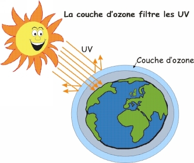
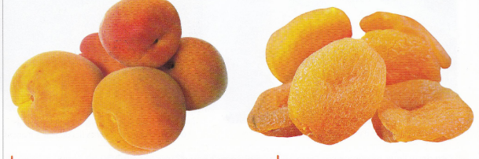
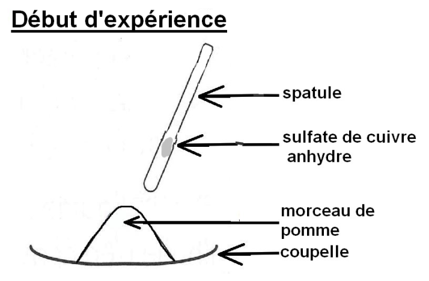
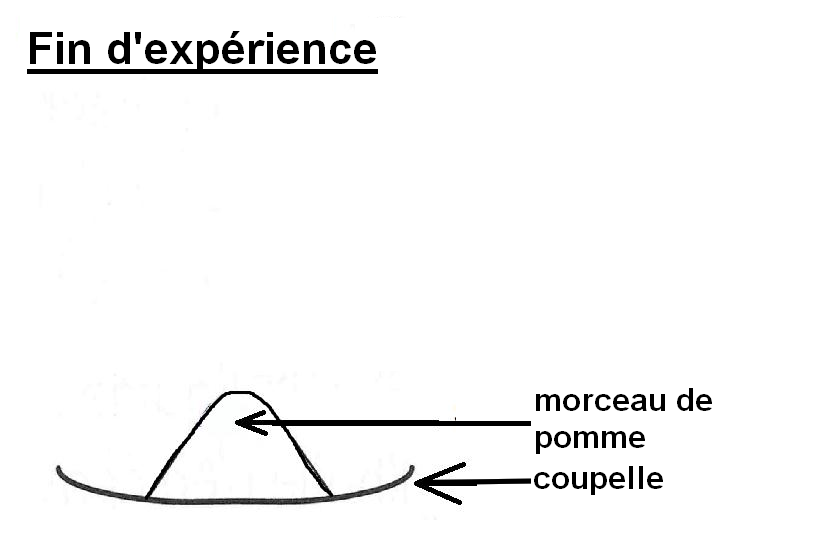

# Séquence 2 : L’histoire de la Terre et de la vie

## Séance 1 : Les conditions de vie sur Terre

Situation déclenchante : Photographie de Thomas Pesquet et de la Terre.


La planète Terre est la seule planète du système solaire à présenter de
la vie.

Problématique : De quoi est constitué notre système solaire ? Pourquoi
on ne peut pas vivre sur une autre planète ? Quelles sont les conditions
nécessaires à la vie ?

Hypothèses :

Vérification des hypothèses :

1.  ### De quoi est constitué notre système solaire ?

#### 

1.  #### Introduction au système solaire

Consigne 1 : Lance le site du document et retrouve les 3 codes secrets.

Consigne 2 : Classer les planètes en fonction de leur type planètes
telluriques et planètes géantes, justifie ton classement.

Consigne 3 : Décrire le mouvement des planètes par rapport au soleil.

Consigne 4 : À l’aide des informations de l’activité, complète le
document 5

Document 1 : Une aventure pour découvrir l’univers.


Sur ce site tu devras aider des
enfants perdus dans l’univers en les aidant à localiser la Terre dans
l’univers, pour cela il faudra découvrir ce qui t’entoure et répondre
aux différentes questions.

Document 2 : Les planètes du système solaire et quelques chiffres.


***Document ****3**** : Le système
solaire***


Le système solaire est composé d’une étoile, le Soleil, de huit planètes
qui tournent autour de lui et d’autres corps célestes (satellites
naturels, comètes, astéroïdes, etc.).

Document 4 : Deux catégories de planètes.

-   Planète tellurique : Planète constituée principalement de roches
    solides.
-   Planète géante : Planète de très grande taille dont la composition
    est riche en gaz.

Document 5 : La place de la Terre.

La Terre est une………………………… du système solaire.

Le………………………………… est l’ensemble composé du Soleil et des astres qui
tournent autour de lui. Il fait partie de la galaxie appelée la………………………
Il est composé d’une…………… (le………………), de…………………… (dont la Terre),
de……………………………… (comme la……………), et de corps rocheux plus petits (…………………
et……………………)

Correction

question 5 Les planètes tournent autour du Soleil avec une trajectoire
circulaire et une vitesse constante (mouvement = trajectoire +vitesse à
décrire)

Bilan :

Les astres (planètes, satellites, étoiles, astéroïdes, comètes) sont
regroupés dans des systèmes.

Plusieurs systèmes forment une galaxie. Il y a une infinité de galaxies
dans l’Univers. L’Univers est trop grand pour être vu en entier. Il est
possible de voir des objets très éloignés dans l’Univers à l’aide d’un
télescope ou de satellites.

Les planètes ont un mouvement circulaire uniforme, autour d’une étoile.

La Terre est dans le système solaire, elle tourne autour de son étoile,
le Soleil.

1.  ### Pourquoi on ne peut pas vivre sur une autre planète ?

```{=html}
<!-- -->
```
1.  #### Les conditions nécessaires à la vie

Consigne : Peut-on trouver de la vie sur Mercure, Vénus ou Mars ?
Justifie.

Document 1 : L’eau liquide et la vie

Les scientifiques pensent qu’une succession de très nombreuses
transformations chimiques est à l’origine de la vie. Or ces
transformations peuvent se produire de façon simultanée dans l’eau à
l’état liquide, mais pas dans d’autres liquides. L’eau à l’état liquide
a donc sans doute été indispensable à l’apparition de la vie.

L’eau est très abondante dans l’univers, mais c’est souvent sous forme
de glace ou de vapeur. L’eau à l’état liquide est rare ailleurs que sur
notre planète.

Document 2 : La température à la surface d’une planète.

Pour qu’une planète possède de l’eau à l’état liquide à sa surface, il
faut que la température permette à l’eau de se trouver à l’état liquide.
Cela signifie que la température moyenne à la surface de la planète doit
être supérieure à 0 °C.

La température de la surface d’une planète dépend notamment de l’énergie
thermique qu’elle reçoit de son étoile. Plus elle est éloignée plus la
quantité reçue est faible.

***Document**** 3**** : ****Comparaison de****s quelques astres du
système solaire***

|                |                                     |                                     |                         |                                                                |     |     |
|----------------|-------------------------------------|-------------------------------------|-------------------------|----------------------------------------------------------------|-----|-----|
| Astres         | Distance au Soleil (millions de km) | Température moyenne de surface (°C) | Présence d’eau actuelle | Présence d’une atmosphère (couche de gaz entourant la planète) |     |     |
| Solide (glace) | Liquide                             | Gaz (vapeur d’eau)                  |                         |                                                                |     |     |
| Mercure        | 58                                  | +180                                |                         |                                                                |     |     |
| Vénus          | 108                                 | +460                                |                         |                                                                | x   | x   |
| Terre          | 150                                 | +15                                 | x                       | x                                                              | x   | x   |
| Lune           | 150                                 | −20                                 | x                       |                                                                |     |     |
| Mars           | 228                                 | −50                                 | x                       |                                                                |     | x   |

***Document ****4**** : l’impact de l’ozone***


L’ozone est un gaz qui absorbe
les UV (ultraviolet). Il est présent dans la haute atmosphère de la
Terre où il forme une couche appelée « couche d’ozone ».

Or, les UV solaires à trop fortes doses sont mortels pour les êtres
vivants aériens : ce sont des rayons qui transportent beaucoup
d’énergie. L’eau liquide peut absorber les rayons UV.

De l’ozone a été détecté sur Vénus et sur Mars, mais en quantité très
faible.

Document 5 : Une différence étonnante entre la Terre et la Lune

La Terre et la Lune sont à la même distance du Soleil. Pourtant leurs
températures moyennes sont différentes. En effet, la Terre possède une
enveloppe gazeuse (atmosphère), contrairement à la Lune. Or, certains
gaz (les gaz à effet de serre) composant cette atmosphère permettent de
conserver la chaleur au lieu de la laisser s’échapper dans l’espace,
c’est l’effet de serre. Parmi les planètes proches du Soleil c’est sur
Vénus que l’effet de serre est le plus important car sot atmosphère est
très riche en gaz à effet de serre.

Aide 1 : Indiquer la particularité de la Terre qui a permis le
développement de la vie.

Aide 2 : Indiquer sont les paramètres qui influence la présence d’eau
liquide d’une planète.

Aide 3 : Indiquer sont les paramètres qui influence la température d’une
planète.

Aide 4 : **Expliquer en quoi la couche d’ozone dans l’atmosphère
favorise le développement de la vie.**

Correction :

1/On observe que sur Vénus (2e planète du système solaire), il fait +
460 °C, alors que sur Mars il ne fait plus que – 50 °C.

Conclusion : plus la planète est éloignée du soleil, plus il y fait
froid.

2/Les êtres vivants sont tous composés d’une grande quantité d’eau. Ils
ont donc besoin de la renouveler avec un apport d’eau, notamment un
apport d’eau à l’état liquide.

3/ D’après le schéma, on voit que la couche d’ozone renvoie une grande
partie des rayons nocifs du soleil (UV). Elle protège donc les êtres
vivants.

4/ La position de la Terre dans le système solaire permet d’avoir une
température adaptée à la présence d’eau sous ses 3 états, et adaptée au
développement de la Vie.

L’eau liquide est nécessaire au fonctionnement des êtres vivants.

La couche d’ozone protège les êtres vivants d’une partie des mauvais
rayons du soleil.

Bilan :

Pour pouvoir vivre sur une planète, il faut regrouper les conditions
nécessaires au fonctionnement des cellules :

• Une température adaptée (environ 15 degrés)

• De l’eau à l’état liquide

• Une atmosphère avec une couche d’ozone protectrice des mauvais rayons
du soleil (Rayons Ultras Violets)

La température d’une planète dépend de sa distance au Soleil et de la
présence d’une atmosphère.

Attention : le dioxygène n’est pas nécessaire à la vie ! (des bactéries
anaérobies qui font de la fermentation ; bactérie dénitrifiante dans le
cycle de l’azote (utilise l’azote à la place du dioxygène))

1.  ### En quoi l’eau liquide est importante pour la vie ?

Hypothèse :

1.  #### L’eau, un composant des ***êtres vivants.***

Consigne 1 : Réaliser le protocole du document 2 et expliquer ce que
l’on peut conclure.

Consigne 2 : Faire un schéma des différentes étapes de l’expérience.

Consigne 3 : Compare la masse d’un organisme frais et d’un organisme
sans eau, calculer la quantité d’eau à l’intérieur.

Consigne 4 : Expliquer en quoi l’eau est importante pour les êtres
vivants.

Document 1 : Expérience au sulfate du cuivre.

Le sulfate de cuivre est normalement blanc, ou bleu très clair ; il se
colore en bleu s’il est en contact avec de l’eau.

1.  Mettre un morceau de pomme dans une coupelle
2.  À l’aide d’une spatule, déposer une petite quantité de sulfate de
    cuivre anhydre sur le morceau de pomme.
3.  Observer le résultat

***Document ****2**** : Composition de****s êtres vivants***




La masse d’un abricot frais est d’environ 96 g, la masse d’un abricot
sec est d’environ 13 g.

Pour obtenir un abricot sec, il suffit d’éliminer l’eau liquide contenue
dans des abricots frais en les chauffant sans les cuire.

Document 3 : l’eau liquide et la vie.

Certaines des transformations chimiques à l’intérieur des êtres vivants
ne peuvent se faire que dans l’eau liquide.

Chez de nombreux êtres vivants, l’eau est un élément circulant
permettant le transport de nutriments ou de déchets dans l’organisme.
L’eau liquide est ainsi le principal élément du sang des animaux ou de
la sève des végétaux.





Observation : J’observe que le sulfate de cuivre anhydre se colore en
bleu une fois posé sur le morceau de pomme.

Conclusion : J’en conclus que la pomme contient de l’eau.

Validation des hypothèses :

On a bien validé nos hypothèses.

Bilan :

Tous les êtres vivants contiennent de l’eau à l’état liquide et ont
besoin d’eau ou d’aliments contenant de l’eau.

## *Séance 2 : Les mouvements de la Terre*

Situation déclanchante :

Notre vision du monde a beaucoup changé au fil des siècles grâce aux
découvertes faites au cours du temps. Ces avancées ont permis d’aboutir
à ce que nous savons aujourd’hui grâce aux moyens technologiques.

1.  ### Comment la représentation de la Terre et de notre système solaire s’est construite ?

Hypothèse :

Vérification des hypothèses :

#### 

1.  #### La représentation de la Terre dans l’univers au cours du temps

*Consigne 1 :* A l’aide de votre tablette, scannez le QRcode ci-contre
ou bien taper le lien suivant dans la barre de rechercher internet :
[*hachette-clic.fr/22st6046*](../Séance%202%20La%20représentation%20de%20la%20Terre%20dans%20l_univers%20au%20cours%20du%20temps/hachette-clic.fr/22st6046)


*Consigne 2 :* Recherchez les informations afin de compléter la frise
chronologique suivante.

Époque

<table>
<tbody>
<tr class="odd">
<td>Instruments utilisés</td>
<td>………………………………………………</td>
<td>………………………………………………</td>
<td>………………………………………………</td>
<td>………………………………………………</td>
</tr>
<tr class="even">
<td>Forme de la Terre</td>
<td><p>Observation :</p>
<p>………………………………………………</p>
<p>Déduction : La Terre est</p>
<p>………………………</p></td>
<td><p>Observation par :</p>
<p>………………………</p>
<p>………………………</p>
<p>Déduction : La Terre est</p>
<p>………………………</p></td>
<td><p>Observation :</p>
<p>………………………</p>
<p>………………………</p>
<p>Déduction : La Terre est</p>
<p>………………………</p></td>
<td><p>Observation :</p>
<p>………………………</p>
<p>………………………</p>
<p>Déduction : La Terre est</p>
<p>………………………</p></td>
</tr>
<tr class="odd">
<td>Mouvement de la Terre</td>
<td><p>Observation …………………………………………………………………………………………</p>
<p>Déduction …………………………………………………………………………………</p></td>
<td><p>Observation par………………………… des………………………………………………</p>
<p>Déduction :…………………………………</p>
<p>……………………………………………………</p></td>
<td></td>
<td></td>
</tr>
<tr class="even">
<td>Schéma du modèle</td>
<td></td>
<td></td>
<td></td>
<td></td>
</tr>
</tbody>
</table>

Correction :


*Bilan :* à compléter :

Dans l’Antiquité, beaucoup pensaient que la Terre était………… car……………
Aristote fût le premier à démontrer que la Terre est……… en
observant…………………………………… Copernic a été le premier scientifique à prouver
que la Terre n’est pas……………………………………, mais que c’est la Terre qui tourne
autour du………… Aujourd’hui, grâce aux……… et aux……………, donc par
l’observation………, nous savons que : la Terre est…………………… et aplatie au
niveau des pôles.

*Bilan* à compléter :

Dans l’Antiquité, beaucoup pensaient que la Terre était plate………… car le
sol est plat…………… Aristote fût le premier à démontrer que la Terre est
sphérique……… en observant l’ombre arrondie de la Terre sur la Lune……
Copernic a été le premier scientifique à prouver que la Terre n’est pas
au centre de l’Univers……, mais que c’est la Terre qui tourne autour du
Soleil………… Aujourd’hui, grâce aux satellites……… et aux sondes
spatiales…, donc par l’observation directe………, nous savons que : la
Terre est sphérique… et aplatie au niveau des pôles.

1.  ### Quelles sont les conséquences des mouvements de la Terre ?

#### 


1.  #### La rotation autour du Soleil.

Consigne 1 : En utilisant les documents 1 et 2, citer trois observations
qui montrent que des saisons existe sur Terre

Consigne 2 : Indiquer comment varie l’inclinaison des rayons solaires
parvenant sur l’hémisphère Nord entre l’été et l’hiver, dans le document
3.

Consigne 3 : À l’aide de l’expérience du document 4 et de la réponse 2,
expliquer pourquoi il fait plus chaud en été qu’en hiver.

Consigne 4 : Rédiger un bilan expliquant l’alternance des saisons.

Document 1 :
Trajectoire
 apparente du Soleil pendant une
journée en France selon la saison.

Document 2 : Variation de la durée des journées et des nuits au cours de
l’année en France.


D
ocument 3 :
Inc
linaison des rayons solaires dans
l’hémisphère Nord.

L’axe de rotation de la Terre est incliné ce qui fait que les rayons
solaires arrivent sur Terre avec des angles différents en fonction des
saisons.

Document 4 : Expérience pour modéliser la variation de l’énergie reçue
selon 
l’inclinaison des rayons solaires.

|                |                     |       |
|----------------|---------------------|-------|
|                | Température (en °C) |       |
| Temps (en min) | Cas 1               | Cas 2 |
| 0              | 20,0                | 20,0  |
| 4              | 25,2                | 22,2  |
| 6              | 28,0                | 22,6  |

Entre les 2 cas l’inclinaison de la lampe change et donc l’inclinaison
des rayons lumineux changent aussi.

Document :

<http://www.lumni.fr/video/pourquoi-y-a-t-il-quatre-saisons>

[https://www.yout-ube.com/watch?v=Ps1UPv4ETRk](https://www.youtube.com/watch?v=Ps1UPv4ETRk)

Bilan :

La Terre tourne sur elle-même en autour de son axe de rotation en
24 heures, ce qui cause le cycle jour/nuit, ce n’est pas toujours la
même partie de la Terre qui est face au Soleil et donc qui est éclairée.

La Terre tourne autour du Soleil en 1 an. Sa trajectoire est elliptique
(ellipse = cercle étiré).

L’axe de rotation de la Terre est incliné ce qui explique l’alternance
des saisons. Les saisons dans l’hémisphère Sud sont inversées par
rapport aux saisons dans l’hémisphère Nord.

## 
Séance 3 : Evolution de la biodiversité

Rappel du primaire :

*Définition d’une espèce :* Une espèce est un ensemble d’individu
capable de se reproduire entre eux et dont la descendance est fertile.

*Situation déclanchante :* À ce jour, environ 2 millions d’espèces ont
été inventoriées, mais on estime qu’il en existe entre 8 et 20
millions !

*Problématique :* Est-ce que toutes les espèces actuelles sont présentes
depuis la formation de la Terre ?

Hypothèse :

Vérification des hypothèses :

1.  ### Quels ont été les grands changements dans l’histoire des êtres vivants ?

```{=html}
<!-- -->
```
1.  #### 

2.  #### Une frise chronologique

Consigne 1 : À partir du document 1 et de vos connaissances, compléter
le QCM.

**Consigne 2 :** Nous nous intéresserons pour le moment qu’aux derniers
540Ma car c’est là que l’on retrouve le plus de fossiles. À partir des
différents documents, réaliser une frise chronologique.

Document 1 : Quelques dates sur les débuts de la Terre et de la vie.

Ma= Millions d’années (1 000 000 ans)

— 4500 Ma : formation de la Terre.

— 3800Ma : apparition de la vie dans les océans.

— 2000Ma : apparition du dioxygène dans l’air.

— 540Ma : Apparition des 1ers animaux invertébrés à coquille.

— 430 Ma : Apparition des 1ers végétaux terrestre.

1\) La vie est elle apparue :

-   avant la formation de la Terre

-   en même temps que la formation de la Terre

-   après la formation de la Terre

2\) La vie est apparue :

-   Dans l’eau en premier

-   sur la terre en premier

-   dans l’eau et sur terre en même temps.

3\) L’oxygène est :

-   nécessaire à la vie

-   n’est pas utile pour vivre

-   est utilisé par certains être vivant pour vivre mais pas tous.

1.  

Document 2 : différents groupes d’animaux au cours des temps
géologiques.

1\. Trilobites : Groupe d’animaux exclusivement marins vivant
principalement dans le fond des mers. Ils ont vécu de-540 Ma et ont
disparus en -245 Ma

2\. Dinosaures : Groupe d’animaux de grande taille, ayant vécu entre
-245Ma et -65Ma. Ce groupe s’est éteint après la chute d’une météorite
au Mexique qui aurait impacté la chaîne alimentaire.

3\. Ammonites : groupe de mollusque ayant vécu entre -205Ma et -65Ma Ils
étaient capables de flotter dans l’eau grâce à une coquille creuse
découpée en plusieurs loges qu’il pouvait remplir ou vider d’eau pour
faire augmenter ou diminuer son poids.

4\. Amphibien : Groupe d’animaux qui débutent leur vie à l’état larvaire
dans l’eau puis se métamorphose pour vivre une fois adulte sur la terre.
Ils sont apparus en -400Ma et sont toujours présent actuellement.

5\. Mammifère : groupe
d’[**animaux**](https://fr.vikidia.org/wiki/Animaux)
[**vertébrés**](https://fr.vikidia.org/wiki/Vertébré) qui nourrissent
leurs petits avec du [**lait**](https://fr.vikidia.org/wiki/Lait)
produit par les glandes mammaires des femelles. Ils sont apparus en
-200Ma mais se sont diversifié avec la disparition des dinosaures.

6\. Oiseaux : Groupe d’animaux
[tétrapodes](https://fr.wikipedia.org/wiki/Tétrapodes) (4 membres)
caractérisée par la [bipédie](https://fr.wikipedia.org/wiki/Bipédie),
des [ailes](https://fr.wikipedia.org/wiki/Aile_(oiseau)) et un
[bec](https://fr.wikipedia.org/wiki/Bec) sans dents. Ils sont apparus
vers -150Ma et sont les seuls représentants actuels des dinosaures.

7\. Lignée humaine : Les premiers ancêtres de la lignée humaine sont
apparus en -7Ma. L’Homme fait partie du groupe des primates. Plusieurs
espèces sont apparues puis ont disparus. Il ne reste actuellement que
notre espèce Homo sapiens.

8\. Algues : Ensemble de plusieurs groupes de végétaux aquatiques
capables de réaliser la photosynthèse. Ils sont apparus en -520Ma et
sont toujours présents actuellement.

9\. Fougère : groupe de végétaux vivant dans les milieux tropicaux. Ils
sont apparus vers -375 Ma.

10\. Gymnosperme : Groupe de végétaux présentant des graines mais pas de
fleur. Ce sont principalement des conifères. Ils sont apparus vers
-305Ma.

11\. Angiosperme : groupe de végétaux qui vont présenter des fleurs puis
des fruits contenant les graines. Ils sont apparus vers -140Ma.

1\. 
 2.

 3.

 4.

 5.

 6.

 7.

 8.

 9.

 10.


11.


Document 3 : Astuce pour réaliser sa frise chronologique.

1\. Prenez votre cahier en mode paysage pour avoir plus de place.

2\. Vous prendrez comme échelle : 1 carreau = 20 Ma.

3\. On part de la gauche vers la droite : ainsi la date la plus ancienne
(-540Ma) se situe à gauche. À droite on retrouvera le 0 qui correspond à
l’actuel.

4\. En dessous de votre ligne des temps, faites des cases qui
commenceront à la date d’apparition du groupe d’êtres vivants et qui se
termineront lors de leur disparition ou à l’actuel s’ils sont toujours
présents.

Bilan :

La Terre s’est formée il y a environ 4500 Ma.

La vie n’est apparue que bien plus tard, d’abord dans les océans puis
sur terre.

La vie s’est diversifiée, mettant en présences différentes espèces dont
certaines ont fini par disparaître alors que d’autres se sont
développées. D’autres encore sont apparues au cours du temps.

Ainsi, nous ne retrouvons pas forcément les mêmes espèces actuellement
que dans le passé.

*TRANSITION :* Différentes espèces au cours du temps mais y a-t-il un
lien entre les espèces passées et actuelles ?