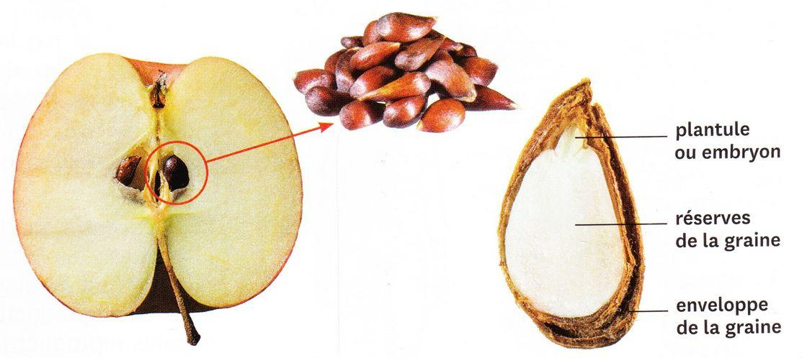
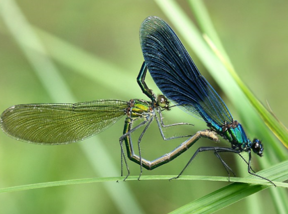

## Séance 2 : La croissance des êtres vivants.

### Comment expliquer la croissance des êtres vivants

  
  
Les êtres vivants grandissent tous, pour cela ils doivent se nourrir.

#### 

#### La croissance des êtres vivants

Consigne 1 : Construire un graphique de l’évolution de la masse d’un
phasme en fonction du temps. (En utilisant l’échelle 1 cm = 1 jour et
1 cm=1 g).

Consigne 2 : À l’aide des documents 1 et 2, montrer que les **êtres
vivants ont une croissance.**

Consigne 3 : À partir des différents documents 3 et 4, montrer que la
croissance d’un être vivant s’explique par la production de matière.

Consigne 4 à faire à la maison : Construire un graphique de l’évolution
de la taille d’un phasme en fonction du temps. (En utilisant l’échelle
1 cm = 1 jour et 1 cm=1 mm). Décrire ensuite le graphique.

Compétence travaillée : Construire un Graphique et Décrire un graphique

Document 1 : Tableau de mesures effectuées par des élèves lors d’un
élevage de phasmes.

Pour vivre, le phasme a besoin d’eau et de matière organique végétal (du
lierre)


|                             |     |     |     |     |     |
|-----------------------------|-----|-----|-----|-----|-----|
| Âge (en jours)              | 1   | 3   | 5   | 7   | 9   |
| Masse (en g)                | 1,7 | 2,9 | 3,6 | 5,0 | 8,2 |
| Longueur du phasme (en mm)  | 2,0 | 3,5 | 5,5 | 7,0 | 8,5 |

***Document 2 : *****Graphique de
l’évolution de la masse d’un plant de blé en fonction du temps**


Document 3 : Une marmotte

Durant l’hiver, elle s’endort dans un terrier et ne consomme aucun aliment : c’est l’hibernation. Au retour du printemps, elle sort de son abri, elle pèse alors 2,5 kg. À la fin de l’été, elle mange 400 grammes de nourriture par jour (de l’herbe, des écorces et des baies). Elle fabrique ainsi d’importantes réserves de graisse (une matière
organique), elle pèse 4 kg avant l’hibernation, qui permettent le
fonctionnement de son organisme durant l’hibernation
suivante.


Document 4 : Le pin douglas.


Le bois est essentiellement composé de cellulose, une matière organique.
Chaque année, un cerne se forme. Il se compose d’une partie claire, le
bois de printemps, et d’une partie plus foncée appelée bois d’été.

Bilan :

Tous les êtres vivants (animal, plante...) sont composés de matière
organique.

Lorsqu’un être vivant grandit ou grossit, il fabrique de la matière
organique.

Les êtres vivants sont donc des producteurs de matière.

Pour grandir, les êtres vivants prélèvent de la matière dans leur milieu
de vie. Il y a donc des échanges de matière entre un être vivant et son
milieu de vie.

Définition matière organique : matière fabriquée par les êtres vivants

### Comment se développe une plante


#### Le développement des végétaux

**Consigne : À partir des documents, construire le cycle de vie du
pommier et explique comment une graine peut permettre la formation d’une
nouvelle plante.**

Document 1 : Définition cycle de vie.

Le cycle de vie est la suite des différentes étapes dans la vie d’un
organisme vivant. Ce cycle est généralement construit avec des flèches
qui relient les différentes étapes. Chaque étape est représentée par un
dessin ou un texte.

Document 2 : Le
pommier


Le pommier est un être vivant, comme tous les êtres vivants il va
grandir et se reproduire. Pendant quelques années (4 ou 5 ans), le
pommier va grandir, c’est la période de croissance. Après, le pommier va
fleurir pour la première fois, il fleurira ensuite tous les ans, c’est
la floraison.

  

Document 3 : La fleur de
pommier.


Certaines de ses fleurs vont se transformer en fruits contenant des
graines, les pommes. Ce phénomène permet la reproduction des pommiers

  
  
  

Document 4 : La
pomme.


La pomme est un fruit qui contient plusieurs pépins, ce sont des graines
de pommiers. Cette graine contient l’embryon qui est un nouvel individu
issu d’une reproduction.

  
  
  


Document 5 : La graine de pommier.

Dans certaines conditions, la graine va donner une nouvelle plante,
c’est la germination. Ce petit pommier se développe : de nouvelles
racines et de nouvelles tiges se forment et grandissent.

  

  


Bilan :

La graine contient une petite plante. Lorsque la graine va germer, la
petite plante va commencer à grandir.

Cette plante va continuer de grandir et subir des transformations, des
fleurs vont apparaître.

Les fleurs de la plante vont se transformer en fruits contenant de
nouvelles graines. Ce sont les fleurs qui permettent aux plantes de se
reproduire.

**Ces étapes constituent le *****cycle de vie du végétal.***


## Séance 3 : le rôle des deux sexes dans la reproduction

1.  ### Comment les animaux se développent-ils ?

```{=html}
<!-- -->
```
1.  #### Le développement des animaux

**Consigne 1 : Construire un tableau comparant la reproduction de la
souris et de la libellule, le nombre d’individus nécessaires pour avoir
un nouvel individu, où se forme le nouvel individu, est-ce que le nouvel
individu ressemble à ses parents, les cellules nécessaires pour produire
un nouvel individu, les étapes nécessaires au passage à l’âge adulte.**

**Consigne 2 : Dessine un schéma représentant le cycle de vie de chaque
animal**

Compétences travaillées : Construire un tableau et Construire un schéma

Document 1 : La vie des libellules


De mai à octobre, il est fréquent
d’admirer près d’étangs et des ruisseaux des libellules aux grandes
ailes brillantes.

On peut observer des mâles et des femelles accouplés en vol ou posés sur
les tiges des plantes aquatiques. Lors de l’accouplement, une cellule
reproductrice mâle (spermatozoïde) rencontre une cellule reproductrice
femelle (ovule), ce qui permet de former un œuf.

Ensuite, les femelles vont pondre ces œufs. Quelques jours après la
ponte, les œufs éclosent et libèrent dans l’eau des larves. Les adultes
mourront tous à l’arrivée de l’hiver.

Ces larves chassent les petits animaux de la mare : elles approchent
lentement de leur proie en marchant grâce à leurs trois paires de
pattes.

La vie larvaire peut durer deux ou trois ans, durant lesquels les larves
vont grandir.

Après deux ou trois ans, au printemps, la larve va sortir de l’eau sur
une tige et devenir immobile. Ce stade d’immobilité est appelé nymphe.
Son corps va subir des transformations que l’on appelle métamorphose.

À la fin de la métamorphose, une jeune libellule adulte est libérée.
Elle ne grandira plus.

Document 2 : La vie des souris


Les souris sont de petits
mammifères pouvant vivre de deux à trois ans.

Les souris adultes peuvent se reproduire toute l’année. Lors de
l’accouplement, une cellule reproductrice mâle (spermatozoïde) rencontre
une cellule reproductrice femelle (ovule), ce qui permet de former un
fœtus. Le fœtus va se développer dans le corps de la femelle pendant une
vingtaine de jours.

Après ce petit temps, la femelle va accoucher d’une jeune souris. La
jeune souris va grandir et deviendra un adulte après trois mois. Elle ne
grandira plus.

|                                                              |        |            |
|--------------------------------------------------------------|--------|------------|
| Êtres vivants                                                | Souris | Libellules |
| Nombre d’individus nécessaires pour avoir un nouvel individu |        |            |
| Où se forme le nouvel individu                               |        |            |
| Une fois naît le nouvel individu ressemble à ses parents     |        |            |
| Cellules nécessaires pour produire un nouvel individu        |        |            |
| Étapes nécessaires au passage à l’âge adulte                 |        |            |





Définitions :

Larve : Stade de développement de certains êtres vivants à la sortie de
l’œuf. La forme et le mode de vie de la larve sont différents de ceux de
l’adulte.

Cycle de vie : Série d’étapes qui composent la vie d’un être vivant.

Métamorphose : Transformation qui permet le passage de la larve à
l’adulte.

Adulte : Individu capable de se reproduire.

Bilan :

Pour se reproduire, la majorité des animaux ont besoin de deux
individus. Une cellule reproductrice mâle et une cellule reproductrice
femelle s’unissent pour former le nouvel individu.

Ce nouvel individu peut soit se former dans un œuf soit dans la femelle.

Chez les insectes, le jeune est différent de l’adulte, on l’appelle
larve. La larve va grandir puis subir une métamorphose où elle va se
transformer en adulte qui est capable de se reproduire.

Chez les mammifères, le jeune ressemble à l’adulte. Le jeune va grandir
puis il deviendra un adulte capable de se reproduire.

Ces étapes constituent le *cycle de vie de l’animal*.

1.  Le point commun entre tous les jeunes animaux est :

    1.  qu’ils sont identiques aux adultes.
    2.  Qu’ils sont différents des adultes.
    3.  Qu’ils grandissent.
    4.  Qu’ils reproduisent.

2.  La libellule va acquérir la possibilité de se reproduire :

    1.  en sortant de l’œuf
    2.  en étant une larve.
    3.  Après la métamorphose.

3.  Pour former un nouvel individu, il faut :

    1.  deux cellules, un spermatozoïde et un ovule.
    2.  Une cellule, un spermatozoïde.
    3.  Une cellule, un ovule.
    4.  Un œuf.

4.  Le fœtus de souris se développe dans

    1.  un œuf :
    2.  le corps de la femelle.
    3.  Le corps du mâle.
    4.  Dans l’eau.

5.  La jeune libellule est appelée larve, donc :

    1.  elle sort d’un œuf.
    2.  C’est un insecte.
    3.  Elle est différente de l’adulte.

6.  La métamorphose est :

    1.  la transformation de l’adulte en œuf.
    2.  La transformation de l’œuf en larve.
    3.  La transformation de la larve en adulte.
    4.  La reproduction.

1.  ### Comment se développent les êtres humains ?

```{=html}
<!-- -->
```
1.  #### 

```{=html}
<!-- -->
```
1.  #### Le développement des êtres humains

Consigne 1 : **Représenter** le cycle de vie d’un être humain.

Consigne 2 : Compléter le bilan.

***Document 1 : ****La reproduction***


Chacun d’entre nous est issu
d’une reproduction sexuée, impliquant un homme et une femme.

A la suite d’un rapport sexuel (accouplement), il peut y avoir une
fécondation : c’est la rencontre d’un spermatozoïde produit par l’homme
et d’un ovule produit par la femme. Il se forme alors une cellule-œuf.

Le développement d’un nouvel individu commence aussitôt : en une
semaine, cette cellule-œuf devient un embryon qui se fixe dans l’utérus
maternel.

Vers la 8^e^ semaine, les organes sont identifiables : on appelle
désormais le futur bébé un fœtus.

Document 2 : Du fœtus au bébé prêt à naître.

L
e futur bébé se développe en
puisant ce dont il a besoin dans le sang de sa mère par l’intermédiaire
du placenta et du cordon ombilical.

A partir du 4^e^ mois, la mère peut sentir son bébé bouger.
L’accouchement a lieu au bout de 9 mois environ .

Entre le 3^e^ et le 4^e^ mois, le sexe du fœtus est reconnaissable par
échographie. En effet, déjà avant la naissance, un garçon et une fille
se distinguent par leur organes génitaux. Ces différences portant sur
les organes reproducteurs sont appelés caractères sexuels primaires.

Document 3 : les étapes de la vie


Un bébé va grandir et devenir un
enfant. La croissance va continuer pendant environ 16 à 18 ans. Lors de
l’adolescence, la puberté va avoir lieu et les individus deviennent
capable de se reproduire. A la fin de l’adolescence, l’adolescent
deviendra un adulte.

Bilan :

La \_\_\_\_\_\_\_\_\_\_\_\_\_\_\_\_\_\_\_ se forme lors de la
fécondation qui est la rencontre d’un
\_\_\_\_\_\_\_\_\_\_\_\_\_\_\_\_\_\_\_ (cellule reproductrice de
l’homme) et d’un \_\_\_\_\_\_\_\_\_\_\_\_\_ (cellule reproductrice de la
femme).

La cellule-œuf va se développer et former un \_\_\_\_\_\_\_\_\_\_\_\_
dans l’appareil reproducteur de \_\_\_\_\_\_\_\_\_\_\_\_.

La grossesse dure pendant \_\_\_\_\_\_\_\_\_\_. À partir de la 8^e^
semaine, tous les organes de l’embryon sont formés, on l’appelle alors
\_\_\_\_\_\_\_\_\_\_.

À partir de la naissance, le bébé continue de \_\_\_\_\_\_\_\_\_, il va
devenir un \_\_\_\_\_\_\_\_\_\_ puis un \_\_\_\_\_\_\_\_\_\_\_\_.

À l’adolescence, l’individu devient capable de se \_\_\_\_\_\_\_\_\_\_,
il va devenir un \_\_\_\_\_\_\_\_\_\_\_. L’ensemble de ces
transformations est la \_\_\_\_\_\_\_\_\_\_.

Après l’adolescence, l’individu ne grandit plus, mais d’autres
transformations vont apparaître jusqu’à sa mort.

Bilan :

La \_\_\_\_\_\_\_\_\_\_\_\_\_\_\_\_\_\_\_ se forme lors de la
fécondation qui est la rencontre d’un
\_\_\_\_\_\_\_\_\_\_\_\_\_\_\_\_\_\_\_ (cellule reproductrice de
l’homme) et d’un \_\_\_\_\_\_\_\_\_\_\_\_\_ (cellule reproductrice de la
femme).

La cellule-œuf va se développer et former un \_\_\_\_\_\_\_\_\_\_\_\_
dans l’appareil reproducteur de \_\_\_\_\_\_\_\_\_\_\_\_.

La grossesse dure pendant \_\_\_\_\_\_\_\_\_\_. À partir de la 8^e^
semaine, tous les organes de l’embryon sont formés, on l’appelle alors
\_\_\_\_\_\_\_\_\_\_.

À partir de la naissance, le bébé continue de \_\_\_\_\_\_\_\_\_, il va
devenir un \_\_\_\_\_\_\_\_\_\_ puis un \_\_\_\_\_\_\_\_\_\_\_\_.

À l’adolescence, l’individu devient capable de se \_\_\_\_\_\_\_\_\_\_,
il va devenir un \_\_\_\_\_\_\_\_\_\_\_. L’ensemble de ces
transformations est la \_\_\_\_\_\_\_\_\_\_.

Après l’adolescence, l’individu ne grandit plus, mais d’autres
transformations vont apparaître jusqu’à sa mort.

Correction :

La cellule-oeuf se forme lors de la fécondation qui est la rencontre
d’un spermatozoïde (cellule reproductrice de l’homme) et d’un ovule
(cellule reproductrice de la femme).

La cellule-œuf va se développer et former un embryon dans l’appareil
reproducteur de la femme.

La grossesse dure pendant 9 mois. À partir de la 8^e^ semaine, tous les
organes de l’embryon sont formés, on l’appelle alors fœtus.

À partir de la naissance, le bébé continue de grandir et grossir, il va
devenir un enfant puis un adolescent.

À l’adolescence, l’individu devient capable de se reproduire, il va
devenir un adulte. L’ensemble de ces transformations est la puberté.

Après l’adolescence, l’individu ne grandit plus, mais d’autres
transformations vont apparaître jusqu’à sa mort.

1.  ### Comment se manifeste la puberté ? 

#### 


1.  #### La puberté

Consigne 1 : **À partir des documents, construire un tableau comparant
les changements liés à la puberté chez les filles et les garçons, vous
indiquerez dans ce tableau : – l’âge moyen de la puberté, les
changements au niveau des organes sexuels, les changements de pilosité,
les changements de comportement et les changements de morphologie
(=forme du corps) **

Consigne 2 : Expliquer en quoi la puberté permet aux humains d’être
capables de se reproduire

Compétence travaillée : construire un tableau

Document 1 : Des changement du corps d’un garçon et d’une fille.


Document 2 : Des transformations
liées à la puberté

On observe des modifications comportementales : envie de plaire, sautes
d’humeur, émotivité, oppositions aux adultes, envie d’indépendance…
cette période que l’on nomme parfois de façon péjorative « crise
d’adolescence » ou « âge bête » est une étape importante du
développement.

L’adolescent-e subit également des transformations physiques (voir le
document 1).

Chez les filles, les règles surviennent. Les ovaires des filles
produisent un ovule par mois et chaque mois, l’utérus se prépare en cas
de fécondation en fabriquant des vaisseaux sanguins. S’il n’y a pas de
fécondation, ces vaisseaux sont détruits et du sang s’écoule du vagin :
ce sont les règles.

Chez les garçons, les éjaculations apparaissent, il s’agit d’émission de
sperme qui est un mélange de spermatozoïdes et de liquide nutritif pour
ces cellules.

Les règles et les éjaculations sont les signes visibles du
fonctionnement des appareils reproducteurs.

Correction :

|         |                       |                 |          |              |                               |
|---------|-----------------------|-----------------|----------|--------------|-------------------------------|
|         | Période de la puberté | Organes sexuels | Pilosité | Comportement | Morphologie (=forme du corps) |
| Filles  |                       |                 |          |              |                               |
| Garçons |                       |                 |          |              |                               |

Bilan :

Un être humain devient capable de se reproduire à partir de la puberté,
car les organes reproducteurs deviennent fonctionnels.

Lors de la puberté, le corps subit des transformations.

Lors de la puberté, il y a aussi des changements de comportement.

L’âge de la puberté n’est pas le même pour tout le monde.

1.  ### Comment se forment un fruit et des graines ?


Transformation de la fleur de prunier en prune


1.  #### La fleur

Consigne 1 :A partir des informations du
document 1, complète le document 2.

Consigne 2 : Réaliser la dissection de la
fleur de forsythia et faire le dessin de cette dissection. Voir document
3

***Document 1 : Les différents composants d’une fleur :***

Les fleurs sont des organes composés de différents éléments :

-   Les sépales sont les éléments les plus externes de la fleur, ils
    sont généralement verts, mais peuvent être de la couleur des
    pétales ; ils forment également une couronne et peuvent eux aussi
    être soudés ;
-   Les pétales sont les éléments les plus colorés de la fleur, ils sont
    disposés en cercle et forment une couronne, ils sont parfois soudés
    les uns aux autres ;
-   Les étamines sont à l’intérieur de la couronne de pétales, elles
    sont aussi disposées en cercle. Une étamine est composée d’une sorte
    de tige qui porte à son extrémité deux petits sacs jaunes pleins de
    pollen. Les étamines sont les organes reproducteurs mâles ;
-   Le pistil est l’élément central de la fleur, c’est l’organe
    reproducteur femelle. Il est constitué d’une zone renflée tout en
    bas de la fleur collée au pédoncule floral, qui se prolonge par une
    espèce de tube dont l’extrémité a souvent une forme d’étoile. À
    l’intérieur se trouve l’ovule.
-   Le pédoncule floral relie la fleur à une tige.

Document 2 : Schéma d’une fleur type.

Document 3 : Dissection florale.

*Matériel *:

<div markdown="1">

• Une paire de ciseaux fins,

• Un scalpel

• Une paire de pinces fines,

• Une loupe binoculaire avec une lumière

</div>

Réalisation de la dissection florale

Vous placerez l’ensemble des éléments sur le document 4 en respectant
l’emplacement dans la fleur.

<div markdown="1">

1.  Enlever les sépales et les pétales

A l’aide de ciseaux et de pinces, ôter les sépales.

Puis de la même manière, ôter les pétales.

1.  Enlever les organes reproducteurs

Prélever à l’aide des pinces les étamines.

Tenir le pistil à l’aide des pinces, puis couper délicatement l’ovaire
situé à sa base (pédoncule floral).

1.  Observer les organes reproducteurs

Observer le pollen des étamines à la loupe binoculaire.

Ouvrir l’ovaire à l’aide du scalpel et observer les ovules contenus dans
les ovaires à la loupe.

1.  Réaliser un compte-rendu

Faire un dessin des différentes pièces florales sur le document 4 en
respectant l’emplacement et le nombre d’éléments.

Légender les pièces florales.

</div>

***Document 4 :***


Bilan :

Une fleur est l’organe de la plante qui permet la formation des fruits
et des graines. Elle est composée de l’extérieur vers l’intérieur, de
sépales, de pétales, d’étamines et d’un pistil.

Les étamines portent les sacs polliniques contenant le pollen.

Le pistil contient des ovules.

#### 


1.  #### La formation du fruit et des graines

Consigne 1 : À l’aide du site : xpfleur.svtdebrock.com, faire les
différentes expériences du document 1 et noter les résultats observés.
(2 points)

Consigne 2 : expliquer dans quelles conditions la fleur se
transforme-t-elle en un fruit contenant des graines, en justifiant vos
réponses à l’aide des expériences que vous aurez effectuées. (1,5
points)

Consigne 3 : Indiquer ce que devient chacun des éléments de la fleur.
(0.5 point)

Consigne 4 : Compléter les schémas **du document 2. (1 point)**

Document 1 : Expériences sur la transformation des en fruits

<table>
<tbody>
<tr class="odd">
<td>Expériences</td>
<td>Conditions expérimentales</td>
<td>Résultats :<span
id="anchor-101"></span><br />
transformation en fruit ou pas.</td>
</tr>
<tr class="even">
<td>1</td>
<td>Fleur intacte</td>
<td></td>
</tr>
<tr class="odd">
<td>2</td>
<td>Fleur dont le pistil est isolé de tout
contact avec des insectes pollinisateurs et du pollen extérieur.</td>
<td></td>
</tr>
<tr class="even">
<td>3</td>
<td>Fleur dont on a supprimé certaines
parties :</td>
<td></td>
</tr>
<tr class="odd">
<td><p>• Sépales</p></td>
<td></td>
<td></td>
</tr>
<tr class="even">
<td><p>• Pétales</p></td>
<td></td>
<td></td>
</tr>
<tr class="odd">
<td><p>• Étamines</p></td>
<td></td>
<td></td>
</tr>
<tr class="even">
<td><p>• Pistil</p></td>
<td></td>
<td></td>
</tr>
<tr class="odd">
<td>4</td>
<td>Fleur dont on a supprimé les<br />
étamines et qui a reçu du pollen de la même espèce sur son pistil</td>
<td></td>
</tr>
<tr class="even">
<td>5</td>
<td>Fleur dont on a supprimé les étamines
et qui a reçu du pollen d’une autre espèce sur son pistil.</td>
<td></td>
</tr>
</tbody>
</table>

Document 2 : de la fleur au fruit


Aides :

<table>
<tbody>
<tr class="odd">
<td>Expériences</td>
<td>Conditions expérimentales</td>
<td>Résultats :<span
id="anchor-110"></span><br />
transformation en fruit ou pas.</td>
<td>Conclusions :<span
id="anchor-112"></span><br />
Pour qu’une fleur se transforme en fruit, il faut..</td>
</tr>
<tr class="even">
<td>1</td>
<td>Fleur intacte</td>
<td></td>
<td></td>
</tr>
<tr class="odd">
<td>2</td>
<td>Fleur dont le pistil isolée de tout
contact avec des insectes pollinisateurs et du pollen extérieur.</td>
<td></td>
<td></td>
</tr>
<tr class="even">
<td>3</td>
<td>Fleur dont on a supprimé certaines
parties :<span
id="anchor-116"></span><br />
• Sépales<br />
• Pétales<br />
• Étamines<br />
• Pistil</td>
<td></td>
<td></td>
</tr>
<tr class="odd">
<td>4</td>
<td>Fleur dont on a supprimé les<br />
étamines et qui a reçu du pollen de la même espèce sur son pistil.</td>
<td></td>
<td></td>
</tr>
<tr class="even">
<td>5</td>
<td>Fleur dont on a supprimé les étamines
et qui a reçu du pollen d’une autre espèce sur son pistil.</td>
<td></td>
<td></td>
</tr>
</tbody>
</table>

*Définition reproduction sexuée : *formation d’un nouvel individu issu
d’un mélange entre des organes mâles et femelles.

*Définition pollinisation : *Transport du pollen, des étamines jusqu’au
pistil.

Bilan :

Les fleurs sont les organes reproducteurs des plantes.

Les étamines produisent du pollen qui contient les cellules
reproductrices mâles et le pistil contient des ovules qui contiennent
les cellules reproductrices femelles.

Dans une fleur, le pollen qui est libéré par les étamines va être
transporté par le vent ou les insectes.

Si le pollen se dépose sur le pistil d’une fleur de la même espèce,
c’est la pollinisation, les cellules mâles et femelles vont se
rencontrer et permettre la fécondation.

La fleur va se transformer. Le pistil va former un fruit et les ovules
qui sont à l’intérieur du pistil vont donner des graines. Les autres
éléments meurent.

## Séance 4 : Production et conservation des aliments que nous consommons

1.  ### **Comment la pâte à pain peut-elle gonfler** ?

<table>
<tbody>
<tr class="odd">
<td>Types de pain</td>
<td>ingrédients</td>
<td>Étapes</td>
</tr>
<tr class="even">
<td>Pain blanc</td>
<td>500g de farine<br />
10g de sel<br />
3200 ml d’eau<br />
8g de levure de boulanger</td>
<td><p>Mélanger les ingrédients</p>
<p>pétrissage.</p>
<p>Laisser reposer la pâte</p>
<p>Façonner la pâte</p>
<p>Laisser reposer la pâte</p>
<p>cuisson à 240 °C</p></td>
</tr>
<tr class="odd">
<td>Pain azyme</td>
<td>500 g de farine<br />
12,5 de sel<br />
250 ml d’eau<br />
 </td>
<td><p>Mélanger les ingrédients</p>
<p>cuisson à 200 °C</p></td>
</tr>
</tbody>
</table>

Fiche méthode

La démarche scientifique

La démarche expérimentale comporte 6 étapes :

**PROBLÈME – HYPOTHÈSE – EXPÉRIENCES – RÉSULTATS ATTENDUS – RÉSULTATS
OBSERVES – INTERPRÉTATION. **

Il est important de noter tous les éléments de la démarche scientifique
et toujours marquer et souligner le nom de l’étape que vous êtes en
train de rédiger.

Formuler un problème scientifique

En observant les phénomènes qui nous entourent, on peut être amené à
dégager un problème scientifique c’est-à-dire une question scientifique.

Proposer une ou plusieurs hypothèses

C’est une proposition de réponse au problème. Elle n’est pas forcément
vraie, mais elle doit être précise et être une réponse scientifique
testable.

Tester les hypothèses

On peut tester une hypothèse par des expériences, des manipulations ou
des recherches.

Pour faire une expérience, il est nécessaire de bien réfléchir au
protocole c’est-à-dire à ce que l’on va faire dans l’expérience.

Si les hypothèses sont testées par des expériences il faut prévoir une
expérience pour chaque hypothèse et respecter 3 règles pour concevoir un
protocole :

 ne tester que l’effet d’un seul paramètre, soit en le supprimant, soit
en le faisant varier. Tous les autres paramètres doivent rester
constants.

 Faire en parallèle deux montages un montage test et un montage témoin
(le montage dans les conditions normales, il permet de comparer les
résultats), on décrira le protocole en comparant les deux montages et en
indiquant la différence entre les deux.

 Répéter l’expérience plusieurs fois si possible.

Avant de réaliser l’expérience, il faut écrire les résultats attendus.
C'est-à-dire les résultats que l’on prévoit obtenir si l’hypothèse est
validée.

Réfléchir aux conséquences vérifiables. Indiquer ce que l’on devrait
observer comme résultat à la fin de l’expérience.

Observer et exploiter les résultats

On doit absolument noter les résultats et il faut les interpréter,
c’est-à-dire leur donner un sens. Pour interpréter les résultats, il
faut les comparer deux à deux. On compare dans ce cas le témoin avec une
autre expérience ayant une seule différence au départ.

Conclure sur la validité de l’hypothèse et répondre au problème par une
synthèse.

1.  #### La levure et la pâte à pain.

Consigne 1 : À partir des documents, proposer une expérience permettant
de vérifier notre hypothèse, appeler le professeur pour vérification.

Consigne 2 : Réaliser l’expérience.

Consigne 3 : Compléter le tableau du document 3 jusqu’aux résultats
attendus.

Consigne 4 : Observer les deux pains, coupez-les en deux et compléter la
fin du tableau.

Document 1 : Recette pour fabriquer du pain.

<div markdown="1">

***Ingrédients ***:

-   30 g de farine
-   30 ml d’eau tiède
-   1/2 sachet de levure boulangère
-   1/2 pincée de sel

Étapes :

1.  Mélanger l’eau et la levure (cette étape à déjà été faite)
2.  Mélanger, dans un récipient, la farine, le sel et l’eau
3.  Pétrir 4 minutes et faire une boule avec la pâte
4.  Laisser gonfler 5 minutes de chaque côté
5.  Cuire 1 minute au micro-ondes.

</div>

Document 2 : Analyse de l’expérience.

<table>
<tbody>
<tr class="odd">
<td>Problème = question scientifique</td>
<td></td>
</tr>
<tr class="even">
<td>Hypothèse = proposition de réponse au problème</td>
<td></td>
</tr>
<tr class="odd">
<td>Protocole = comparer les deux tests de l’expérience en précisant la
différence entre les deux</td>
<td></td>
</tr>
<tr class="even">
<td><p>Résultats attendus =</p>
<p>Résultats que l’on devrait avoir si l’hypothèse est vérifiée</p></td>
<td></td>
</tr>
<tr class="odd">
<td><p>Résultats observés =</p>
<p>Résultats que l’on observe réellement</p></td>
<td></td>
</tr>
<tr class="even">
<td><p>Conclusion = Hypothèse validée ou non et </p>
<p>reformuler cette hypothèse</p></td>
<td></td>
</tr>
</tbody>
</table>

Bilan :

Pour fabriquer du pain, on utilise des levures. Les levures sont des
micro-organismes. Ce sont des êtres vivants unicellulaires. Ces levures
permettent de faire gonfler la pâte à pain.

On utilise d’autres micro-organismes, par exemple des bactéries, pour
faire le fromage ou des yaourts.

1.  ### 
    Comment les levures font-elles gonfler le pain ?


1.  #### Le rôle de la levure dans le gonflement du pain

Consigne : Analyse l’expérience du document 2 en complétant le tableau
du document 3.


Document 1 : Photo de levures
observées au microscope (x600)

La levure est un champignon microscopique utilisé dans la fabrication de
divers aliments et boissons : pain, bière, vin, etc.

Pour fabriquer du pain, il faut d’abord faire une pâte avec de la farine
et de l’eau qu’on laisse reposer avant de la cuire. Pour se nourrir, les
levures consomment des sucres.

Document 2 : Expérience pour mettre en évidence le rôle des levures.

Les scientifiques ont voulu tester l’hypothèse que les levures
produisent un gaz.

<table>
<tbody>
<tr class="odd">
<td><p>Début de l’expérience<br />
<br />
</p></td>
<td>
</td>
<td>
</td>
</tr>
</tbody>
</table>

Document 3 : Analyse de l’expérience.

<table>
<tbody>
<tr class="odd">
<td>Problème</td>
<td>Comment expliquer que les levures font gonfler le pain ?</td>
</tr>
<tr class="even">
<td>Hypothèse</td>
<td></td>
</tr>
<tr class="odd">
<td>Protocole</td>
<td></td>
</tr>
<tr class="even">
<td>Résultats attendus</td>
<td></td>
</tr>
<tr class="odd">
<td>Résultats observés</td>
<td></td>
</tr>
<tr class="even">
<td>Conclusion</td>
<td></td>
</tr>
</tbody>
</table>

#### 

1.  #### Le rôle de la levure dans le gonflement du pain

Consigne : Analyse l’expérience du document 2 en complétant le tableau
du document 3.


Document 1 : Photo de levures
observées au microscope (x600)

La levure est un champignon microscopique utilisé dans la fabrication de
divers aliments et boissons : pain, bière, vin, etc.

Pour fabriquer du pain, il faut d’abord faire une pâte avec de la farine
et de l’eau qu’on laisse reposer avant de la cuire. Pour se nourrir, les
levures consomment des sucres.

Document 2 : Expérience pour mettre en évidence le rôle des levures.

Les scientifiques ont voulu tester l’hypothèse que les levures
produisent un gaz.

<table>
<tbody>
<tr class="odd">
<td><p>Début de l’expérience<br />
<br />
</p></td>
<td>
</td>
<td>
</td>
</tr>
<tr class="even">
<td>Fin de l’expérience (après quelques heures)</td>
<td>
</td>
<td>
le ballon contient un gaz, le
dioxyde de carbone.</td>
</tr>
</tbody>
</table>

Document 3 : Analyse de l’expérience.

<table>
<tbody>
<tr class="odd">
<td>Problème</td>
<td>Comment expliquer que les levures font gonfler le pain ?</td>
</tr>
<tr class="even">
<td>Hypothèse</td>
<td></td>
</tr>
<tr class="odd">
<td>Protocole</td>
<td></td>
</tr>
<tr class="even">
<td>Résultats attendus</td>
<td></td>
</tr>
<tr class="odd">
<td>Résultats observés</td>
<td></td>
</tr>
<tr class="even">
<td>Conclusion</td>
<td></td>
</tr>
</tbody>
</table>

Bilan :

Les levures vont faire gonfler la pâte à pain en produisant un gaz, le
dioxyde de carbone.

Ce gaz va créer des petites bulles dans la pâte.

1.  ### Comment conserver les aliments ?

#### 

1.  #### La conservation des aliments

Clélia a lu un article qui l’a intriguée : « Une famille a attrapé la
salmonellose. La famille entière a été malade après avoir consommé des
hamburgers. » Elle se demande comment cela est possible et comment
l’éviter.

**Consigne 1 : D’après les informations des documents, expliquer à
Clélia comment la famille a pu tomber malade.**

**Consigne 2 : D’après les informations des documents, citer quelles
sont habitudes que nous pouvons avoir pour éviter ce problème en
expliquant leur intérêt.**

Compétence travaillée : extraire et mettre en relations des informations

Document 1 : La salmonellose

La salmonellose est une maladie provoquée par des bactéries nommées
salmonelles, ce sont des bactéries pathogènes. Ces bactéries se
développent dans les aliments crus comme les œufs, le lait et la viande,
et dans les aliments peu cuits. Cette maladie provoque des diarrhées,
des vomissements et de la fièvre.

La meilleure protection contre le risque de salmonellose est une bonne
cuisson des aliments.

***Document 2 : ****L****es conditions de développement des bactéries***


***Document 3 : ****L****’hygiène en cuisine.***

Les bactéries sont présentes partout. Si l’on désire conserver des
aliments ou des plats cuisinés, une solution est d’éviter que les
micro-organismes néfastes ne contaminent les aliments.

Des règles simples permettent d’empêcher leur présence sur les surfaces
de travail et les aliments :

-   Nettoyer le plan de travail
-   Laver les légumes
-   Nettoyer les instruments de cuisine
-   Se laver les mains
-   Porter des vêtements adaptés

Définitions :

Micro-organismes : êtres vivants très petits observables uniquement au
microscope.

Pathogène : se dit d’un élément qui provoque des maladies chez l’être
humain

Bilan :

Des micro-organismes peuvent se développer sur les aliments. Certains de
ces micro-organismes sont pathogènes. On prend donc des mesures
d’hygiène pour éviter la contamination des aliments.

Pour conserver les aliments on peut les stériliser (ce qui tue les
micro-organismes) ou les conserver au froid (ce qui évite le
développement de micro-organismes).


1.  ### Comment nos aliments sont-ils produits ?

1.  #### La production d’aliments 

Consigne 1 : Compléter le tableau du document 3 pour comparer
l’agriculture conventionnelle et l’agriculture biologique.

Consigne 2 : Construire un tableau à double entrée, pour comparer
l’élevage en poulailler et l’élevage « Label Rouge », en indiquant les
avantages et les inconvénients de chacun.

Consigne 3 : Construire un schéma montrant l’ensemble des étapes de la
fabrication du pain.

Document 1 : Calendrier de culture des pommes de terre.

En agriculture conventionnelle, on pulvérise des produits chimiques
(pesticides) sur les feuilles pour protéger les plants contre le mildiou
et certains insectes comme le doryphore. On utilise aussi des engrais
chimiques pour augmenter la croissance des plantes.


***Document 2 : Protéger les plantes ****sans certains**** produits
issus de l’industrie chimique.***

En agriculture dite biologique, on ne peut pas utiliser de produits de
l’industrie chimique. Le but est d’éviter d’exposer le cultivateur et le
consommateur à des substances mauvaises pour la santé. Il est aussi de
préserver des insectes qui, eux, ne sont pas nuisibles.

Pour protéger les cultures, il faut donc trouver d’autres solutions.
Elles sont souvent plus complexes. Par exemple, les champs accueillent
chaque année une culture différente : les ennemis de la culture
précédente ne trouent ainsi plus à se nourrir et disparaissent. On peut
aussi choisir des variétés plus résistantes ou enlever les insectes à la
main. Certains produits à base de cuivre ou de bactéries sont aussi
parfois utilisés.

Document 3 : Comparaison de l’agriculture conventionnelle et biologique.

<table>
<tbody>
<tr class="odd">
<td></td>
<td>Agriculture biologique </td>
<td>Agriculture conventionnelle</td>
</tr>
<tr class="even">
<td>Avantage</td>
<td></td>
<td></td>
</tr>
<tr class="odd">
<td>inconvénients</td>
<td></td>
<td></td>
</tr>
</tbody>
</table>

Document 4 : Élevage en poulailler.


title="ventilation-dans-un-poulailler-industriel"
 Ce type d’élevage contient
environ 23 poulets par m². Ce sont des poulets de souches à croissance
rapide. Les poulets grandissent donc très vite, en 40 jours, le poulet
peut être tué pour donner de la viande. Mais leur viande a peu de goût.

L’absence de déplacement est responsable de nombreuses maladie du
squelette et des articulations les faisant souffrir.

Ce type d’élevage permet la production de viande dont le coût est plus
faible.

Document 5 : Élevage « Label Rouge »


title="poulet-volaille-label-rouge-pascale-magdelaine-itavi"
Dans ce type d’élevage, des
poulets a croissance lente sont utilisés, ils grandissent lentement, il
faut attendre environ 120 jours pour que le poulet puisse être tué pour
sa viande. Mais la viande a plus de goût. Un éleveur peut avoir jusqu’à
11 poulets par m². Les poulets de ce type d’élevage doivent pouvoir
aller en plein air.

Ce type d’élevage produit une viande dont le coût est plus élevé.

Document 6 : Du blé au pain.

Le blé est la céréale la plus cultivée en France (37 millions de tonnes
en 2018). La majorité du blé va servir à la production de farine, le
reste va servir principalement comme nourriture pour les animaux.

Pour fabriquer la farine, les grains blé vont être broyés par des meules
pour obtenir jusqu’à obtenir une poudre fine.

La farine va ensuite être mélangée à de l’eau, de la levure et du sel,
pour former une pâte qui va ensuite être laissée au repos. La pâte est
ensuite cuite.

Bilan

Les exploitations agricoles (culture ou élevage) produisent les matières
premières d’origine animale (viandes, poissons) ou végétale (légumes,
fruits). Ces produits sont à la base de notre alimentation.

Beaucoup de nos aliments proviennent de la transformation des matières
premières agricoles, par exemple le pain ou le yaourt.
