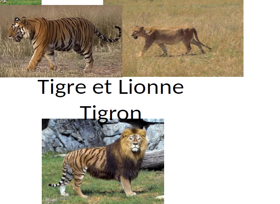
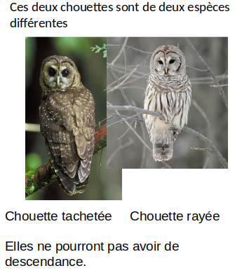
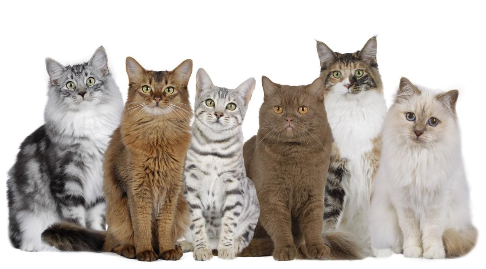
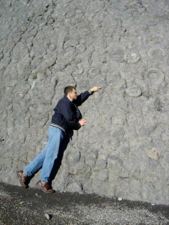

# Séquence : La biodiversité actuelle et passée

!!! note-prof
    si besoin d'infos

!!! question "Problématique"
    Qu'est-ce que la biodiversité ?

    
## Séance 1 : La notion d'espèce

!!! question "Problématique"
    Comment est définie une espèce ? 

[Activité La notion d’espèce](../espece)

??? abstract "Bilan"
    Une espèce regroupe des êtres vivants qui peuvent se reproduire entre eux et dont la descendance est fertile. Généralement les individus d’une espèce se ressemblent.
    Dans certains cas, deux individus d’espèces différentes peuvent se reproduire, mais leur descendance est généralement stérile. Cette descendance est appelée hybride 
    
    Définitions : 

    - Descendance : Ensemble des êtres vivants issus d’une reproduction.

    - Fertile : un individu fertile peut se reproduire.

    - Stérile : un individu stérile ne peut pas se reproduire.

## Séance 2 : La diversité intraspécifique

Tous les chats font partie de la même espèce, Felis catus. Cependant, malgré de nombreux caractères communs, ils ne se ressemblent pas tous parfaitement et appartiennent à différentes races.

!!! question "Problématique"
    Quels sont les critères qui permettent de classer les chats en différentes races ? 

[Activité La diversité intraspécifique des chats](../biodivIntra)

??? abstract "Bilan"
    Dans une espèce, il existe des variations de certains caractères. Cela crée un biodiversité intraspécifique.

    Chez les êtres vivants dont la reproduction est contrôlée, les êtres vivants qui ont le même aspect sont regroupés dans des groupes nommés races chez les animaux et variétés chez les plantes.

    Définition : diversité intraspécifique : diversité des individus au sein d’une même espèce.

## Séance 3 : Paléoenvironnement et crise biologique

 

A Digne-Les-Bains dans les Alpes de Haute-Provence, on peut trouver un site exceptionnel : une dalle de roche calcaire remplie de fossiles d’ammonites, un mollusque marin disparu depuis bien longtemps…

!!! question "Problématique"
    Comment la biodiversité a changé sur Terre 

[Activité Paléoenvironnement et crise biologique](../paleoenv)

??? abstract "Bilan"
    L’étude des fossiles permet de reconstituer l’histoire du vivant. 

    Certains groupes d’êtres vivants ont disparu et tous les groupes ne sont pas apparus en même temps.
    Les espèces ont changé au cours du temps. Certaines ont disparu, d’autres sont apparues.

    A certaines périodes, de nombreuses espèces ont disparu sur un temps court, on parle de crise biologique.

    Définition :
    Fossiles : restes ou des traces d’êtres vivants ayant vécu par le passé et qui ont été conservés dans les roches.

