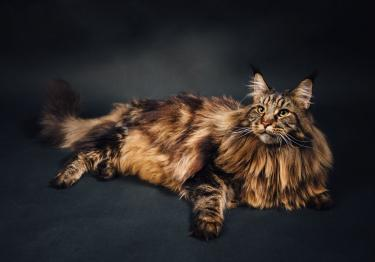

# Activité : La diversité intraspécifique des chats

!!! note "Compétences"

    - Trouver et extraire des informations / 
    - Réaliser un tableau 

!!! warning "Consignes"

    1. A l’aide des documents, complète le tableau qui permet de classer les chats selon différents critères.
    2. Expliquer pourquoi l'on peut dire qu'il existe une diversité dans l'espèce des chats

    
??? bug "Critères de réussite"
    - 

**Document 1 L'Abyssin**

L’Abyssin est un infatigable joueur. Il se trouve constamment en mouvement, sans pour autant faire beaucoup de bruit ni de grabuge. L’Abyssin est élégant. Il possède un corps sculpté quasiment à la perfection. Sa fourrure est très appréciée. Elle est courte, chaude et particulièrement élastique au toucher.

**Document 2 Le Maine Coon**

Le Maine Coon est, avec le Savannah, l’une des plus grandes races de chat. Sa longueur peut aisément dépasser le mètre. Le Maine Coon est aussi un géant au cœur tendre, qui préfère les câlins et la tranquillité aux activités intenses. Il est un compagnon des plus agréables, y compris pour les enfants et ses congénères.

**Document 3 Le Chartreux**

Chat de taille moyenne et de constitution robuste, le Chartreux est un compagnon débrouillard, intelligent et au caractère bien affirmé. Attaché à son propriétaire tout en conservant une assez grande indépendance, il sait apprécier les moments de tendresse, mais sait aussi y mettre fin quand il n’en veut plus.
Race aux origines anciennes, le Chartreux est bien plus populaire en France qu’ailleurs dans le monde, notamment au Royaume-Uni où on lui préfère le British Shorthair national. D’ailleurs, une certaine confusion avec ce dernier a longtemps régné du fait de croisements.

**Document 4 Le Sphynx**

Le Sphynx est un chat de taille moyenne doté d'un charme particulier : il dévoile un corps paraissant nu, quoique recouvert d'un duvet très fin. En plus d'avoir un physique original, il se révèle être un excellent chat de compagnie. Très attaché à son propriétaire, le Sphynx aime être cajolé et se montre sociable. À la fois calme, vif et intelligent, c'est un agréable compagnon au quotidien.

**Document 5 Tableau comparant des chats.**

<table>
<thead>
  <tr>
    <th>  &nbsp;&nbsp;			 </th>
    <th> Longueur des poils </th>
    <th> Taille </th>
    <th> Longueur des oreilles </th>
  </tr>
</thead>
<tbody>
  <tr>
    <td> Sphynx </td>
    <td>  </td>
    <td>  </td>
    <td>  </td>
  </tr>
  <tr>
    <td> Abyssin   </td>
    <td>  </td>
    <td>  </td>
    <td>  </td>
  </tr>
  <tr>
    <td> Chartreux </td>
    <td>  </td>
    <td>  </td>
    <td>  </td>
  </tr>
  <tr>
    <td> Maine Coon </td>
    <td>  </td>
    <td> 	 </td>
    <td>  </td>
  </tr>
</tbody>
</table>

??? note-prof "correction"

    <table>
    <thead>
      <tr>
        <th>  &nbsp;&nbsp;			 </th>
        <th> Longueur des poils </th>
        <th> Taille </th>
        <th> Longueur des oreilles </th>
      </tr>
    </thead>
    <tbody>
      <tr>
        <td> Sphynx </td>
        <td> Aucun </td>
        <td> Moyen </td>
        <td> Grandes </td>
      </tr>
      <tr>
        <td> Abyssin   </td>
        <td> Court </td>
        <td> Petit </td>
        <td> Grandes </td>
      </tr>
      <tr>
        <td> Chartreux </td>
        <td> Moyen </td>
        <td> Moyen </td>
        <td> Petites </td>
      </tr>
      <tr>
        <td> Maine Coon </td>
        <td> Long </td>
        <td> Grand </td>
        <td> Moyennes </td>
      </tr>
    </tbody>
    </table>