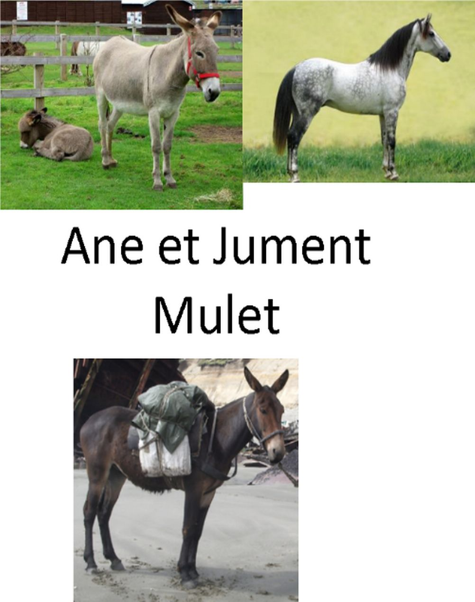
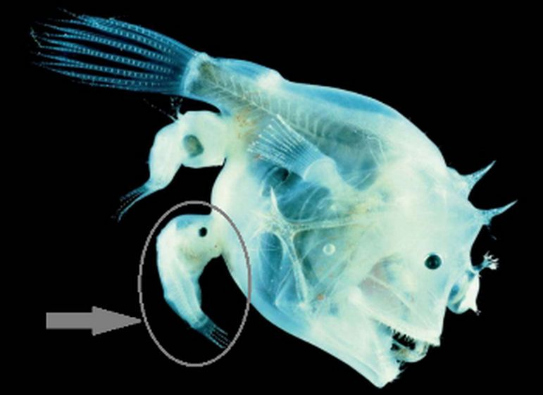

# Activité : La notion d’espèce

!!! note Compétences

    Restituer des connaissances 

## Exercice 1 : L’âne, la jument et le mulet.

!!! warning Consignes
    Pour chaque phrase du document 2, cocher la bonne réponse.

**Document 1 Reproduction de l'âne et de la jument**

Le mulet est le petit de l’âne et de la jument.
Il n’est pas capable de se reproduire. On dit qu’il est stérile.

{: style="width:300px;"}

**Document 2 Questions sur la reproduction de l'âne et de la jument**

1 L’âne et la jument ont en commun :

- Des yeux et des plumes.
- Des yeux, une bouche, des poils et quatre pattes.
- Uniquement de grandes oreilles.

2 L’âne et la jument appartiennent à :

- Deux espèces différentes, car ils ne se reproduisent jamais entre eux.
- La même espèce, car ils peuvent se reproduire entre eux et leurs descendants aussi.
- Deux espèces différentes, car leurs descendants ne peuvent pas se reproduire entre eux.

## Exercice 2 : La baudroie

!!! warning Consignes
    1. À partir de l’observation de chaque animal sur l’image, penses-tu qu’ils appartiennent à la même espèce ou à 2 espèces différentes ? Justifie ta réponse.
    2. Sachant que le petit poisson est, en réalité, un mâle capable de se reproduire avec la grande femelle, et que leurs descendants sont fertiles, dire si ces deux animaux sont finalement de la même espèce. Justifie ta réponse. 

{: style="width:300px;"}

La baudroie est un poisson des grands fonds. La femelle peut mesurer jusqu’à 1 mètre de long. Elle est souvent parasitée par un autre poisson, très petit (3 cm), fixé sur elle. Le poisson parasite est celui entouré sur la photo. Un parasite vit et prélève sur l’animal des substances alimentaires pour assurer sa propre survie.

