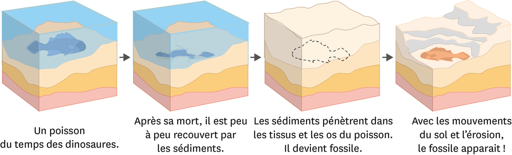
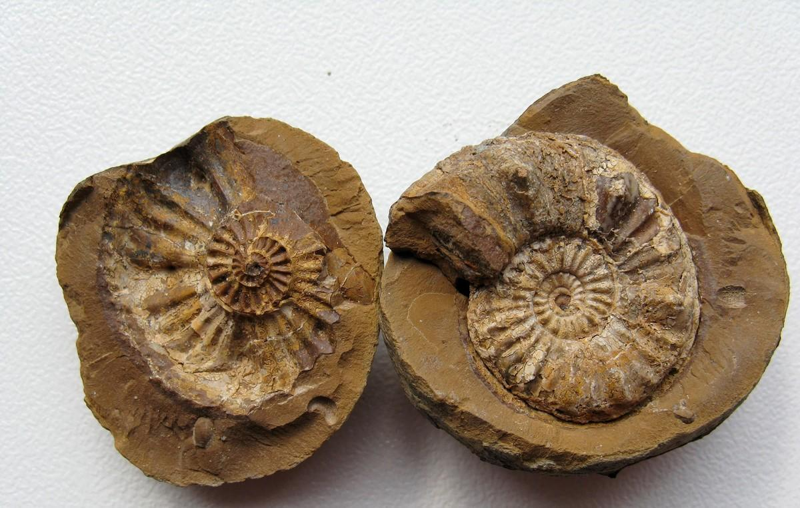
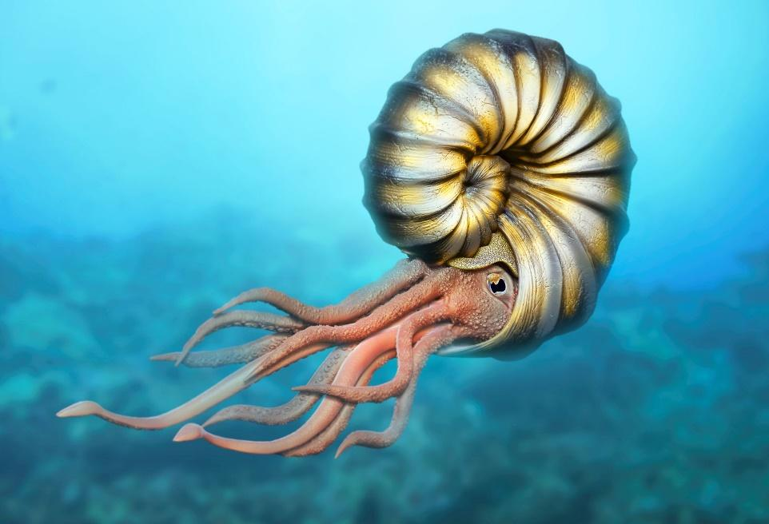
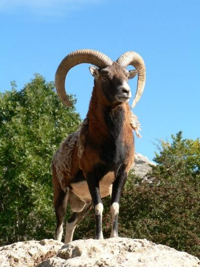
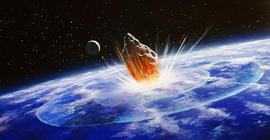
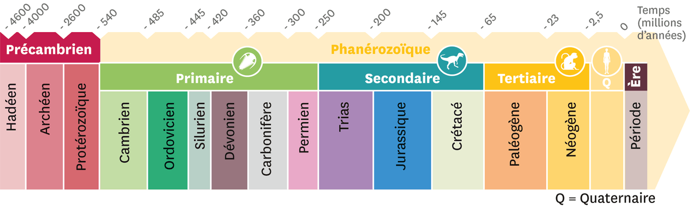

# Activité : Paléoenvironnement et crise biologique

!!! note Compétences

    Trouver et exploiter des informations 

!!! warning Consignes

    1. A l’aide des documents 1 et 2, faire un schéma en plusieurs étapes montrant la fossilisation des ammonites 
    2. A l’aide des documents 3 à 5, comparer dans un tableau l’environnement de Digne-Les-Bains aujourd’hui et il y a 350 millions d’années. 
    3. A l’aide des documents 4 et 6, représenter par une double flèche horizontale le temps correspondant au passage des ammonites sur Terre sur la frise chronologique du document 4. Replacer également par une flèche verticale rouge la crise biologique du Crétacé Tertiaire. 
    
??? bug Critères de réussite
    - 

**Document 1 : Les étapes de la formation d’un fossile.**

Définitions : 

Sédiments : Ensemble de particules (exemple : grain de sable) qui se déposent sur les fonds marins et forment ensuite des roches sédimentaires.

Fossile : reste d’être vivant, ou empreinte, conservé dans une roche sédimentaire.

**Document 2 : Vidéo sur la formation des fossiles** 

[https://www.youtube.com/watch?v=0JKubRV7ncw](https://www.youtube.com/watch?v=0JKubRV7ncw)

**Document 3 : Un fossile d’ammonite**

Sur la gauche, on observe un moulage externe de l'extérieur de la coquille. Sur la droite, on observe le moulage interne de l'ammonite (de l'intérieur de la coquille du mollusque). Un moulage entier indique qu'il y avait peu de courants, donc un milieu aquatique calme.

{: style="width:300px;"}

**Document 4 : L’ammonite, un animal aquatique.**

{: style="width:300px;"}

Les ammonites apparaissent il y a environ 380 millions d’années, au cours d’une période appelée le Dévonien. C’est une population importante, répandue dans toutes les mers de la fin de l’ère primaire. Elles devaient avoir un mode de vie assez comparable à celui des calamars. Elles devaient vivre dans les profondeurs des océans. Elles portent une coquille spiralée où elles peuvent se dissimuler, et qui leur sert également de flotteur. L’ammonite peut enfin sortir la tête et les tentacules de sa coquille.

**Document 5 : Quelques êtres vivants présents à Digne-Les-Bains actuellement.**

{: style="width:300px;"}

Digne-Les-Bains est une petite commune des Alpes. On peut y observer des lièvres et des mouflons ainsi que des fleurs sauvages.

{: style="width:300px;"}

**Document 6 : La disparition des ammonites.**

{: style="width:300px;"}

La crise du Crétacé-Tertiaire est une extinction de masse survenue voici 65,5 millions d'années, au passage du Crétacé au Paléogène. Environ 76 % des espèces marines de la planète se seraient alors éteintes, parmi lesquelles figurent les ammonites. De nombreuses victimes ont également été recensées sur la terre ferme, dont les dinosaures. 

C'est d'ailleurs pour cette raison que cette crise biologique est certainement la plus connue d'entre toutes (il y en a déjà eu cinq qualifiées de majeures, et nous serions dans la sixième, selon certains spécialistes).

Définition : 

Crise biologique : Période assez courte durant laquelle, à l'échelle du globe, un grand nombre d'espèces animales et végétales disparaissent simultanément

**Document 7 : Frise des temps géologiques**

Le temps est découpé en ères et en périodes géologiques, qui s’étendent sur plusieurs millions d’années.

**Document 8 Tableau comparant Digne les bains à deux périodes différentes**

<table>
<colgroup>
<col style="width: 200px">
<col style="width: 400px">
<col style="width: 400px">
</colgroup>
<thead>
  <tr>
    <th></th>
    <th>Il y a 350Ma</th>
    <th>Il y a 0 Ma</th>
  </tr>
</thead>
<tbody>
  <tr style="height: 100px">
    <td>Nom de la période</td>
    <td></td>
    <td></td>
  </tr>
  <tr style="height: 100px">
    <td>Espèces présentes</td>
    <td></td>
    <td></td>
  </tr>
  <tr style="height: 100px">
    <td>Milieu de vie (aquatique ou terrestre)</td>
    <td></td>
    <td></td>
  </tr>
</tbody>
</table>