# Séquence 3 : Diversité et parenté des êtres vivants

## Séance 1 : L’unité du vivant

*Rappel : u*n être vivant respire, se nourrit, se reproduit.

*Situation déclanchante* : A priori, entre cette plante (élodée), ce
micro-organisme (une paramécie) et moi, il n’y a pas de points communs.
Pourtant on est tous classés dans le groupe des êtres vivants : c’est
donc que l’on a quelque chose en commun.

Si on ne peut pas le voir à l’œil nu, comment faudrait-il faire ?

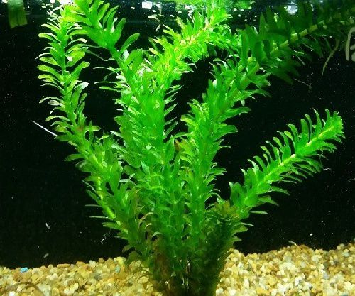
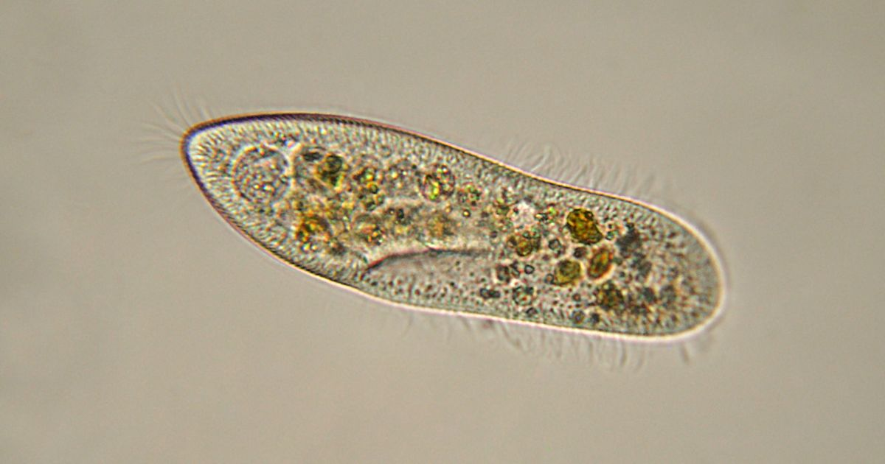


*Problématique* : Quel est le point commun entre tous les êtres
vivants ?

Hypothèse :

Vérification des hypothèses :

Présentation des règles pour le dessin d’observation.

Faire préparer 2 demi-feuilles pour les dessins d’observation :

Calcul du grossissement = Oculaire x Objectif : par exemple : 15 × 4 =60
ou 15 × 10 = 150

1.  ### Quel est le point commun entre tous les êtres vivants ?

```{=html}
<!-- -->
```
1.  #### Observation de l’épiderme d’un triton

Consigne 1 : Observer une lame de mue de triton au microscope.

Consigne 2 : **Réaliser l**e dessin de ton observation en utilisant les
informations des documents 1 et 2**.**

Compétences travaillées : Observation au microscope et réaliser un
dessin d’observation

***D****ocument 1 : ****Observation au microscope.***

1\. Vérifier qu’on est au petit objectif (anneau rouge) pour démarrer et
que l’objectif est remonté au maximum

2\. Observer nettement au petit objectif, pour cela avec la vis
macrométrique (grosse vis) rapprocher l’objectif de la lame jusqu’à
observer nettement l’image.

3\. Grossir à l’objectif x10 (donc grossissement x100 ou x150 en
fonction de leur oculaire)

NE PAS RELEVER L’OBJECTIF quand on change de grossissement :
l’observation au petit objectif a permis de trouver à peu près le bon
plan d’observation pour l’objectif plus gros.

Donc on fait tourner la roulette (anneau métallique au-dessus des
objectifs qui les font tourner, ne pas tourner directement les
objectifs) et on passe à l’objectif x10 (anneau jaune). On ajuste un
TOUT PETIT PEU le plan d’observation avec la vis micrométrique,
attention si on tourne trop la lame peut casser.

Document 2 : Fiche méthode pour réaliser un dessin d’observation

<table>
<tbody>
<tr class="odd">
<td>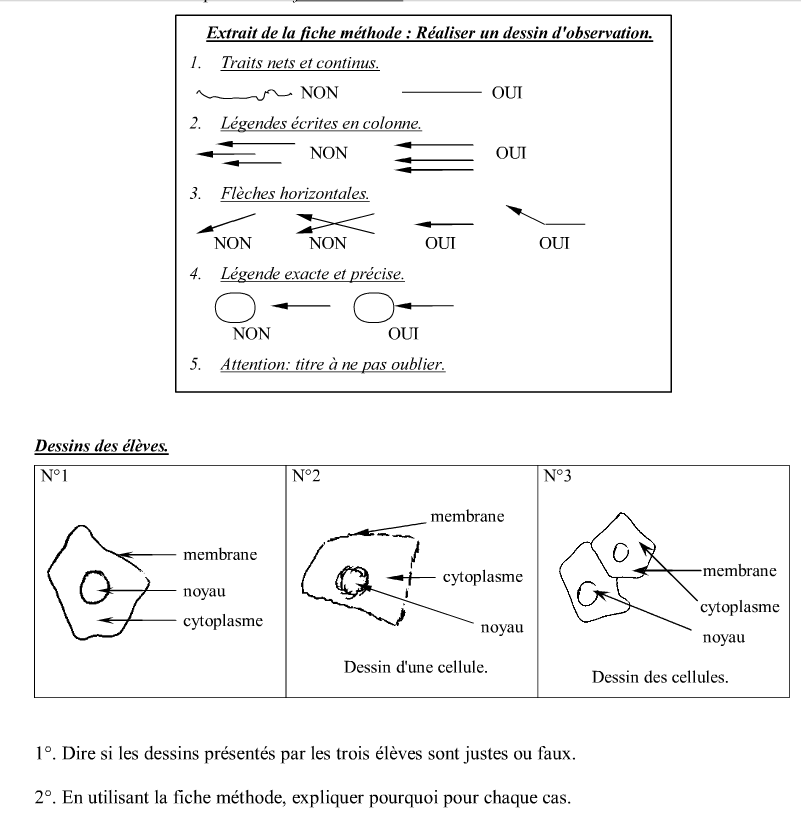
Faire un dessin
d’observation</td>
<td></td>
<td></td>
<td></td>
</tr>
<tr class="even">
<td>Niveau I : Maîtrise insuffisante</td>
<td>Niveau F : Maîtrise fragile</td>
<td>Niveau S : Maîtrise satisfaisante</td>
<td>Niveau TB : Très bonne maîtrise</td>
</tr>
<tr class="odd">
<td>Au moins 2 critères sont correctement réalisés et le titre ou les
légendes sont présents.</td>
<td>Au moins 5 critères sont correctement réalisés et le titre et des
légendes sont présents.</td>
<td><p>Au moins 6 critères sont correctement réalisés</p>
<p>+ Autonomie du travail.</p></td>
<td></td>
</tr>
<tr class="even">
<td>Critères de réussite :<br />
</td>
<td></td>
<td></td>
<td></td>
</tr>
</tbody>
</table>

Document 3 : Légendes à placer et leur définition.

-   Noyau : Élément arrondi à l’intérieur de la cellule
-   Cytoplasme : Contenu de la cellule
-   Membrane plasmique : Enveloppe qui délimite une cellule

-   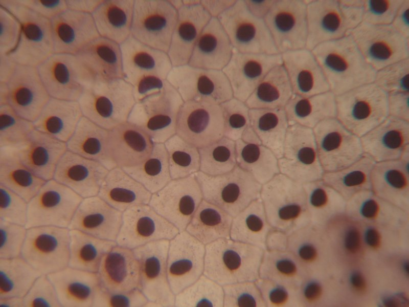
    Photo de mue de triton vue
    au microscope optique x400

1.  #### Observation de l’épiderme d’un oignon

Consigne 1 : Préparer une lame d’épiderme d’oignon au microscope.

Consigne 2 : Observer une lame d’épiderme d’oignon au microscope.

Consigne 3 : **Réaliser l**e dessin de ton observation en utilisant les
informations des documents 1 et 2**.**

Compétences travaillées : Observation au microscope et réaliser un
dessin d’observation

Document 1 : Préparation d’une lame microscopique :

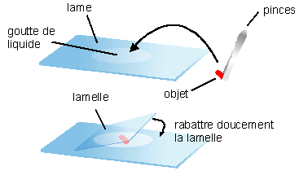


1.  À l’aide d’un compte-goutte, déposer une petite goutte de colorant
    au centre de la lame.
2.  À l’aide d’une pince fine, prélever un morceau d’épiderme d’oignon
    (pellicule très fine entre deux épaisseurs)
3.  Le déposer sur une lame
4.  Recouvrir d’une lamelle : placer un bord de la lamelle contre la
    goutte, l’incliner à 45° et laisser tomber la lamelle

Document 2 : Légendes à placer et leur définition.

-   Noyau : Élément arrondi à l’intérieur de la cellule
-   Cytoplasme : Contenu de la cellule
-   Membrane plasmique : Enveloppe qui délimite une cellule

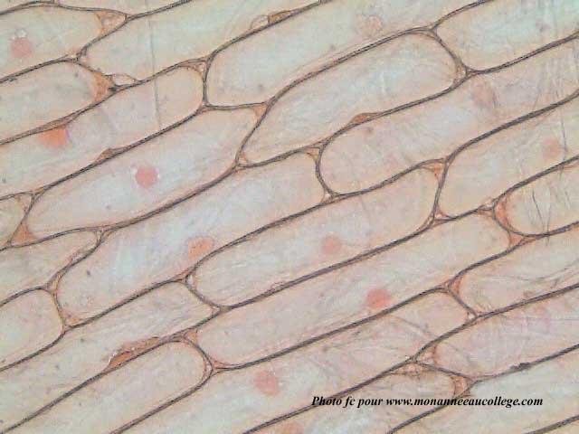
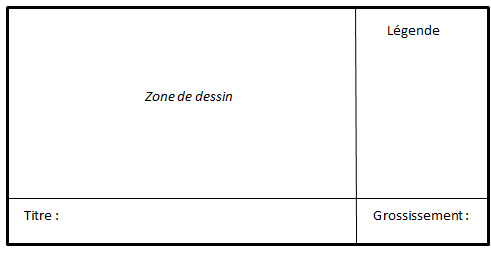


> 
> 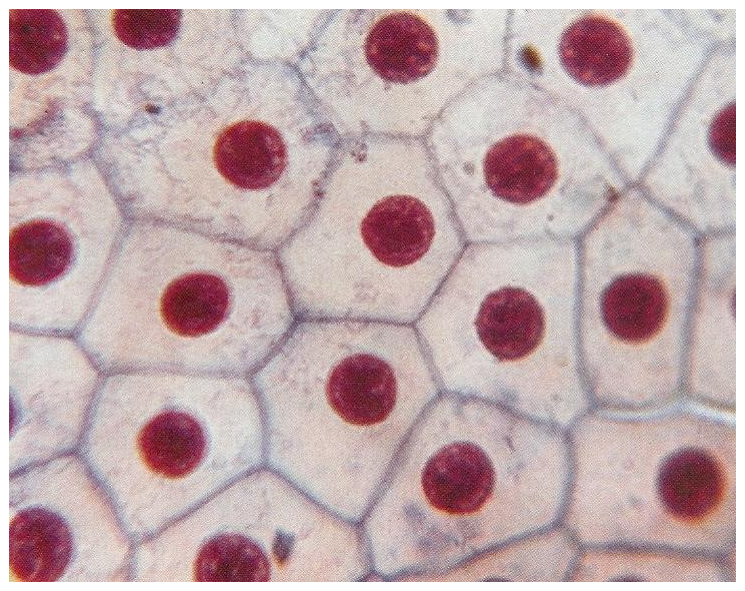
> 

Document. La paramécie, un être composé d’une seule cellule

> 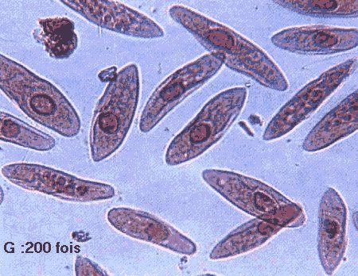
> 
> 

Demander aux élèves de repérer les éléments en communs,

Ils complètent les légendes des deux premiers dessins à l’aide de la
légende du 3e : membrane plasmique, cytoplasme et noyau.

Tous les êtres vivants sont constitués d’une ou plusieurs cellules.

#### 

1.  #### Calculer la taille de ce que l’on observe au microscope

Consigne : À partir des informations, calculer la taille des 3 cellules
en photos.

Pour connaître la taille réelle d’un élément observé au microscope :

-   Tu mesures l’élément dont tu souhaites connaître la taille sur le
    > document

-   Puis tu divises par le grossissement

> Taille réelle de l’élément
> =$$\frac{\mathit{Taille}\mathit{mesur}ée\mathit{avec}\mathit{la}rè\mathit{gle}}{\mathit{grossissement}\mathit{du}\mathit{microscope}}$$

*Rappel : le grossissement du microscope = grossissement de l’oculaire x
grossissement de l’objectif*

*Attention : à ne pas oublier de noter l’unité (cm, mm, µm…)*

Exemples :

<table>
<tbody>
<tr class="odd">
<td>Photographie</td>
<td>
</td>
<td>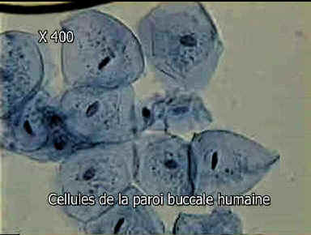
</td>
<td>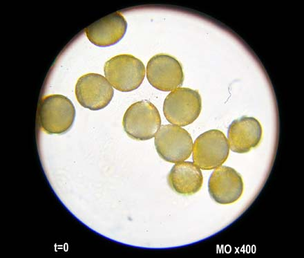
</td>
</tr>
<tr class="even">
<td></td>
<td><blockquote>
<p>Photographie d’Euglène x200 </p>
</blockquote></td>
<td><blockquote>
<p>Photographie de cellules de la bouche x400</p>
</blockquote></td>
<td><blockquote>
<p>Photographie de grains de pollen x400</p>
</blockquote></td>
</tr>
<tr class="odd">
<td>Taille mesurée</td>
<td></td>
<td></td>
<td></td>
</tr>
<tr class="even">
<td>Grossissement</td>
<td></td>
<td></td>
<td></td>
</tr>
<tr class="odd">
<td>Calcul de la taille réelle</td>
<td></td>
<td></td>
<td></td>
</tr>
<tr class="even">
<td>Taille réelle</td>
<td></td>
<td></td>
<td></td>
</tr>
</tbody>
</table>

Bilan :

Certaines choses ne peuvent pas être vues à l’œil nu, car ils sont très
petits, on dit qu’ils sont *microscopiques*. Pour pouvoir les observer,
l’être humain va utiliser un *microscope.*

Tous les êtres vivants sont composés de *cellules*. On dit que la
*cellule est l’unité du vivant.*

Quand un organisme est formé d’une cellule, c’est un organisme
*unicellulaire*. Quand un organisme est formé de plusieurs cellules,
c’est un organisme *pluricellulaire*.

Les cellules sont constituées d’une *membrane plasmique*, d’un
*cytoplasme* et d’un *noyau* pour **certains unicellulaires et les
pluricellulaires**.

## Séance 2 : Hérédité et lien de parenté

*Rappel : ***Espèce :** ensemble d’individu qui se reproduisent entre
eux et ont une descendance fertile.

*Situation déclenchante : *Dans le dessin animé, Le monde de Dory, le
poisson-chirurgien, part à la recherche de ses parents. Ce qu’elle
ignore, c’est que toutes les espèces ont un lien de parenté.

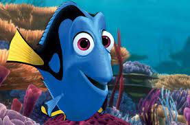
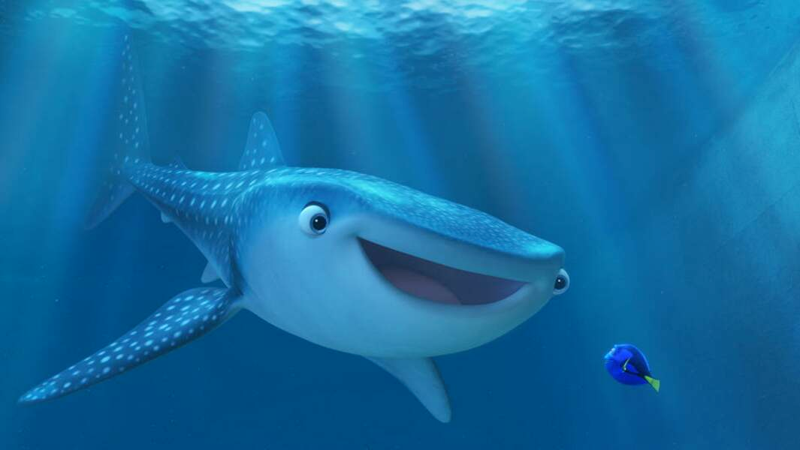


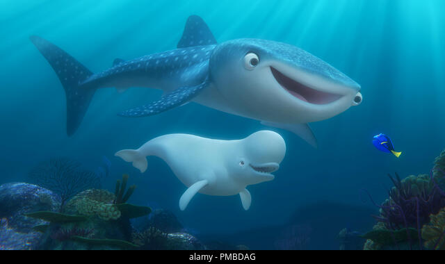
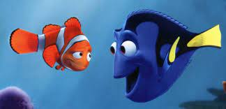
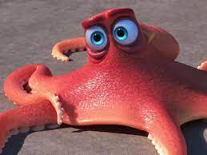


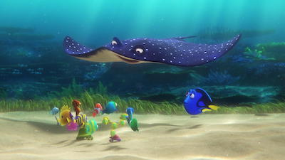


1.  ### Comment peut-on faire des liens de parenté entre les espèces d’êtres vivants ?

```{=html}
<!-- -->
```
1.  #### Des liens de parenté dans le monde de Dory.

Dans le dessin animé, Le monde de Dory, le poisson-chirurgien, part à la
recherche de ses parents. Ce qu’elle ignore, c’est que toutes les
espèces ont un lien de parenté.

Consigne 1 : À partir du jeu de carte et des documents 1,2 et 3, classer
les **êtres vivants.**

Consigne 2 : À l’aide de votre travail précédent et du document 4,
dessiner sur votre cahier les groupes emboîtés réalisés

Consigne 3 : À partir de votre travail précédent, expliquer pourquoi on
peut dire que Dory a des liens de parentés avec toutes les espèces
présentes et avec quelle espèce ses liens de parenté sont le plus fort.

***Document ****1**** : ****les groupes emboîtés.***

Pour classer les êtres vivants, les scientifiques utilisent des groupes
emboîtés. Pour cela, ils commencent par définir une liste de caractères
qui vont permettre de les classer, ce sont les attributs.

Ensuite, ils observent chaque espèce pour définir les attributs qu’elle
possède dans un tableau

Les scientifiques réunissent dans un ensemble, appelé groupe, les
espèces qui possèdent des attributs communs. Puis ils classent les
espèces à l’intérieur.

Les scientifiques nomment ensuite ces groupes.

***Document ****2**** : Comment établir des parentés entre espèces.***

Les attributs partagés par différentes espèces traduisent une origine
commune, c’est-à-dire des relations de parenté entre les organismes
vivants.

Plus les organismes vivants partagent d’attributs en commun, plus ils
sont porches parents.

Document 3 : Tableau des attributs. Pour chaque être vivant, indiquer si
le caractère est présent ou absent en cochant ou non la case.

|                             |                   |               |                  |                |              |        |
|-----------------------------|-------------------|---------------|------------------|----------------|--------------|--------|
|                             | Poisson chirurgie | Poisson clown | Requin – baleine | Poulpe tacheté | Raie léopard | Béluga |
| Yeux, bouche                |                   |               |                  |                |              |        |
| Tentacule                   |                   |               |                  |                |              |        |
| Allaitement                 |                   |               |                  |                |              |        |
| Vertèbre                    |                   |               |                  |                |              |        |
| Squelette osseux            |                   |               |                  |                |              |        |
| Nageoire caudale symétrique |                   |               |                  |                |              |        |
| Squelette cartilagineux     |                   |               |                  |                |              |        |

***Document ****4**** : Créer des groupes emboîtés.***

1.  À l’aide du tableau d’attributs complété, repère l’attribut commun
    au plus grand nombre d’espèces.
2.  Dessine une première grande boite et inscrit l’attribut choisi en
    haut à gauche. Range dedans toutes les espèces qui ont cet attribut.
3.  Repère maintenant le nouvel attribut commun au plus grand nombre
    d’espèces dans cette boite.
4.  Dessine une autre boite plus petite à l’intérieur de la précédente
    et inscrit le nom de l’attribut.
5.  Continue ainsi jusqu’à avoir utilisé tous les attributs pour que
    toutes les espèces soient classées dans des boîtes.
6.  Nommer les différents groupes

Document 5 : Le nom de différents groupes d’êtres vivants.

-   ***Animaux :*** êtres vivants possédant une bouche et des yeux
-   ***Céphalopodes :*** êtres vivants à corps mou avec des tentacules.
-   ***Chondrichtyens :*** être vivants au squelette cartilagineux.
-   ***Ostéichtyens :*** êtres vivants avec un squelette constitué d’os
    plus durs que du cartilage.
-   ***Téléostéens :*** groupe qui contient la majorité de ce que l’on
    nomme « les poissons » dans le langage courant.
-   ***Vertébrés :*** être vivant possédant des vertèbres.
-   ***Mammifères :*** êtres vivants constitués de poils et qui
    réalisent l’allaitement.

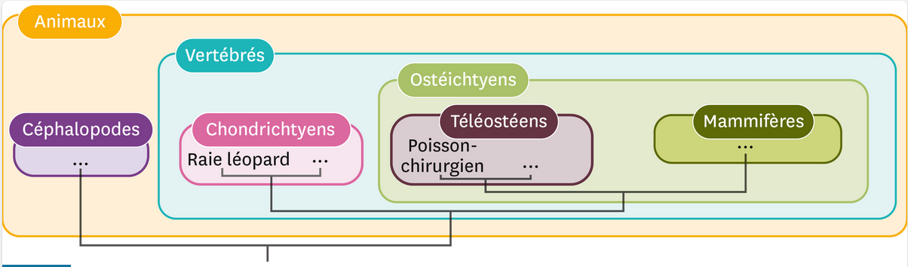
Bilan :

Les êtres vivants peuvent être classés en fonction des attributs qu’ils
possèdent sous la forme de groupes emboîtés.

On classe dans un même groupe les êtres vivants possédant un *attribut
en commun*.

Ces groupes emboîtés permettent de mettre en évidence les relations de
parenté entre les espèces.

Les espèces **qui sont dans un même groupe sont plus proches entre elles
que d’une espèce d’un autre groupe. Elles ont un ancêtre commun.**

Définition attribut : Caractère défini par les scientifiques qui permet
d’établir des relations de parenté.

1.  #### Classification des végétaux

Consigne 1 : En utilisant les documents et le matériel, proposer une
classification des végétaux.

Consigne 2 : Sachant que le sapin est dans le même groupe de que le pin
sylvestre, citer les attributs que possède le sapin.

|                                                                                 |                                                                                      |                                                                                     |                                                                         |
|---------------------------------------------------------------------------------|--------------------------------------------------------------------------------------|-------------------------------------------------------------------------------------|-------------------------------------------------------------------------|
| Compétence travaillée : Communiquer sous différentes formes (Groupes emboîtées) |                                                                                      |                                                                                     |                                                                         |
| Niveau I : Maîtrise insuffisante                                                | Niveau F : Maîtrise fragile                                                          | Niveau S : Maîtrise satisfaisante                                                   | Niveau TB : Très bonne maîtrise                                         |
|                                                                                 | Les règles sont, en partie, respectées et quelques informations ont été bien placées | Toutes les informations sont bien placées et la majorité des règles sont respectées | Toutes les informations sont bien placées et les règles sont respectées |

<div markdown="1">

<div markdown="1">


Document 1 : Le polypode.

Le polypode est une fougère. Il possède des pigments verts, une tige et
des feuilles en frondes.

Taille : 50 cm.

Document 2 : Le
cerisier.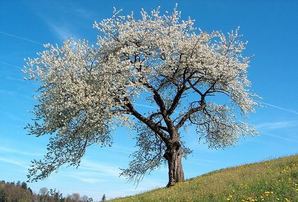


Le cerisier est un arbre. Il possède des pigments verts, une tige, des
graines et des fleurs.

Taille : 20 m.

***Document ****3**** : Polytric***

Le polytric est une mousse. Il possède des pigments verts et une tige.

Taille : 5 à 10 cm.

Document 4 : Ulve

L’ulve est une algue. Elle possède des pigments verts.  
Taille : 20 cm.

Document 5 : Le pin sylvestre.

Le pin sylvestre est un arbre. Il possède des pigments verts, une tige
et des graines.

Taille : 35 à 40 m.

</div>

</div>

Document 6 : Tableau des attributs. Pour chaque être vivant, indiquer si
le caractère est présent ou absent en cochant ou non la case.

|               |      |     |     |     |     |
|---------------|------|-----|-----|-----|-----|
|               | Tige |     |     |     |     |
| Ulve          |      |     |     |     |     |
| Polytric      |      |     |     |     |     |
| Polypode      |      |     |     |     |     |
| Pin Sylvestre |      |     |     |     |     |
| Cerisier      |      |     |     |     |     |

<table>
<tbody>
<tr class="odd">
<td>Cerisier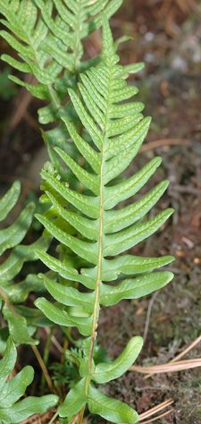
<td>Polypode</td>
<td><p>Ulve</p></td>
</tr>
<tr class="even">
<td><p>Polytric</p></td>
<td><p>Pin sylvestre</p>
<p>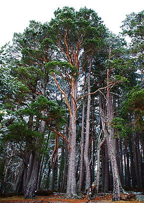
</p></td>
<td></td>
</tr>
<tr class="odd">
<td>Feuilles en fronde</td>
<td>Graines</td>
<td></td>
</tr>
<tr class="even">
<td>Fleurs</td>
<td>Pigments verts</td>
<td>Tige</td>
</tr>
</tbody>
</table>

<table>
<tbody>
<tr class="odd">
<td>Cerisier
<td>Polypode</td>
<td><p>Ulve</p></td>
</tr>
<tr class="even">
<td><p>Polytric</p></td>
<td><p>Pin sylvestre</p>
<p>
</p></td>
<td></td>
</tr>
<tr class="odd">
<td>Feuilles en fronde</td>
<td>Graines</td>
<td></td>
</tr>
<tr class="even">
<td>Fleurs</td>
<td>Pigments verts</td>
<td>Tige</td>
</tr>
</tbody>
</table>

1.  #### Exercices d’entraînement

Exercice 1

Consigne 1 : Complète le tableau des attributs et construit les groupes
emboîtés pour les **êtres vivant ci-dessous.**

Consigne 2 : Repère l’attribut partagé par tous les **êtres vivants.**

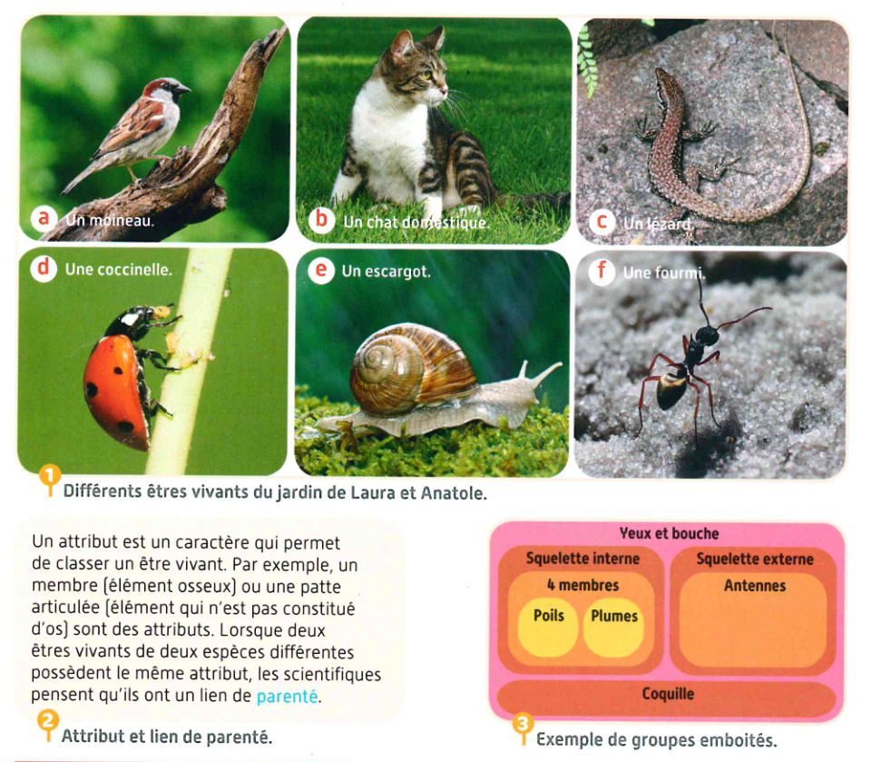


un moineau un chat un lézard


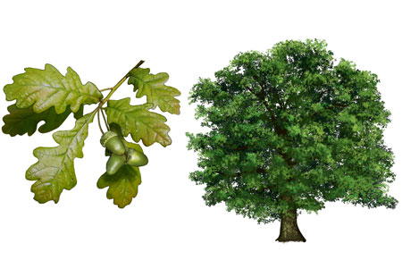


une fourmi un chêne

<table>
<tbody>
<tr class="odd">
<td><blockquote>
<p>attribut</p>
</blockquote>
<blockquote>
&#10;</blockquote></td>
<td><blockquote>
<p>Yeux et bouche</p>
</blockquote></td>
<td><blockquote>
<p>cellules</p>
</blockquote></td>
<td><blockquote>
<p>Squelette interne</p>
</blockquote></td>
<td><blockquote>
<p>4 membres (pattes ou ailes)</p>
</blockquote></td>
<td><blockquote>
<p>Poils</p>
</blockquote></td>
<td><blockquote>
<p>Plumes</p>
</blockquote></td>
<td><blockquote>
<p>Squelette externe</p>
</blockquote></td>
<td><blockquote>
<p>Pigment vert (couleur verte)</p>
</blockquote></td>
</tr>
<tr class="even">
<td><blockquote>
<p>Moineau</p>
</blockquote></td>
<td><blockquote>
&#10;</blockquote></td>
<td><blockquote>
&#10;</blockquote></td>
<td><blockquote>
<p>présent</p>
</blockquote></td>
<td><blockquote>
&#10;</blockquote></td>
<td><blockquote>
&#10;</blockquote></td>
<td><blockquote>
&#10;</blockquote></td>
<td><blockquote>
<p>Absent</p>
</blockquote></td>
<td><blockquote>
<p>Absent</p>
</blockquote></td>
</tr>
<tr class="odd">
<td><blockquote>
<p>Chat</p>
</blockquote></td>
<td><blockquote>
&#10;</blockquote></td>
<td><blockquote>
&#10;</blockquote></td>
<td><blockquote>
<p>présent</p>
</blockquote></td>
<td><blockquote>
&#10;</blockquote></td>
<td><blockquote>
&#10;</blockquote></td>
<td><blockquote>
&#10;</blockquote></td>
<td><blockquote>
<p>Absent</p>
</blockquote></td>
<td><blockquote>
<p>Absent</p>
</blockquote></td>
</tr>
<tr class="even">
<td><blockquote>
<p>Lézard</p>
</blockquote></td>
<td><blockquote>
&#10;</blockquote></td>
<td><blockquote>
&#10;</blockquote></td>
<td><blockquote>
<p>présent</p>
</blockquote></td>
<td><blockquote>
&#10;</blockquote></td>
<td><blockquote>
&#10;</blockquote></td>
<td><blockquote>
&#10;</blockquote></td>
<td><blockquote>
<p>Absent</p>
</blockquote></td>
<td><blockquote>
<p>Absent</p>
</blockquote></td>
</tr>
<tr class="odd">
<td><blockquote>
<p>Fourmi</p>
</blockquote></td>
<td><blockquote>
&#10;</blockquote></td>
<td><blockquote>
&#10;</blockquote></td>
<td><blockquote>
<p>Absent</p>
</blockquote></td>
<td><blockquote>
&#10;</blockquote></td>
<td><blockquote>
&#10;</blockquote></td>
<td><blockquote>
&#10;</blockquote></td>
<td><blockquote>
<p>présent</p>
</blockquote></td>
<td><blockquote>
<p>Absent</p>
</blockquote></td>
</tr>
<tr class="even">
<td><blockquote>
<p>Chêne</p>
</blockquote></td>
<td><blockquote>
&#10;</blockquote></td>
<td><blockquote>
&#10;</blockquote></td>
<td><blockquote>
<p>Absent</p>
</blockquote></td>
<td><blockquote>
&#10;</blockquote></td>
<td><blockquote>
&#10;</blockquote></td>
<td><blockquote>
&#10;</blockquote></td>
<td><blockquote>
<p>Absent</p>
</blockquote></td>
<td><blockquote>
<p>Présent</p>
</blockquote></td>
</tr>
</tbody>
</table>

Exercice 2

Consigne 1 : Rappeler la définition d’espèce.

Consigne 2 : Expliquer si le zèbre et le cheval sont de la m**ême espèce
en utilisant l’exemple du zorse**

Document 1 : le zorse.

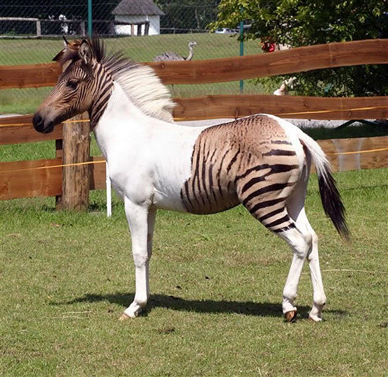
C’est animal est un zorse,
c’est-à-dire le fils d’un zèbre et d’une jument. Cet animal est dit
« hybride » et ne se rencontre pas dans la nature, car les zèbres et les
chevaux sont d’espèces différentes et n’habitent pas les mêmes régions.

Ce croisement est le résultat d’une expérience dans un zoo.

Le zorse (zèbre+horse) est un animal stérile, qui n’aura donc pas de
descendance.

## Séance 3 : Modification du peuplement au cours des saisons

*Situation déclanchante :* Rappel de la sortie en début d’année,
rappeler le nombre d’espèces trouvées. Refaire une sortie dans la cours
avec pour objectif cette fois-ci de compter et noter les différentes
espèces observées.

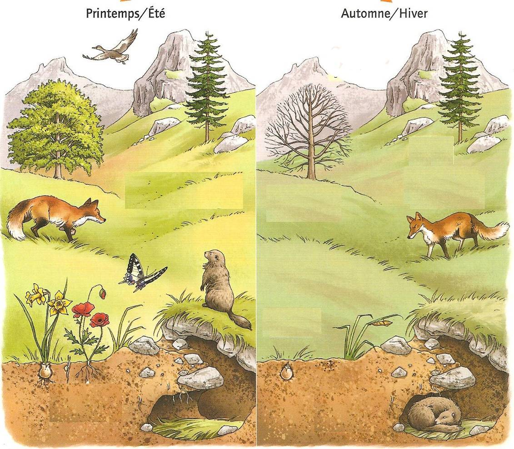
Quel constat peut-on faire ?

Nous observons qu’entre septembre et maintenant nous voyons moins
d’espèces animales et les arbres ont perdu leurs feuilles.

1.  ### Comment varie le peuplement du milieu au cours des saisons ?

1.  #### Modification du peuplement au cours des saisons

**Avec votre tablette, scanner
le**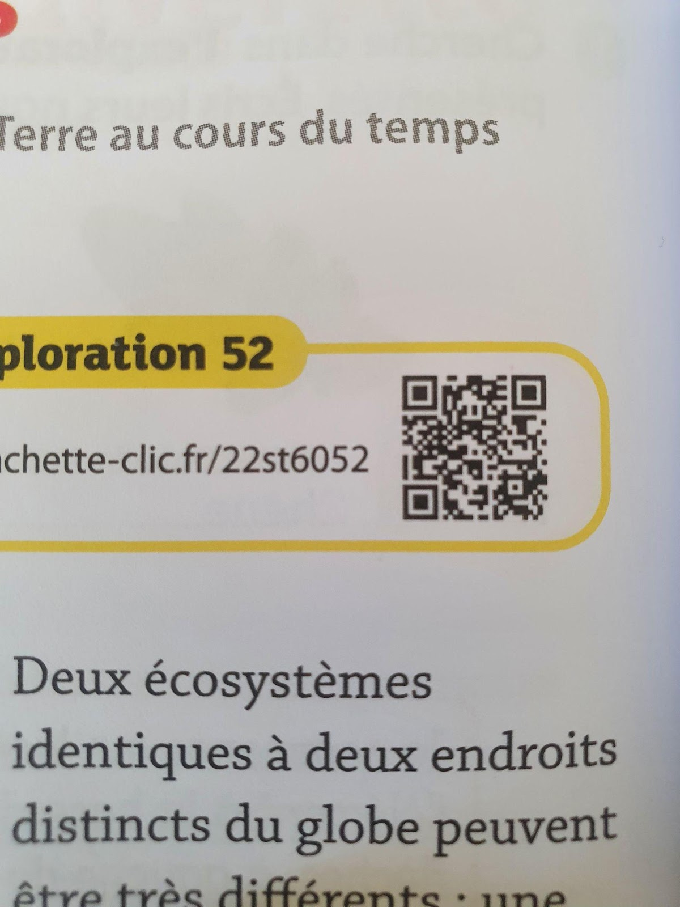
title="cuserstheo-the-bestdownloads299863548_572847387853569_3740961055456715430_n.jpg"
** QRcode suivant ou recopier
dans votre barre de recherche le lien suivant :
**[**hachette-clic.fr/22st6052**](http://hachette-clic.fr/22st6052)

Consigne 1 : Cliquer sur « Espèces au cours de l’année » puis réaliser
dans le cahier le graphique du nombre d’espèces en fonction du mois de
l’année. (Aidez-vous de la fiche méthode du document 1)

Consigne 2 : Décrire l’évolution de la température moyenne au cours de
l’année dans l’environnement étudié. (Aidez-vous de la fiche méthode du
document 2)

Consigne 3 : Construire un tableau comparant le mode de vie des
différents êtres vivants entre l’été et l’hiver, en utilisant les
informations de l’animation.

Consigne 4 : Compléter le texte du document 3.

Document 1 : Résumé de la méthode pour construire un graphique

Un graphique est composé de 2 axes que l’on appelle : l’abscisse (celui
du bas) et l’ordonnée (celui du haut). C’est toujours l’ordonnée qui
varie en fonction de l’abscisse.

Exemple d’une consigne : Tracer le graphique représentant l’évolution du
prix du pain en fonction des années. Le prix du pain sera en ordonnées.
Les années seront en abscisse.

Une fois que les axes sont bien placés, on les gradue : on décide, pour
chaque axe, de la valeur d’un carreau. Il y a toujours le même écart
entre deux graduations d’un même axe.

Ensuite, on place les points sur le graphique, on les relie à main
levée. Et, on donne un titre.

Document 2 : Résumé de la méthode pour décrire un graphique

Décrire un graphique revient à présenter l’évolution de la grandeur
étudiée. On commence par écrire une phrase d’introduction présentant les
grandeurs étudiées. (exemple : Ce graphique représente la température en
fonction de l’heure de la journée)

Il faut commencer par compter le nombre de segments qu’il y a dans la
courbe : il faudra rédiger autant de phrases qu’il y a de segments.
Rédiger une phrase par segment de courbe. Chaque phrase comporte l’un
des verbes suivants : augmenter, diminuer ou rester stable.

Chaque phrase indique le moment de début et de fin et les valeurs du
phénomène mesuré.

Remarque : c’est le phénomène mesuré sur l’axe vertical qui évolue ; il
ne faut donc pas dire que la courbe augmente ou diminue, mais que la
grandeur étudiée augmente ou diminue.

Document 3 : Résumé des informations de l’animation

Quand il fait trop froid, certains être vivants……………… vers des pays plus
chauds comme………………… ; certains………………… (c’est à dire que leur fourrure
s’épaissit et qu’ils adaptent leur alimentation), comme le………………… ;
d’autres………………… (c’est à dire qu’ils dorment durant toute la saison),
comme le………………… et les………………… ; d’autres perdent leur………………… pour éviter
la……………………………, comme le……………; d’autres……………………… mais leur descendance
survit dans le sol sous forme de…………… ou de bulbes, comme
les…………………………………………………………………

|         |     |     |
|---------|-----|-----|
|         |     |     |
| Renard  |     |     |
| Hérison |     |     |
| Fourmi  |     |     |
| Chêne   |     |     |
|         |     |     |

Quand il fait trop froid, certains être vivants migrent… vers des pays
plus chauds comme l’hirondelle… ; certains hivernent… (c’est-à-dire que
leur fourrure s’épaissit et qu’ils adaptent leur alimentation), comme le
renard… ; d’autres hibernent… (c’est-à-dire qu’ils dorment durant toute
la saison), comme le hérisson… et les fourmis…… ; d’autres perdent leurs
feuilles… pour éviter la déshydratation…, comme le chêne… ; d’autres
meurent… mais leur descendance survit dans le sol sous forme de graines…
ou de bulbes, comme les plantes de la prairie…

#### Fiche méthode description d’un graphique


Décrire un graphique revient à
présenter l’évolution de la grandeur étudiée. On commence par écrire une
phrase d’introduction présentant les grandeurs étudiées. (exemple : Ce
graphique représente la température en fonction de l’heure de la
journée)

Il faut commencer par compter le nombre de segments qu’il y a dans la
courbe : il faudra rédiger autant de phrases qu’il y a de segments.
Rédiger une phrase par segment de courbe. Chaque phrase comporte l’un
des verbes suivants : augmenter, diminuer ou rester stable.

Chaque phrase indique le moment de début et de fin et les valeurs du
phénomène mesuré.

Remarque : c’est le phénomène mesuré sur l’axe vertical qui évolue ; il
ne faut donc pas dire que la courbe augmente ou diminue, mais que la
grandeur étudiée augmente ou diminue.

(Exemple : Ce graphique représente la température en fonction de l’heure
de la journée.

De 0 h à 6 h, la température reste stable à 8 °C.

De 6hà14h, la température augmente de 8 à 30 °C.

De 14 h à 24 h, la température diminue de 30 à 8 °C).

Fiche méthode construction d’un graphique

Une courbe représente des données chiffrées et permet de visualiser
facilement leur évolution. On peut construire une courbe à partir d’un
tableau qui présente des couples de valeurs.

Tout le graphique se fait au crayon à papier.

Exemple :

|                     |     |     |     |     |     |     |     |
|---------------------|-----|-----|-----|-----|-----|-----|-----|
| Heure de la journée | 0   | 4   | 8   | 12  | 16  | 20  | 24  |
| Température (°C)    | 11  | 12  | 18  | 21  | 22  | 19  | 13  |

Étapes de la construction :

-   Il faut construire deux axes gradués :

    -   Construire deux axes perpendiculaires. L’axe vertical correspond
        à la grandeur étudiée.
    -   Choisir une origine, une échelle pour les axes selon les valeurs
        du tableau
    -   Graduer les axes régulièrement, en respectant cette échelle
    -   Indiquer la grandeur représentée et son unité à l’extrémité des
        axes

-   Pour positionner un couple de valeurs :

    -   Repérer la bonne valeur sur l’axe horizontal (abscisses) et
        construire une ligne pointillée verticale passant par cette
        autre valeur
    -   Repérer la bonne valeur sur l’axe vertical (ordonnées) et
        construire une ligne pointillée horizontale passant par cette
        autre valeur
    -   L’intersection de ces lignes pointillées correspond à un point
        de la courbe
    -   Procéder de même pour tous les couples de valeurs
    -   Effacer les lignes en pointillés

-   Relier, à main levée, les points obtenus

-   Ajouter un titre au graphique selon le modèle : Graphique de
    l’évolution de « axe vertical » en fonction de « axe horizontal »


Bilan : Synthèse :

Au cours des saisons, les *paramètres physiques de l’écosystème
varient* : dans notre exemple, la *température *est plus chaude en été
qu’en hiver. Les êtres vivants sont sensibles aux changements de la
température. Quand la température diminue, les êtres vivants ont
différents comportements :* migration, hivernation, hibernation*, perte
des feuilles, survie de la descendance.

proposer d’autres graphiques à faire pour s’entraîner.

Synthèse :

Au cours des saisons, les *paramètres physiques de l’écosystème
varient* : dans notre exemple, la *température *est plus chaude en été
qu’en hiver. Les êtres vivants sont sensibles aux changements de la
température. Quand la température diminue, les êtres vivants ont
différents comportements :* migration, hivernation, hibernation*, perte
des feuilles, survie de la descendance.

1.  #### Exercice 1 sur les graphiques

Consigne 1 Indiquer ce que représente l’ordonnée du graphique.

Consigne 2 : Indiquer ce que représente l’abscisse du graphique.

Consigne 3 : Indiquer le mois de l’année où il y a le plus de sarcelles
d’hiver en Camargue.

Consigne 4 : Préciser quel est l’effectif de sarcelles d’hiver à ce
moment-là.

Consigne 5 : Indiquer les mois de l’année où il y a le moins de
sarcelles d’hiver en Camargue.

Consigne 6 : Indiquer l’information extraite de ce graphique en
recopiant et complétant le document 3.

Document 1 : la sarcelle d’hiver

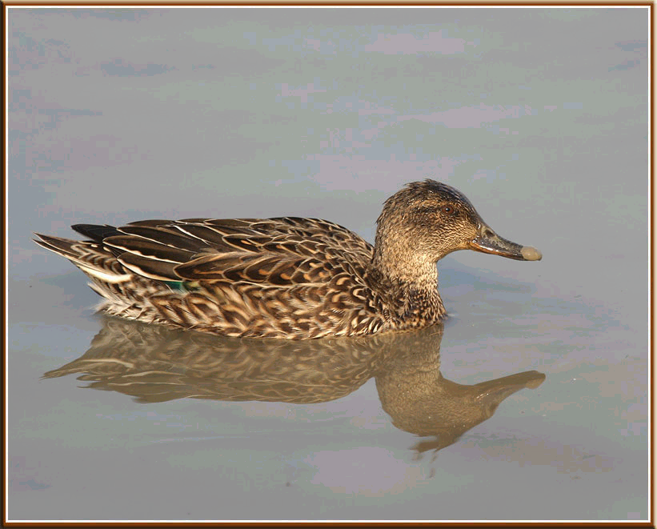
La Sarcelle d’hiver est un oiseau
migrateur.

En été, les sarcelles d’hiver se nourrissent et se reproduisent sur les
lacs de Scandinavie ou au nord de la Russie. Ces lacs sont en partie
gelés en hiver.

En hiver, les sarcelles d’hiver sont présentes dans des aires
d’hivernage au sud de l’Europe, notamment en Camargue, où elles se
nourrissent de graines enfouies dans la vase.

Document 2 : Graphique de l’évolution de la population de la Sarcelle en
Camargue au cours d’une année.


Document 3 :

« Les sarcelles d’hiver arrivent en Camargue, sur leur aire d’hivernage,
dès le mois de -------. Elles repartent vers leurs lieux de reproduction
en Scandinavie dès le mois de --------. Ces allers-retours appelés
migrations leur permettent de trouver de la ------------ tout au long de
l’année »

1.  #### Exercice 2 sur les graphiques

Consigne 1 : À l’aide du tableau ci-dessus, construire le graphique
représentant l’évolution de la masse de la marmotte en fonction du
temps.

Consigne 2 : Décrire le graphique obtenu.

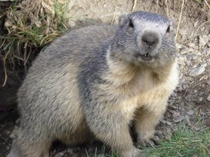
Document 1 : La marmotte des
Alpes

Les marmottes des Alpes vivent en petites colonies familiales entre 1000
et 3000 mètres d’altitude. A l’approche de l’automne, elles aménagent,
au fond de leur terrier, une chambre tapissée d’herbes sèches. Dans le
courant de l’automne, elles ferment l’entrée depuis l’intérieur et
s’endorment d’un profond sommeil entrecoupé de brèves périodes de
réveil : on dit qu’elles hibernent. Elles ne se nourrissent pas jusqu’au
mois d’avril.

Document 2 : Evolution de la masse de la marmotte au cours de l’année.

|                            |     |     |     |     |     |     |     |     |     |     |     |     |
|----------------------------|-----|-----|-----|-----|-----|-----|-----|-----|-----|-----|-----|-----|
| Temps en Mois              | A   | M   | J   | J   | A   | S   | O   | N   | D   | J   | F   | M   |
| Masse de la marmotte en Kg | 3.8 | 4   | 4.1 | 4.3 | 5   | 5.2 | 5.3 | 5.4 | 5.1 | 4.7 | 4.4 | 3.9 |
