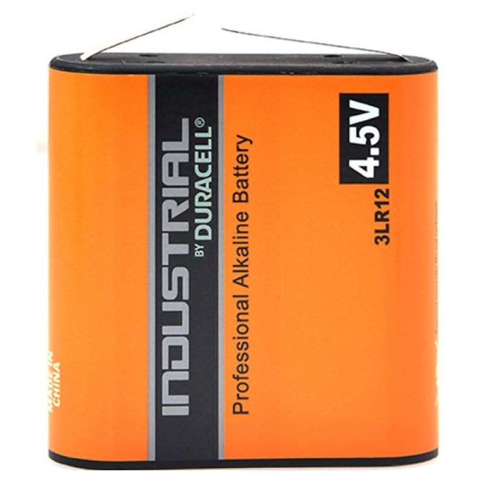
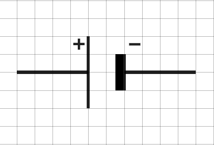
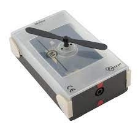
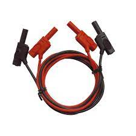

# Activité : Circuit électrique

!!! note "Compétences"

    - Manipuler
    - Schématiser 

!!! warning "Consignes"

    1. Faire le circuit électrique du document 1
    2. Faire un schéma du circuit en suivant les règles du document 2 et 3
    3. Faire un schéma de la chaine énergétique
    
??? bug "Critères de réussite"
    - 

**Document 1 Protocole à réaliser.**

1. brancher une pince sur un fil
2. relier la pince à la pile
3. relier l'autre bout du fil à un moteur
4. relier un second cable à l'autre branchement du moteur
5. brancher une pince sur un fil
6. relier la pince à la seconde borne de la pile

**Document 2 Méthode de schématisation électrique**  
1. Représenter un grand rectangle (il symbolise le circuit, les traits symbolisent les fils)  
2. Gommer, sur les traits du rectangles, l’emplacement des dipôles  
3. Ajouter dans les espaces gommés, le symbole des dipôles du circuit en respectant l’ordre

**Attention !**
Utiliser une règle et un crayon à papier
Ne pas représenter de dipôle dans les angles du rectangle

**Document 3 Symboles normalisés des dipôles.**

<table markdown class="tg">
<thead>
<tr>
<th colspan="2">Nom</th>
<th >Photographie</th>
<th >Symbole</th>
</tr>
</thead>
<tbody markdown>
<tr markdown>
<td colspan="2">Pile</td>
<td markdown >
 {: style="width:100px" }
</td>
<td markdown > {: style="width:100px" }</td>
<tr markdown>
<td colspan="2">Ampoule</td>
<td markdown >
 {: style="width:100px" }
</td>
<td markdown > {: style="width:100px" }</td>
  </tr>
<tr markdown>
<td  colspan="2">Moteur</td>
<td markdown >
 {: style="width:100px" }
</td>
<td markdown > {: style="width:100px" }</td>
  </tr>
<tr markdown>
<td  colspan="2">Fil électrique</td>
<td markdown >
 {: style="width:100px" }
</td>
<td markdown > {: style="width:100px" }</td>
  </tr>
</tbody>
</table>

**Document 4 Définitions**  

- Générateur : objet fournisseur d’énergie électrique.  
- Récepteur : objet receveur d’énergie électrique.
- Circuit électrique : chaîne d’objet électrique composé de générateur et de récepteurs
- dipôle : Élément d’un circuit électrique qui possède deux extrémités pour être branché.

