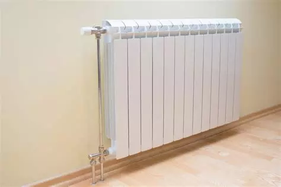
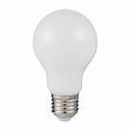
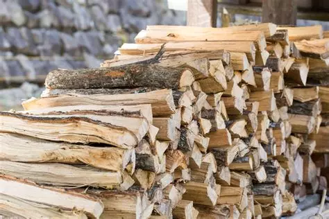
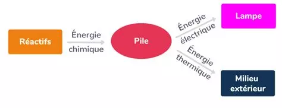

# Activité : la conversion de l'énergie

!!! note Compétences

    Interpréter 

!!! warning Consignes

    1. Indiquer la forme d'énergie liée à chaque image du document 2. 
    2. Créer un dispositif convertissant l'énergie d'une forme à l'autre avec le matériel fourni.
    3. Compléter le document 6 pour faire la chaîne énergétique de votre dispositif.
    
??? bug Critères de réussite
    - 

**Document 1 Différentes formes d'énergies.**

L'énergie est la capacité à produire des changements (de température, de mouvement...).
Cette énergie se mesure en joule.
Il existe différentes formes d'énergie.

| Formes d'énergie | Définition |
|--|--|
| Énergie mécanique | Énergie liée aux mouvements des objets |
|  Énergie chimique |  Énergie contenue dans les espèces chimiques et aussi aux êtres vivants |
|  Énergie nucléaire |  Énergie contenue à l'intérieur des atomes  |
|  Énergie lumineuse |  Énergie liée à la lumière  |
|  Énergie électrique |  Énergie liée au passage du courant électrique  |
|  Énergie thermique|  Énergie liée à la température d'un objet  |
	

**Document 2 Quelques formes d'énergie.**

{:style="width:200px;"}

{:style="width:200px;"}
{:style="width:200px;"}

{:style="width:200px;"}

**Document 3 Conversion d'énergie**

De nombreux appareils peuvent convertir l'énergie d'une forme à l'autre.
Par exemple, un écran de téléphone converti l'énergie électrique issue de la batterie en énergie lumineuse et en énergie thermique.

**Document 4 Chaîne énergétique**

On appelle chaîne énergétique la modélisation des transferts d’énergie et les conversions d’énergie grâce à des convertisseurs : 

- Les rectangles symbolisent les réservoirs d’énergie ;
- Les ovales symbolisent les convertisseurs ;
- Les flèches symbolisent les transferts d’énergie.

**Document 5 Materiel pour un dispositif convertissant l'énergie**

- Dynamo
- Fils électriques
- Ampoule

**Document 6 Chaîne énergétique d'un dispositif convertissant l'énergie**

